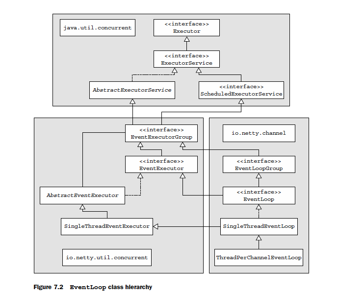
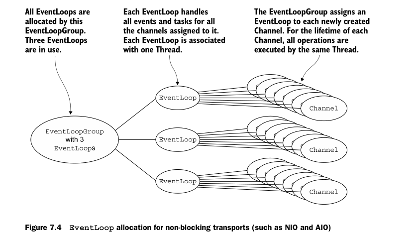

# CHAPTER 7

This chapter covers:

- Threading model overview
- Event loop concept and implementation
- Task scheduling
- Implementation details

- [CHAPTER 7](#chapter-7)
  - [Threading model overview](#threading-model-overview)
  - [EventLoop](#eventloop)
  - [Scheduling tasks using EventLoop](#scheduling-tasks-using-eventloop)
  - [Thread management](#thread-management)
  - [EventLoop/thread allocation](#eventloopthread-allocation)

## Threading model overview

Pooling and reusing threads is an improvement over creating and destroying a thread
with each task, but it doesn’t `eliminate`(消除) the cost of context switching, which quickly
becomes apparent as the number of threads increases and can be severe under heavy
load. In addition, other thread-related problems can arise during the lifetime of a project
simply because of the overall complexity or concurrency requirements of an application.
In short, multithreading can be complex. In the next sections we’ll see how Netty
helps to simplify it.

## EventLoop

The basic idea of an event loop is illustrated in the following listing, where each
task is an instance of Runnable

```java
while (!terminated) {
    List<Runnable> readyEvents = blockUntilEventsReady();
    for (Runnable ev: readyEvents) {
        ev.run();
    }
}
```



## Scheduling tasks using EventLoop

Occasionally you’ll need to schedule a task for later (deferred) or periodic execution.
For example, you might want to register a task to be fired after a client has been
connected for five minutes. A common use case is to send a heartbeat message to a
remote peer to check whether the connection is still alive. If there is no response, you
know you can close the channel.
In the next sections, we’ll show you how to schedule tasks with both the core Java
API and Netty’s EventLoop . Then, we’ll examine the internals of Netty’s
implementation and discuss its advantages and limitations.

## Thread management

## EventLoop/thread allocation

`EventLoop`与线程之间的关系

ASYNCHRONOUS TRANSPORTS 异步传输

Asynchronous implementations use only a few `EventLoops` (and their associated
Threads), and in the current model these may be shared among `Channels`. This allows
many Channels to be served by the smallest possible number of Threads, rather than
assigning a Thread per Channel .
Figure 7.4 displays an EventLoopGroup with a fixed size of three EventLoop s (each
powered by one Thread ). The EventLoop s (and their Thread s) are allocated directly
when the EventLoopGroup is created to ensure that they will be available when needed.
The EventLoopGroup is responsible for allocating an EventLoop to each newly cre-
ated Channel . In the current implementation, using a round-robin approach achieves
a balanced distribution, and the same EventLoop may be assigned to multiple Channel s.
(This may change in future versions.)


