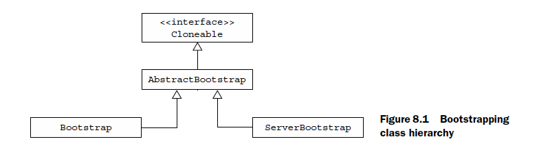

# CHAPTER 8

This chapter covers

- Bootstrapping clients and servers
- Bootstrapping clients from within a Channel
- Adding ChannelHandlers
- Using ChannelOptions and attributes



## Bootstrap class

```java
public abstract class AbstractBootstrap
<B extends AbstractBootstrap<B,C>,C extends Channel>
{

}

public class Bootstrap
extends AbstractBootstrap<Bootstrap,Channel>
{

}

public class ServerBootstrap
extends AbstractBootstrap<ServerBootstrap,ServerChannel>
{

}
```

## Bootstrapping a client

```java
{
        EventLoopGroup group = new NioEventLoopGroup();
        Bootstrap bootstrap = new Bootstrap();
        bootstrap.group(group)
            .channel(NioSocketChannel.class)
            .handler(new SimpleChannelInboundHandler<ByteBuf>() {
                @Override
                protected void channelRead0(
                    ChannelHandlerContext channelHandlerContext,
                    ByteBuf byteBuf) throws Exception {
                    System.out.println("Received data");
                }
                });
        ChannelFuture future =
            bootstrap.connect(
                    new InetSocketAddress("www.manning.com", 80));
        future.addListener(new ChannelFutureListener() {
            @Override
            public void operationComplete(ChannelFuture channelFuture)
                throws Exception {
                if (channelFuture.isSuccess()) {
                    System.out.println("Connection established");
                } else {
                    System.err.println("Connection attempt failed");
                    channelFuture.cause().printStackTrace();
                }
            }
        });
}
```
## IllegalStateException

More on IllegalStateException When bootstrapping, before you call `bind()` or `connect()` you must call the following
methods to set up the required components.
- group()
- channel() or channnelFactory()
- handler()

Failure to do so will cause an IllegalStateException. The handler() call is particularly
important because it’s needed to configure the ChannelPipeline.

## Bootstrapping servers

```java
{
        NioEventLoopGroup group = new NioEventLoopGroup();
        ServerBootstrap bootstrap = new ServerBootstrap();
        bootstrap.group(group)
            .channel(NioServerSocketChannel.class)
            .childHandler(new SimpleChannelInboundHandler<ByteBuf>() {
                @Override
                protected void channelRead0(ChannelHandlerContext channelHandlerContext,
                    ByteBuf byteBuf) throws Exception {
                    System.out.println("Received data");
                }
            });
        ChannelFuture future = bootstrap.bind(new InetSocketAddress(8080));
        future.addListener(new ChannelFutureListener() {
            @Override
            public void operationComplete(ChannelFuture channelFuture)
                throws Exception {
                if (channelFuture.isSuccess()) {
                    System.out.println("Server bound");
                } else {
                    System.err.println("Bind attempt failed");
                    channelFuture.cause().printStackTrace();
                }
            }
        });
    }
```

## Bootstrapping clients from a Channel

This can happen when an application, such as a proxy server, has to
integrate with an organization’s existing systems, such as web services or databases. In
such cases you’ll need to bootstrap a client Channel from a ServerChannel.

```java
{
        ServerBootstrap bootstrap = new ServerBootstrap();
        bootstrap.group(new NioEventLoopGroup(), new NioEventLoopGroup())
            .channel(NioServerSocketChannel.class)
            .childHandler(
                new SimpleChannelInboundHandler<ByteBuf>() {
                    ChannelFuture connectFuture;
                    @Override
                    public void channelActive(ChannelHandlerContext ctx)
                        throws Exception {
                        Bootstrap bootstrap = new Bootstrap();
                        bootstrap.channel(NioSocketChannel.class).handler(
                            new SimpleChannelInboundHandler<ByteBuf>() {
                                @Override
                                protected void channelRead0(
                                    ChannelHandlerContext ctx, ByteBuf in)
                                    throws Exception {
                                    System.out.println("Received data");
                                }
                            });
                        bootstrap.group(ctx.channel().eventLoop());
                        connectFuture = bootstrap.connect(
                            new InetSocketAddress("www.manning.com", 80));
                    }

                    @Override
                    protected void channelRead0(
                        ChannelHandlerContext channelHandlerContext,
                            ByteBuf byteBuf) throws Exception {
                        if (connectFuture.isDone()) {
                            // do something with the data
                        }
                    }
                });
        ChannelFuture future = bootstrap.bind(new InetSocketAddress(8080));
        future.addListener(new ChannelFutureListener() {
            @Override
            public void operationComplete(ChannelFuture channelFuture)
                throws Exception {
                if (channelFuture.isSuccess()) {
                    System.out.println("Server bound");
                } else {
                    System.err.println("Bind attempt failed");
                    channelFuture.cause().printStackTrace();
                }
            }
        });
    }
```

## Shutdown

Above all, you need to shut down the `EventLoopGroup`, which will handle any
pending events and tasks and subsequently release all active threads. This is a matter
of calling `EventLoopGroup.shutdownGracefully()`. This call will return a Future,
which is notified when the shutdown completes. Note that `shutdownGracefully`() is
also an asynchronous operation, so you’ll need to either block until it completes or
register a listener with the returned Future to be notified of completion.

```java
EventLoopGroup group = new NioEventLoopGroup();
Bootstrap bootstrap = new Bootstrap();
bootstrap.group(group)
.channel(NioSocketChannel.class);
...
Future<?> future = group.shutdownGracefully();
// block until the group has shutdown
future.syncUninterruptibly();
```