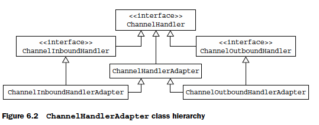

# CHAPTER 5

This chapter covers

- The ChannelHandler and ChannelPipeline APIs
- Detecting resource leaks
- Exception handling

- ChannelHandlers
- ChannelPipeline
- ChannelHandlerContext

## Channel lifecycle

## ChannelHandler lifecycle

## ChannelHandler adapters

## Resource management

## ChannelPipeline

In summary,

- A ChannelPipeline holds the ChannelHandlers associated with a Channel.
- A ChannelPipeline can be modified dynamically by adding and removing ChannelHandlers as needed.
- ChannelPipeline has a rich API for invoking actions in response to inbound and outbound events.

## ChannelHandlerContext

## Handling inbound exceptions

## Handling outbound exceptions