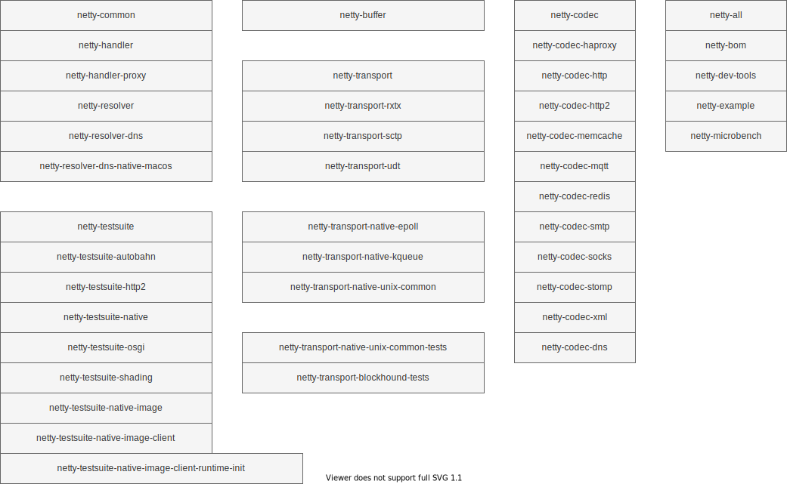

# Netty

如果你来到了这里，相信我，大概率你白来了，虽然是Netty的源码分析，但是到目前位置，只是对Netty组件简单介绍，并没有深入分析文章。

如果是想精通Netty不建议大家阅读，浪费时间。如果是小白入门，可以阅读。

## 写在前面

Netty 是最流程的 Java I/O 框架,主要是`性能强悍`+`良好的 API`，支持高并发，良好的 API 减少开发负担。
为了`性能`，Netty 做了很多的优化。如：为了更好的内存管理（复用），提供了 `PooledByteBuf` 相关的类，操作`非堆内存`，减少 GC 等等。

了解 Netty 必须对 TCP/IP 协议有所了解。建议阅读书籍 《TCP/IP 详解 卷 1》，这里是本人的笔记 [《TCP/IP 详解 卷 1》 读书笔记](https://github.com/web1992/read/blob/main/tcp-ip/TCP-IP-%E8%AF%A6%E8%A7%A3-%E5%8D%B71/readme.md)

同时建议阅读 [《UNIX 网络编程卷 1》](https://github.com/web1992/read/tree/main/tcp-ip/Unix%E7%BD%91%E7%BB%9C%E7%BC%96%E7%A8%8B-%E5%8D%B71/readme.md) 这本书。
理解 Java 的 BIO(Blocking I/O)，NIO(on-blocking I/O)，(AIO 了解即可)。

## Netty 的工程结构

下面对核心（常见）的模块组成简单总结：

| 模块                   | 描述                                                                                                               |
| ---------------------- | ------------------------------------------------------------------------------------------------------------------ |
| netty-codec            | 编码解码模块，常见的类:`ByteToMessageCodec`，`ByteToMessageDecoder`,`MessageToByteEncoder`,`MessageToMessageCodec` |
| netty-transport        | 传输模块，常见的类：`Channel`，`Bootstrap`，`EventLoop`                                                            |
| netty-transport-native | 传输模块+`native` (和平台相关的实现)，如：`epoll`,`kqueue`                                                         |
| netty-testsuite        | 测试模块                                                                                                           |
| netty-common           | 通用的工具类 如：`HashedWheelTimer` 定时器                                                                         |
| netty-buffer           | 内存分配（包含非堆内存或者说非托管内存），常见的类：`Unpooled`,`PooledByteBuf`                                     |
| netty-handler          | 常见的 Handler 实现类                                                                                              |
| netty-resolver         | DNS 域名解析                                                                                                       |
| netty-example          | 常见的 Demo                                                                                                        |
| netty-microbench       | 性能测试                                                                                                           |
| netty-bom              | Maven 依赖                                                                                                         |

## 源码分析

源码版本 `4.1.67.Final-SNAPSHOT`

git branch `4.1`

- [netty-bootstrap.md](netty-bootstrap.md)
- [netty-byte-buf.md](netty-byte-buf.md)
- [netty-byte-to-message-decoder.md](netty-byte-to-message-decoder.md)
- [netty-channel.md](netty-channel.md)
- [netty-channel-future.md](netty-channel-future.md)
- [netty-channel-handler.md](netty-channel-handler.md)
- [netty-channel-handler-context.md](netty-channel-handler-context.md)
- [netty-channel-outbound-buffer.md](netty-channel-outbound-buffer.md)
- [netty-channel-pipeline.md](netty-channel-pipeline.md)
- [netty-event-executor-chooser.md](netty-event-executor-chooser.md)
- [netty-event-loop.md](netty-event-loop.md)
- [netty-fast-thread-local.md](netty-fast-thread-local.md)
- [netty-message-to-message-codec.md](netty-message-to-message-codec.md)
- [netty-pool-thread-cache.md](netty-pool-thread-cache.md)
- [netty-read-data.md](netty-read-data.md)
- [netty-write-data.md](netty-write-data.md)

## Links

- [netty-core.md](netty-core.md)
