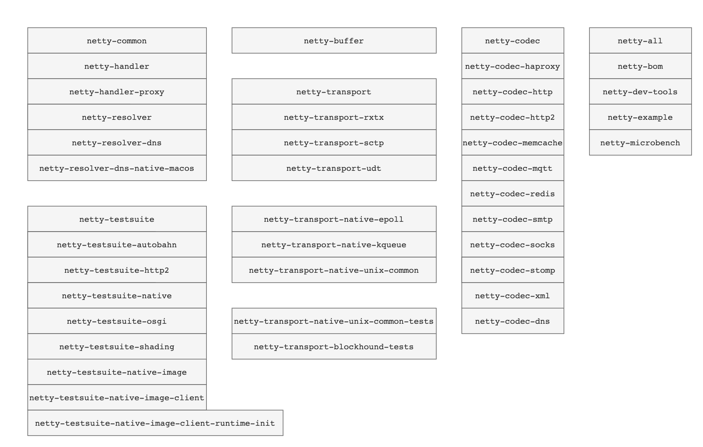

# Netty

## 写在前面

Netty 是最流程的 Java I/O 框架,主要是`性能强悍`+`良好的 API`，高性能支持高并发，良好的 API 减少开发负担。
为了`性能`，Netty 做了很多的优化。如：为了更好的内存管理（复用），提供了 PooledByteBuf 相关的类，操作`非堆内存`，减少 GC 等等。

了解 Netty 必须对 TCP/IP 协议有所了解。建议阅读书籍 《TCP/IP 详解 卷 1》，这里是本人的笔记 [《TCP/IP 详解 卷 1》 读书笔记](https://github.com/web1992/read/blob/main/tcp-ip/TCP-IP-%E8%AF%A6%E8%A7%A3-%E5%8D%B71/readme.md)

同时建议阅读 《UNIX网络编程卷1》 这本书

## Netty 的工程结构

下面对核心（常见）的模块组成简单总结：

| 模块                   | 描述                                                                                                       |
| ---------------------- | ---------------------------------------------------------------------------------------------------------- |
| netty-codec            | 编码解码模块，常见的类:ByteToMessageCodec，ByteToMessageDecoder,MessageToByteEncoder,MessageToMessageCodec |
| netty-transport        | 传输模块，常见的类：Channel，Bootstrap，EventLoop                                                          |
| netty-transport-native | 传输模块+native (和平台相关的实现)，如：epoll,kqueue                                                       |
| netty-testsuite        | 测试模块                                                                                                   |
| netty-common           | 通用的工具类 如：HashedWheelTimer 定时器                                                                   |
| netty-buffer           | 内存分配（包含非堆内存或者说非托管内存），常见的类：Unpooled,PooledByteBuf                                 |
| netty-handler          | 常见的 Handler 实现类                                                                                      |
| netty-resolver         | DNS 域名解析                                                                                               |
| netty-example          | 常见的 Demo                                                                                                |
| netty-microbench       | 性能测试                                                                                                   |
| netty-bom              | Maven 依赖                                                                                                 |

## 源码分析

源码版本 4.1.67.Final-SNAPSHOT

git banrch `4.1`

- [source-code-bootstrap.md](source-code-bootstrap.md)
- [source-code-byte-buf.md](source-code-byte-buf.md)
- [source-code-byte-to-message-decoder.md](source-code-byte-to-message-decoder.md)
- [source-code-channel.md](source-code-channel.md)
- [source-code-channel-future.md](source-code-channel-future.md)
- [source-code-channel-handler.md](source-code-channel-handler.md)
- [source-code-channel-handler-context.md](source-code-channel-handler-context.md)
- [source-code-channel-outbound-buffer.md](source-code-channel-outbound-buffer.md)
- [source-code-channel-pipeline.md](source-code-channel-pipeline.md)
- [source-code-event-executor-chooser.md](source-code-event-executor-chooser.md)
- [source-code-event-loop.md](source-code-event-loop.md)
- [source-code-fast-thread-local.md](source-code-fast-thread-local.md)
- [source-code-message-to-message-codec.md](source-code-message-to-message-codec.md)
- [source-code-pool-thread-cache.md](source-code-pool-thread-cache.md)
- [source-code-read-data.md](source-code-read-data.md)
- [source-code-write-data.md](source-code-write-data.md)
