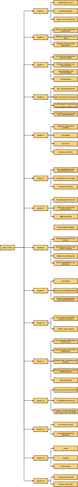

# Netty in action

`Netty in action` 笔记

- [draw.io](draw.io/netty-in-action.xml)
- [Netty in action (source code with the book)](https://github.com/normanmaurer/netty-in-action)
- [netty.io](http://netty.io/)
- [user-guide-for-4.x](https://netty.io/wiki/user-guide-for-4.x.html)

## Chapter List

- [Chapter List](netty-inaction.md)

## Summary

- [Summary](netty-in-action-summary.md)

## Roadmap

## 源码分析

源码版本：[4.1.31.Final](https://github.com/netty/netty/releases/tag/netty-4.1.31.Final)

`Netty in action` 每个章节的代码例子：[netty-in-action](https://github.com/normanmaurer/netty-in-action)

- [Bootstrap](source-code-bootstrap.md)
- [NioEventLoop](source-code-event-loop.md)
- [NioServerSocketChannel](source-code-channel.md)
- [ChannelPipeline](source-code-channel-pipeline.md)
