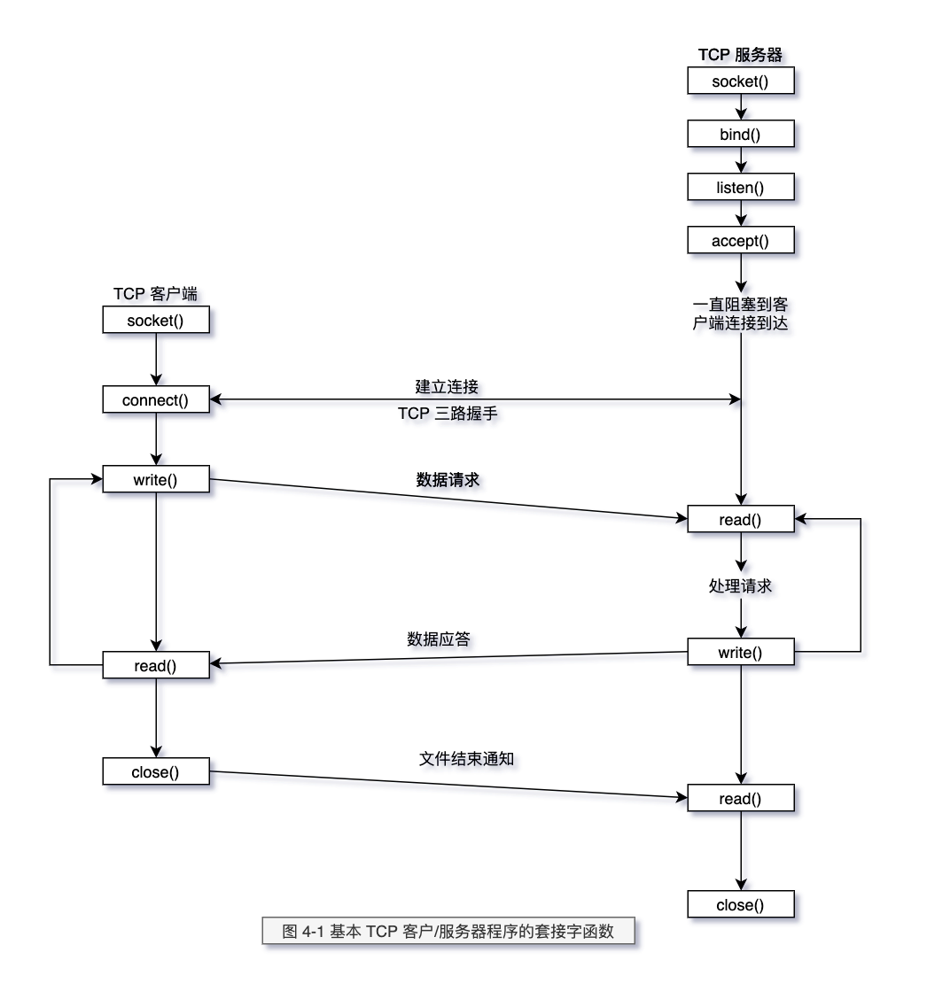

# Socket 基础

建议阅读 《Uninx 网络编程卷 1》 这本书，对 Unix 网络编程有很详细的介绍。

## Socket 编程

下面的图是从 《Uninx 网络编程卷 1》 这本书来的。

> 图 4-1 基本 TCP 客户/服务器程序的套接字函数



上图 说明使用 TCP 进行数据传输的时候，需要执行的 C 函数。

从图中我们可以看到 TCP 客户端/服务器的交互流程（交互过程中的函数调用），在 C 语言中是函数，而到了
JAVA 语言中，NIO 网络编程对这些函数进行了封装（抽象）。抽象出来了二个类：`ServerSocketChannel` 和 `SocketChannel`

- `ServerSocketChannel` 服务器(LISTEN 状态 Socket)抽象
- `SocketChannel (SocketChannelImpl)` 客户端(ESTABLISHED 状态 Socket)抽象

下面是二个类的 JDK 文档。注意其中的关键字: `listening socket` 和 `connecting sockets`

````java
// A selectable channel for stream-oriented listening sockets.
public abstract class ServerSocketChannel extends ... {

}
```java
// A selectable channel for stream-oriented connecting sockets.
public abstract class SocketChannel extends ...{

}
````

注意： TCP 是全双工的，在服务器和客户端都会维护连接。

## 服务器

这里通过 `运行代码`+`断点`+`lsof`命令 。来运行 Netty 例子，查询 TCP 的状态

本书运行的 Netty 例子，见文末尾连接。

```java
// sun.nio.ch.ServerSocketChannelImpl
ServerSocketChannelImpl(SelectorProvider var1) throws IOException {
    super(var1);
    this.fd = Net.serverSocket(true);
    this.fdVal = IOUtil.fdVal(this.fd);
    this.state = 0;
}

// bind
public ServerSocketChannel bind(SocketAddress var1, int var2) throws IOException {
    Net.bind(this.fd, var4.getAddress(), var4.getPort());// 在此处加断点
    Net.listen(this.fd, var2 < 1 ? 50 : var2);// 在此处加断点
}

```

```sh
# 执行 Net.bind 之后
➜  ~ lsof -i:8007
COMMAND  PID USER   FD   TYPE             DEVICE SIZE/OFF NODE NAME
java    4691   zl   95u  IPv6 0xe3ebd2dd6f674cc5      0t0  TCP *:8007 (CLOSED)
# 执行 Net.listen 之后
➜  ~ lsof -i:8007
COMMAND  PID USER   FD   TYPE             DEVICE SIZE/OFF NODE NAME
java    4691   zl   95u  IPv6 0xe3ebd2dd6f674cc5      0t0  TCP *:8007 (LISTEN)
➜  ~
```

上面的 TCP 状态从 `CLOSED` -> `LISTEN`

## 客户端

而当客户端连接之后：

```java
// SocketChannelImpl
    public boolean connect(SocketAddress var1) throws IOException {
        // ...
        var8 = Net.connect(this.fd, var9, var5.getPort());// 在次数断点
    }
```

在执行 `Net.connect` 之后：

```sh
➜  ~ lsof -i:8007
COMMAND   PID USER   FD   TYPE             DEVICE SIZE/OFF NODE NAME
java    39828   zl   92u  IPv6 0xe3ebd2dd77c13005      0t0  TCP *:8007 (LISTEN)
java    39828   zl   96u  IPv6 0xe3ebd2dd6f674cc5      0t0  TCP localhost:8007->localhost:57500 (ESTABLISHED)
java    39874   zl   89u  IPv6 0xe3ebd2dd6f674665      0t0  TCP localhost:57500->localhost:8007 (ESTABLISHED)
```

> 因为我是在笔记本同时运行服务器和客户端的，因此可以看到二个 `ESTABLISHED` 状态的连接,此外也说明了 TCP 是全双工的。
> 而处于 LISTEN 状态的链接是服务用来接收客户端连接的 Socket

## Links

- [Netty 例子](https://github.com/netty/netty/tree/4.1/example/src/main/java/io/netty/example/echo)
