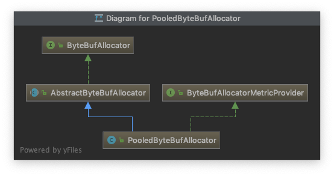
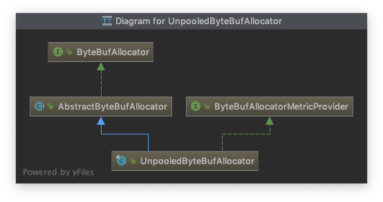

# ByteBuf

## Sequential Access Indexing

```pre
  +-------------------+------------------+------------------+
  | discardable bytes |  readable bytes  |  writable bytes  |
  |                   |     (CONTENT)    |                  |
  +-------------------+------------------+------------------+
  |                   |                  |                  |
  0      <=      readerIndex   <=   writerIndex    <=    capacity
```

## Readable bytes (the actual content)

```java
 // Iterates the readable bytes of a buffer.
 ByteBuf buffer = ...;
 while (buffer.isReadable()) {
     System.out.println(buffer.readByte());
 }
```

## Writable bytes

```java
 // Fills the writable bytes of a buffer with random integers.
 ByteBuf buffer = ...;
 while (buffer.maxWritableBytes() >= 4) {
     buffer.writeInt(random.nextInt());
 }
```

## Discardable bytes

```pre

 BEFORE discardReadBytes()

     +-------------------+------------------+------------------+
     | discardable bytes |  readable bytes  |  writable bytes  |
     +-------------------+------------------+------------------+
     |                   |                  |                  |
     0      <=      readerIndex   <=   writerIndex    <=    capacity


 AFTER discardReadBytes()

     +------------------+--------------------------------------+
     |  readable bytes  |    writable bytes (got more space)   |
     +------------------+--------------------------------------+
     |                  |                                      |
readerIndex (0) <= writerIndex (decreased)        <=        capacity

```

## Clearing the buffer indexes

```pre
<pre>
 BEFORE clear()

     +-------------------+------------------+------------------+
     | discardable bytes |  readable bytes  |  writable bytes  |
     +-------------------+------------------+------------------+
     |                   |                  |                  |
     0      <=      readerIndex   <=   writerIndex    <=    capacity


 AFTER clear()

     +---------------------------------------------------------+
     |             writable bytes (got more space)             |
     +---------------------------------------------------------+
     |                                                         |
     0 = readerIndex = writerIndex            <=            capacity
</pre>
```

## Search operations

For simple single-byte searches, use `indexOf(int, int, byte)` and `bytesBefore(int, int, byte)`.`bytesBefore(byte)` is especially useful when you deal with a {@code NUL}-terminated string.
For complicated searches, use `forEachByte(int, int, ByteProcessor)` with a `ByteProcessor` implementation.

## Mark and reset

There are two marker indexes in every buffer. One is for storing
`#readerIndex() readerIndex` and the other is for storing
`writerIndex() writerIndex`. You can always reposition one of the
two indexes by calling a reset method. It works in a similar fashion
to the mark and reset methods in `InputStream` except that there's no `readlimit`.

## Derived buffers(派生)

You can create a view of an existing buffer by calling one of the following methods:

- duplicate()
- slice()
- slice(int, int)
- readSlice(int)
- retainedDuplicate()
- retainedSlice()}
- retainedSlice(int, int)
- readRetainedSlice(int)

## Unpooled

## PooledByteBufAllocator



## UnpooledByteBufAllocator


