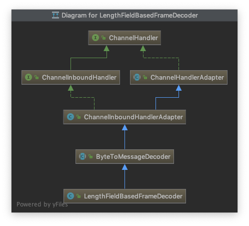

# ByteToMessageDecoder

Netty 中负责把字节流转化成一个具体对象的基类

> 来自Netty docs:

Generally frame detection should be handled earlier in the pipeline by adding a `DelimiterBasedFrameDecoder`, `FixedLengthFrameDecoder`, `LengthFieldBasedFrameDecoder`, or `LineBasedFrameDecoder`.

If a custom frame decoder is required, then one needs to be careful when implementing one with `ByteToMessageDecoder`. Ensure there are enough bytes in the buffer for a complete frame by checking `ByteBuf.readableBytes()`. If there are not enough bytes for a complete frame, return without modifying the reader index to allow more bytes to arrive.

To check for complete frames without modifying the reader index, use methods like ByteBuf.getInt(int). One MUST use the reader index when using methods like `ByteBuf.getInt(int)`. For example `calling in.getInt(0)` is assuming the frame starts at the beginning of the buffer, which is not always the case. Use `in.getInt(in.readerIndex())` instead.

## LengthFieldBasedFrameDecoder

`LengthFieldBasedFrameDecoder`

> Netty docs:

A decoder that splits the received `ByteBuf` dynamically by the
value of the length field in the message.  It is particularly useful when you
decode a binary message which has an integer header field that represents the
length of the message body or the whole message.

`LengthFieldBasedFrameDecoder` has many configuration parameters so
that it can decode any message with a length field, which is often seen in
proprietary client-server protocols.

一个通过长度来动态解析`ByteBuf` 的`解码器`,在解码一个二进制消息时,而这个消息有一个整数字段来代表消息体或者整个消息，十分有用。
`LengthFieldBasedFrameDecoder`提供了很多参数来配置消息满足不同的协议。通常在客户端-服务器这种协议下使用。

### LengthFieldBasedFrameDecoder构造参数

理解了`LengthFieldBasedFrameDecoder`参数的作用，其实就明白了的实现

```java
    private final ByteOrder byteOrder;
    private final int maxFrameLength;// 这个消息的最大长度
    private final int lengthFieldOffset;// 代表消息长度字段的开始位置
    private final int lengthFieldLength;// 长度字段的长度
    private final int lengthFieldEndOffset;// 长度字段的结束位置 = 开始位置 + 长度字段的长度
    // 长度调整字段(这里存在两种情况,一是：长度字段表示整个消息体的字段(head+body),二是：长度字段只表示body的长度
    private final int lengthAdjustment;
    // 需要跳过的字段（丢弃的字段）
    private final int initialBytesToStrip;
    private final boolean failFast;
    private boolean discardingTooLongFrame;
    private long tooLongFrameLength;
    private long bytesToDiscard;
```

### demo

```java

lengthFieldOffset   = 0
lengthFieldLength   = 2
lengthAdjustment    = 0
initialBytesToStrip = 0 (= do not strip header)

BEFORE DECODE (14 bytes)         AFTER DECODE (14 bytes)
+--------+----------------+      +--------+----------------+
| Length | Actual Content |----->| Length | Actual Content |
| 0x000C | "HELLO, WORLD" |      | 0x000C | "HELLO, WORLD" |
+--------+----------------+      +--------+----------------+


lengthFieldOffset   = 0
lengthFieldLength   = 2
lengthAdjustment    = 0
initialBytesToStrip = 2 (= the length of the Length field)

BEFORE DECODE (14 bytes)         AFTER DECODE (12 bytes)
+--------+----------------+      +----------------+
| Length | Actual Content |----->| Actual Content |
| 0x000C | "HELLO, WORLD" |      | "HELLO, WORLD" |
+--------+----------------+      +----------------+

lengthFieldOffset   =  0
lengthFieldLength   =  2
lengthAdjustment    = -2 (= the length of the Length field)
initialBytesToStrip =  0

BEFORE DECODE (14 bytes)         AFTER DECODE (14 bytes)
+--------+----------------+      +--------+----------------+
| Length | Actual Content |----->| Length | Actual Content |
| 0x000E | "HELLO, WORLD" |      | 0x000E | "HELLO, WORLD" |
+--------+----------------+      +--------+----------------+

lengthFieldOffset   = 2 (= the length of Header 1)
lengthFieldLength   = 3
lengthAdjustment    = 0
initialBytesToStrip = 0

BEFORE DECODE (17 bytes)                      AFTER DECODE (17 bytes)
+----------+----------+----------------+      +----------+----------+----------------+
| Header 1 |  Length  | Actual Content |----->| Header 1 |  Length  | Actual Content |
|  0xCAFE  | 0x00000C | "HELLO, WORLD" |      |  0xCAFE  | 0x00000C | "HELLO, WORLD" |
+----------+----------+----------------+      +----------+----------+----------------+

lengthFieldOffset   = 0
lengthFieldLength   = 3
lengthAdjustment    = 2 (= the length of Header 1)
initialBytesToStrip = 0

BEFORE DECODE (17 bytes)                      AFTER DECODE (17 bytes)
+----------+----------+----------------+      +----------+----------+----------------+
|  Length  | Header 1 | Actual Content |----->|  Length  | Header 1 | Actual Content |
| 0x00000C |  0xCAFE  | "HELLO, WORLD" |      | 0x00000C |  0xCAFE  | "HELLO, WORLD" |
+----------+----------+----------------+      +----------+----------+----------------+

lengthFieldOffset   = 1 (= the length of HDR1)
lengthFieldLength   = 2
lengthAdjustment    = 1 (= the length of HDR2)
initialBytesToStrip = 3 (= the length of HDR1 + LEN)

BEFORE DECODE (16 bytes)                       AFTER DECODE (13 bytes)
+------+--------+------+----------------+      +------+----------------+
| HDR1 | Length | HDR2 | Actual Content |----->| HDR2 | Actual Content |
| 0xCA | 0x000C | 0xFE | "HELLO, WORLD" |      | 0xFE | "HELLO, WORLD" |
+------+--------+------+----------------+      +------+----------------+


lengthFieldOffset   =  1
lengthFieldLength   =  2
lengthAdjustment    = -3 (= the length of HDR1 + LEN, negative)
initialBytesToStrip =  3

BEFORE DECODE (16 bytes)                       AFTER DECODE (13 bytes)
+------+--------+------+----------------+      +------+----------------+
| HDR1 | Length | HDR2 | Actual Content |----->| HDR2 | Actual Content |
| 0xCA | 0x0010 | 0xFE | "HELLO, WORLD" |      | 0xFE | "HELLO, WORLD" |
+------+--------+------+----------------+      +------+----------------+
```

## 继承关系图

`LengthFieldBasedFrameDecoder`继承了`ByteToMessageDecoder`


