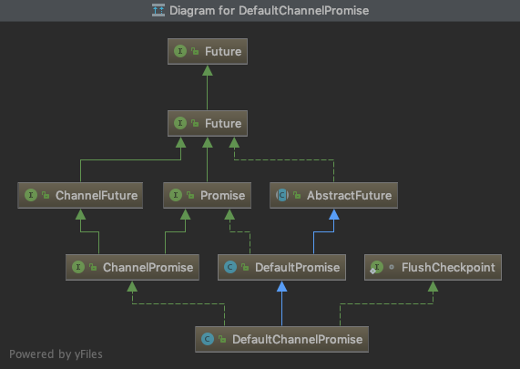

# ChannelFuture

`ChannelFuture`代表`netty`中`IO`事件的异步任务的结果

`ChannelFuture`有四中状态，如下图:

成功，失败，取消，都表示这个任务完成

```doc
                                       +---------------------------+
                                       | Completed successfully    |
                                       +---------------------------+
                                  +---->      isDone() = true      |
  +--------------------------+    |    |   isSuccess() = true      |
  |        Uncompleted       |    |    +===========================+
  +--------------------------+    |    | Completed with failure    |
  |      isDone() = false    |    |    +---------------------------+
  |   isSuccess() = false    |----+---->      isDone() = true      |
  | isCancelled() = false    |    |    |       cause() = non-null  |
  |       cause() = null     |    |    +===========================+
  +--------------------------+    |    | Completed by cancellation |
                                  |    +---------------------------+
                                  +---->      isDone() = true      |
                                       | isCancelled() = true      |
                                       +---------------------------+
```

类图：



可以给`ChannelFuture`添加一个`GenericFutureListener`在事件完成的时候收到一个通知.