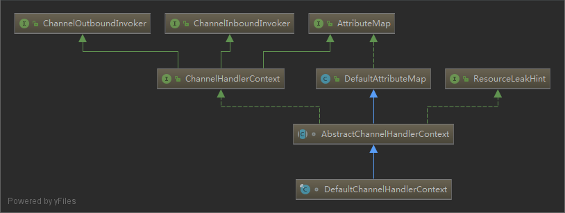
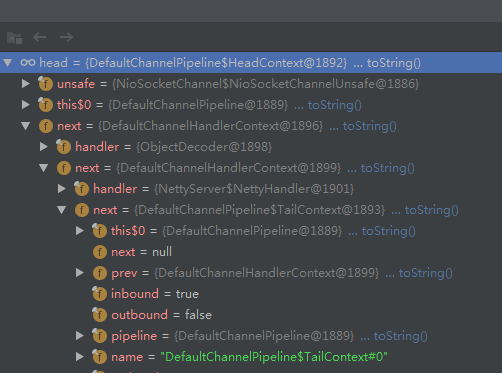

# ChannelHandlerContext

`ChannelHandlerContext` 在 `Netty` 中负责包装 `ChannelHandler`

被 `DefaultChannelPipeline` 引用 `head` 和 `tail`

方便 `pipeline` 操作 `AbstractChannelHandlerContext` 链

> DefaultChannelPipeline

```java
final AbstractChannelHandlerContext head;
final AbstractChannelHandlerContext tail;
```

`DefaultChannelPipeline` 提供了 `addLast` `addFirst` 等方法,使 `AbstractChannelHandlerContext` 形成链表

代码如下：

```java
private void addFirst0(AbstractChannelHandlerContext newCtx) {
    AbstractChannelHandlerContext nextCtx = head.next;
    newCtx.prev = head;
    newCtx.next = nextCtx;
    head.next = newCtx;
    nextCtx.prev = newCtx;
}
```

## addLast

已 `addLast` 方法为例子:

```java
// addLast 会把 channelHadler 调用 newContext
// 方法包装成 AbstractChannelHandlerContext
// 通过 addLast0 方法形成 ctx 链
@Override
public final ChannelPipeline addLast(EventExecutorGroup group, String name, ChannelHandler handler) {
    final AbstractChannelHandlerContext newCtx;
    synchronized (this) {
        checkMultiplicity(handler);
        newCtx = newContext(group, filterName(name, handler), handler);
        addLast0(newCtx);
        // If the registered is false it means that the channel was not registered on an eventloop yet.
        // In this case we add the context to the pipeline and add a task that will call
        // ChannelHandler.handlerAdded(...) once the channel is registered.
        if (!registered) {
            newCtx.setAddPending();
            callHandlerCallbackLater(newCtx, true);
            return this;
        }
        EventExecutor executor = newCtx.executor();
        if (!executor.inEventLoop()) {
            newCtx.setAddPending();
            executor.execute(new Runnable() {
                @Override
                public void run() {
                    callHandlerAdded0(newCtx);
                }
            });
            return this;
        }
    }
    callHandlerAdded0(newCtx);
    return this;
}
```

## DefaultChannelHandlerContext



## ChannelPipeline and Channel

`ChannelPipeline` 与 `Channel` 进行关联

```java
// AbstractChannel 的构造方法
protected AbstractChannel(Channel parent) {
    this.parent = parent;
    id = newId();
    unsafe = newUnsafe();
    pipeline = newChannelPipeline();
}
```

`Channel` 转发 `IO` 事件

当 `IO` 事件发生的时候，`Channel` 把读取到的 `byte` 数据交给 `pipeline` 处理

具体的代码如下：

```java
// AbstractNioByteChannel#NioByteUnsafe#read
pipeline.fireChannelRead(byteBuf);
```

> 看个 demo



从上图可以看下目前这个 `ctx` 链

```java
HeadContext -> DeafultChannelHandlerContext(ObjectDecoder) -> DeafultChannelHandlerContext(NettyHandler) -> TailContext
```

> 相关代码

```java
/**
 * 负责pipeline的组装
 */
final class ChannelInitializerImpl extends ChannelInitializer<Channel> {
    @Override
    protected void initChannel(Channel ch) throws Exception {
        ChannelPipeline pipeline = ch.pipeline();
        // ObjectDecoder 负责把 byte 转化成 java 对象
        pipeline.addLast(new ObjectDecoder(new MyClassResolver()));
        // NettyHandler 处理业务逻辑
        pipeline.addLast(new NettyHandler());
    }
}
```

## Netty in action

下面的图片来自 `Netty in action`


