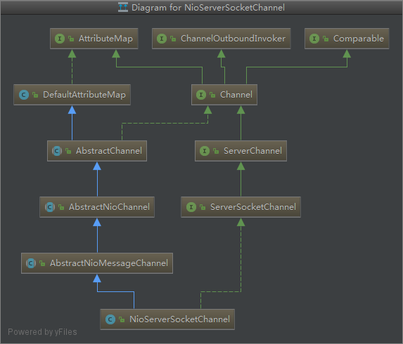

# Channel

从下面几点了解`NioServerSocketChannel`与`NioSocketChannel`

1. [创建实例](#创建实例)
2. [open ServerSocketChannel](#创建ServerSocketChannel)
3. [unsafe 和 pipeline 的初始化](#unsafe和pipeline的初始化)
4. [设置为非阻塞模式](#设置为非阻塞模式)
5. [NioServerSocketChannel绑定 Selector](#绑定Selector)
6. [NioServerSocketChannel绑定 Socket](#绑定Socket)
7. [NioSocketChannel 与 NioServerSocketChannel](#NioSocketChannel与NioServerSocketChannel)
8. [NioSocketChannel与Selector绑定](#ServerBootstrapAcceptor)

> 上面的几个步骤在 java Nio 中是`同步`的代码调用，而在 Netty 中，进行了`异步`的处理,把 5,6 步骤放到了 taskQueue,让 NioEventLoop 进行处理
> 同时也会把注册事件放入到 pipeline 中进行流处理(比如你可以注册一个 ChannelHandler 对注册事件进行特殊的处理)

## NioServerSocketChannel



### 创建实例

`AbstractBootstrap#initAndRegister`

```java
    // 利用反射进行初始化
    // 这里是一个无参的构造方法
    channel = channelFactory.newChannel();
    init(channel);
```

### 创建ServerSocketChannel

`NioServerSocketChannel#newSocket`

```java
    private static ServerSocketChannel newSocket(SelectorProvider provider) {
        try {
            /**
             *  Use the {@link SelectorProvider} to open {@link SocketChannel} and so remove condition in
             *  {@link SelectorProvider#provider()} which is called by each ServerSocketChannel.open() otherwise.
             *
             *  See <a href="https://github.com/netty/netty/issues/2308">#2308</a>.
             */
             // 通过 SelectorProvider 来打开一个Channel
             // provider 一个静态变量，为了提升性能
            return provider.openServerSocketChannel();
        } catch (IOException e) {
            throw new ChannelException(
                    "Failed to open a server socket.", e);
        }
    }
```

## 设置为非阻塞模式

`AbstractNioChannel#AbstractNioChannel`

```java
    protected AbstractNioChannel(Channel parent, SelectableChannel ch, int readInterestOp) {
        super(parent);
        this.ch = ch;
        this.readInterestOp = readInterestOp;
        try {
            // 设置为非阻塞模式
            ch.configureBlocking(false);
        } catch (IOException e) {
            try {
                ch.close();
            } catch (IOException e2) {
                if (logger.isWarnEnabled()) {
                    logger.warn(
                            "Failed to close a partially initialized socket.", e2);
                }
            }

            throw new ChannelException("Failed to enter non-blocking mode.", e);
        }
    }
```

## unsafe和pipeline的初始化

`AbstractChannel#AbstractChannel`

`Channel` 在初始化的时候，会进行`unsafe`和`pipeline`的初始化,代码如下:

```java
    protected AbstractChannel(Channel parent) {
        this.parent = parent;
        id = newId();
        unsafe = newUnsafe();
        pipeline = newChannelPipeline();
    }
```

## 绑定Selector

`AbstractNioChannel#doRegister`

这个过程是异步的,这个绑定`Selector`事件是通过`pipeline`提交给`EventLoop`进行绑定的

最终的实现代码如下：

```java
    @Override
    protected void doRegister() throws Exception {
        boolean selected = false;
        for (;;) {
            try {
                // 第一个参数： Selector与channel进行绑定
                // 第二个参数： 这里经典的做法是设置为 SelectionKey#OP_ACCEPT, 但是这里设置为0
                // Netty是在AbstractNioChannel#doBeginRead 进行了绑定,可看下面的解释
                // 第三个参数： 把 this就是NioServerSocketChannel当做附件进行绑定，方便后续使用
                selectionKey = javaChannel().register(eventLoop().unwrappedSelector(), 0, this);
                return;
            } catch (CancelledKeyException e) {
                if (!selected) {
                    // Force the Selector to select now as the "canceled" SelectionKey may still be
                    // cached and not removed because no Select.select(..) operation was called yet.
                    eventLoop().selectNow();
                    selected = true;
                } else {
                    // We forced a select operation on the selector before but the SelectionKey is still cached
                    // for whatever reason. JDK bug ?
                    throw e;
                }
            }
        }
    }

    // AbstractNioChannel#doBeginRead
    @Override
    protected void doBeginRead() throws Exception {
        // Channel.read() or ChannelHandlerContext.read() was called
        final SelectionKey selectionKey = this.selectionKey;
        if (!selectionKey.isValid()) {
            return;
        }

        readPending = true;

        final int interestOps = selectionKey.interestOps();
        // interestOps 其实就是 javaChannel().register(eventLoop().unwrappedSelector(), 0, this); 0这个参数
        // readInterestOp 其实就是SelectionKey#OP_ACCEPT(readInterestOp在AbstractNioChannel的构造方法中进行的初始化)
        // 这里进行检查如果插入的事件是0，那么就进行OP_ACCEPT的注册
        if ((interestOps & readInterestOp) == 0) {
            selectionKey.interestOps(interestOps | readInterestOp);
        }
    }
```

### 绑定Socket

`NioServerSocketChannel#doBind`

这个过程是异步的,这个绑定`Socket`事件是通过 pipeline 提交给 EventLoop 进行绑定的

最终的实现代码如下：

```java
    @Override
    protected void doBind(SocketAddress localAddress) throws Exception {
        if (PlatformDependent.javaVersion() >= 7) {
            javaChannel().bind(localAddress, config.getBacklog());
        } else {
            javaChannel().socket().bind(localAddress, config.getBacklog());
        }
    }
```

### NioSocketChannel与NioServerSocketChannel

| NioSocketChannel                                   | NioServerSocketChannel                                         |
| -------------------------------------------------- | -------------------------------------------------------------- |
|  |  |

从类图中可以看出`NioSocketChannel`与`NioServerSocketChannel`不同:

NioSocketChannel 继承了 `AbstractNioByteChannel`
NioServerSocketChannel 继承了 `AbstractNioMessageChannel`

> NioServerSocketChannel 代表服务端，NioSocketChannel代表连接的客户端

`AbstractNioByteChannel` 与 `AbstractNioMessageChannel` 实现了不同的 `newUnsafe`方法

`AbstractNioByteChannel#newUnsafe`

```java
    @Override
    protected AbstractNioUnsafe newUnsafe() {
        // NioSocketChannel 的的unsafe
        return new NioByteUnsafe();
    }
```

`AbstractNioMessageChannel#newUnsafe`

```java
    @Override
    protected AbstractNioUnsafe newUnsafe() {
        // NioServerSocketChannel 的unsafe
        return new NioMessageUnsafe();
    }
```

在EventLopp中有下面这个代码:

```java
            // Also check for readOps of 0 to workaround possible JDK bug which may otherwise lead
            // to a spin loop
            if ((readyOps & (SelectionKey.OP_READ | SelectionKey.OP_ACCEPT)) != 0 || readyOps == 0) {
                // 正式因为这个unsafe类型的不同，可以可以对OP_READ事件和OP_ACCEPT分别进行处理
                // 如果是OP_ACCEPT事件，unsafe就是 -> NioServerSocketChannel 的unsafe
                // 否则就是 -> NioSocketChannel 的的unsafe
                // 而NioServerSocketChannel的unsafe的读事件中，调用accept，并初始化了NioSocketChannel(客户端)
                // 并通过  pipeline.fireChannelRead(readBuf.get(i)); 进行事件广播
                // 最终事件被ServerBootstrapAcceptor（其实也是一个ChannelHandler）处理
                // ServerBootstrapAcceptor 负责把这个客户端的NioSocketChannel与EventLoop，Selector进行关联
                // 具体的代码实现可以看下面ServerBootstrapAcceptor的实现
                unsafe.read();
            }
```

## ServerBootstrapAcceptor

```java
 // ServerBootstrapAcceptor 继承了ChannelInboundHandlerAdapter,其实就是一个ChannelHandler
 // 可以把ServerBootstrapAcceptor放入到pipeline进行流处理
 private static class ServerBootstrapAcceptor extends ChannelInboundHandlerAdapter {
 }
```

`ServerBootstrapAcceptor`重写了`channelRead`方法,代码如下:

```java
        @Override
        @SuppressWarnings("unchecked")
        public void channelRead(ChannelHandlerContext ctx, Object msg) {
            // 这个事件是在EventLoop中unsafe.read()触发的
            // child 这个channel是客户端的链接
            final Channel child = (Channel) msg;

            child.pipeline().addLast(childHandler);

            setChannelOptions(child, childOptions, logger);

            for (Entry<AttributeKey<?>, Object> e: childAttrs) {
                child.attr((AttributeKey<Object>) e.getKey()).set(e.getValue());
            }

            try {
                // childGroup 本质上也是一个EventLoopGroup
                // childGroup 是在ServerBootstrap初始的时候初始化的
                // childGroup.register 这个方法的含义是从childGroup选择一个(轮询的方式)EventLoop与Channel
                // 进行绑定，并且使用Selector管理Channel，
                // 从而形成了下图的EventLoop 与Channel映射关系
                childGroup.register(child).addListener(new ChannelFutureListener() {
                    @Override
                    public void operationComplete(ChannelFuture future) throws Exception {
                        if (!future.isSuccess()) {
                            forceClose(child, future.cause());
                        }
                    }
                });
            } catch (Throwable t) {
                forceClose(child, t);
            }
        }
```

最终EventLoop与Channel关系，如下图：

一个`EventLoop`会关联多个`Channel`

