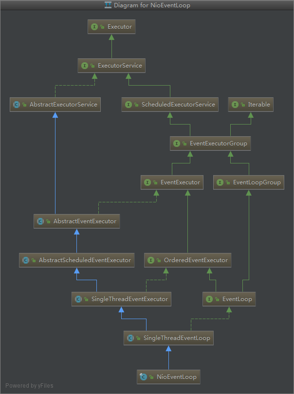
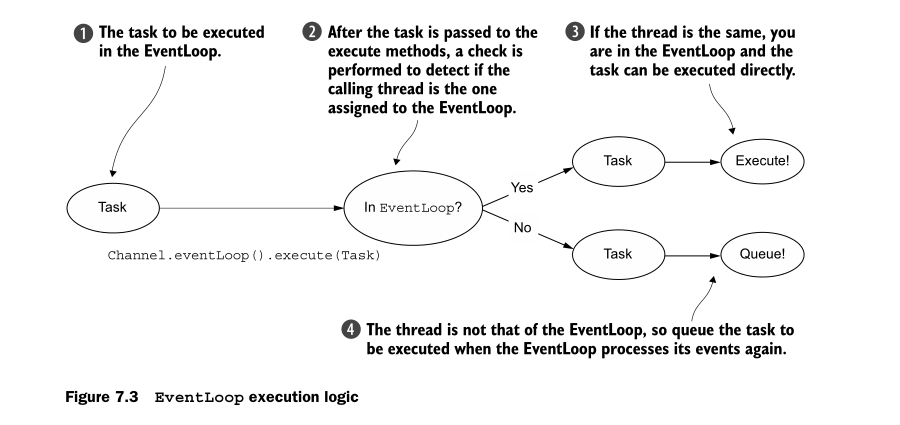
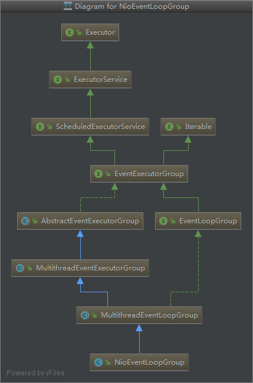
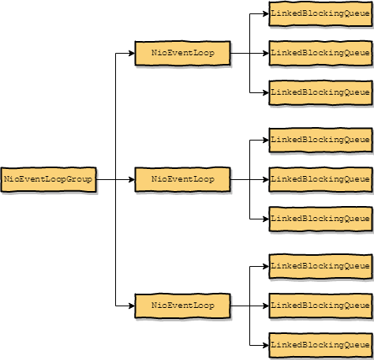

# EventLoop

## 1. NioEventLoop

类图继承关系：



从这个类图种可以看到`NioEventLoop`的作用：

1. 继承了`ExecutorService`,因此可以作为一个线程池,执行提交的任务
2. 继承了`ScheduledExecutorService`,  因此可以进行`定时`任务的执行
3. 继承了`EventLoopGroup`

下面从这几个方面进行分析：

01. EventLoop 的初始化
02. EventLoop 的定时任务
03. EventLoop 的异步任务
04. EventLoop I/O task and non-I/O tasks
05. EventLoop 核心方法 run
06. EventLoop 核心方法 processSelectedKeys
07. EventLoop 核心方法 processSelectedKey
08. EventLoop 核心方法 select
09. EventLoop 核心方法 runAllTasks
10. EventLoop 与 EventLoopGroup

### EventLoop 的初始化

`Channel`在进行初始之后，会进行一个注册`register`的操作,这个时候`Channel`与`EventLoop`进行了关联

`AbstractChannel#AbstractUnsafe#register`

```java
        @Override
        public final void register(EventLoop eventLoop, final ChannelPromise promise) {
            // 省略其它代码
            // Channel 与eventLoop 进行关联
            AbstractChannel.this.eventLoop = eventLoop;
            // 其他注册事件处理
            if (eventLoop.inEventLoop()) {
                register0(promise);
            } else {
                try {
                    eventLoop.execute(new Runnable() {
                        @Override
                        public void run() {
                            register0(promise);
                        }
                    });
                } catch (Throwable t) {
                    logger.warn(
                            "Force-closing a channel whose registration task was not accepted by an event loop: {}",
                            AbstractChannel.this, t);
                    closeForcibly();
                    closeFuture.setClosed();
                    safeSetFailure(promise, t);
                }
            }
        }
```

### EventLoop 的定时任务

下面来自 `Netty in action`

Occasionally(偶尔) you’ll need to schedule a task for later (deferred) or periodic execution.
For example, you might want to register a task to be fired after a client has been connected for five minutes. A common use case is to send a heartbeat message to a
remote peer to check whether the connection is still alive. If there is no response, you
know you can close the channel

个人理解 `EventLoop`提供的定时任务和 jdk 提供的定时任务执行 API 功能相似，但是 netty 的`EventLoop`与
`Channel`进行了关联，可以定时对`Channel`连接执行一些操作(如心跳检查)

### EventLoop 的异步任务

下面来自 `Netty in action`

If the calling Thread is that of the EventLoop , the code block in question is executed. Otherwise, the EventLoop schedules a task for later execution and puts it in an
internal queue. When the EventLoop next processes its events, it will execute those in
the queue. This explains how any Thread can interact directly with the Channel with-
out requiring synchronization in the ChannelHandlers.

如果当前运行的线程和`EventLoop`是同一个线程，那么就直接执行这个任务，否则就吧这个任务提交到任务队列
进行异步任务的执行

```java
    // SingleThreadEventExecutor 中维护了一个任务队列，进行异步任务的处理
   private final Queue<Runnable> taskQueue;
```



代码例子：

```java
            if (eventLoop.inEventLoop()) {
                // 是同一个线程
                register0(promise);
            } else {
                // 不是同一个线程
                // 包装成Runnable，放到任务队列进行执行
                eventLoop.execute(new Runnable() {
                        @Override
                        public void run() {
                            register0(promise);
                        }
                    });
            }
```

We stated earlier the importance of not blocking the current I/O thread. We’ll say
it again in another way: “Never put a long-running task in the execution queue,
because it will `block` any other task from executing on the same thread.” If you must
make blocking calls or execute long-running tasks, we advise the use of a dedicated EventExecutor

> 请不要在`taskQueue`进行`耗时`的异步任务，耗时的任务会阻塞其他任务的执行（性能会下降）

### EventLoop I/O task and non-I/O tasks

- I/O task IO 事件
- non-I/O tasks 非 IO 事件

ioRatio 默认是`1:1`的比率，即如果IO实际执行了10秒，那么非 IO 事件也执行10秒

```java
if (ioRatio == 100) {
    try {
        // 如果 ioRatio=100
        // 执行发生的IO事件(比如：socket连接，socket读事件，socket写事件)
        processSelectedKeys();
    } finally {
        // Ensure we always run tasks.
        // 执行在taskQueue中的任务
        runAllTasks();
    }
} else {
    final long ioStartTime = System.nanoTime();
    try {
        processSelectedKeys();
    } finally {
        // Ensure we always run tasks.
        final long ioTime = System.nanoTime() - ioStartTime;
        // 如果ioTime执行了 60 纳秒，ioRatio=50
        // 那么执行任务的时间就是60纳秒
        runAllTasks(ioTime * (100 - ioRatio) / ioRatio);
    }
}
```

### EventLoop 核心方法 run

[源码地址 NioEventLoop](https://github.com/netty/netty/blob/4.1/transport/src/main/java/io/netty/channel/nio/NioEventLoop.java#L401-L484)

不同版本的源代码，存在细微的差别

```java

    private final IntSupplier selectNowSupplier = new IntSupplier() {
        @Override
        public int get() throws Exception {
            return selectNow();
        }
    };

    // DefaultSelectStrategy
    @Override
    public int calculateStrategy(IntSupplier selectSupplier, boolean hasTasks) throws Exception {
        // 如果有任务，就返回selectNow,否则去执行SELECT操作，SELECT阻塞操作，同时可以用wakenUp结束阻塞，（即唤醒）
        // SELECT 里面是一个无限运行，根据wakenUp等条件，可以决定是否结束循环
        return hasTasks ? selectSupplier.get() : SelectStrategy.SELECT;
    }

 protected void run() {
        for (;;) {//无线循环
            try {
                // 根据条件，来决定是去SELECT还是继续当前的循环
                switch (selectStrategy.calculateStrategy(selectNowSupplier, hasTasks())) {
                    case SelectStrategy.CONTINUE:// 继续当前的循环
                        continue;

                    case SelectStrategy.BUSY_WAIT:
                        // fall-through to SELECT since the busy-wait is not supported with NIO

                    case SelectStrategy.SELECT:// 进行Select操作
                        select(wakenUp.getAndSet(false));

                        if (wakenUp.get()) {
                            selector.wakeup();
                        }
                        // fall through
                    default:
                }

                cancelledKeys = 0;
                needsToSelectAgain = false;
                final int ioRatio = this.ioRatio;
                if (ioRatio == 100) {
                    try {
                        // 如果ioRatio是100，那执行索引已经就绪的IO事件
                        processSelectedKeys();
                    } finally {
                        // Ensure we always run tasks.
                        // 最后执行任务队列中的所有任务
                        runAllTasks();
                    }
                } else {
                    // ioStartTime 开始时间
                    final long ioStartTime = System.nanoTime();
                    try {
                        // 处理已经就绪的IO事件
                        processSelectedKeys();
                    } finally {
                        // Ensure we always run tasks.
                        // ioTime 计算出IO消耗的时间
                        final long ioTime = System.nanoTime() - ioStartTime;
                        // 计算执行task的时间,按照百分比进行计算
                        // 如果ioRatio=50,那么他们的比率就是1:1，即执行IO的时间
                        // 与执行task的时间相同
                        runAllTasks(ioTime * (100 - ioRatio) / ioRatio);
                    }
                }
            } catch (Throwable t) {
                handleLoopException(t);
            }
            // Always handle shutdown even if the loop processing threw an exception.
            try {
                if (isShuttingDown()) {
                    closeAll();
                    if (confirmShutdown()) {
                        return;
                    }
                }
            } catch (Throwable t) {
                handleLoopException(t);
            }
        }
    }
```

### EventLoop 核心方法 processSelectedKeys

```java
    // processSelectedKeys方法实现
    private void processSelectedKeys() {
        if (selectedKeys != null) {
            // 如果selectedKeys不是null，执行优化的Select操作

            // 这里来说下Netty是怎么优化进行Selectkey的优化的
            // java的NIO中Selector的实现类中，使用HashSet来存储已经就绪的IO事件的
            // Netty中在 NioEventLoop#openSelector 这个方式中，利用反射，自己实现了一个set
            // 而netty这个set是基于数组实现的，
            // netty实现类SelectedSelectionKeySet继承了AbstractSet并重写了add和iterator方法
            // 而我们知道HashSet在add 的时候会对key做hash操作,而netty实现的SelectedSelectionKeySet的add操作
            // 直接通过数组下标，进行add操作，效率比HashSet更快(少了hasgcode这个步骤)

            // 首先我们知道 一个Selector可以管理多个Channel,
            // 优化的同时也引入了另一个问题，HashSet 有remove方法来删除已经处理的IO事件(可以理解为Selector中hashset 与 Channel引用关系)，而
            // SelectedSelectionKeySet 没有实现remove方法，因此需要我们自己手动断开IO事件与数组引用，保证GC正常回收
            // Selector 与 Channel 是绑定的，因此Selector中的HashSet是常驻内存的。如果不进行回收，重复的垃圾对象会一直增加,
            // 比如: Channel发生了一次IO事件，就会向这个selectedKeys中插入一个key
            // 可以在 SelectedSelectionKeySet的reset方法中找到相关的操作
            // 此外 selectedKeys.keys[i] = null; 这个操作断开了Selector 与 Channel 之间的引用关系，在之后某一个Channel关闭的时候
            // 保证GC可以回收这个Channel
            processSelectedKeysOptimized();
        } else {
            // 执行普通的Select操作
            // 经典的java Nio操作
            processSelectedKeysPlain(selector.selectedKeys());
        }
    }
```

### EventLoop 核心方法 processSelectedKey

这个方法是遍历所有IO实践的后续处理

```java
    private void processSelectedKey(SelectionKey k, AbstractNioChannel ch) {
        final AbstractNioChannel.NioUnsafe unsafe = ch.unsafe();
        // 检查channel和selector是否有效
        if (!k.isValid()) {
            final EventLoop eventLoop;
            try {
                eventLoop = ch.eventLoop();
            } catch (Throwable ignored) {
                // 这里eventLoop之间的绑定是异步的，如果发生了异常，就忽略
                // If the channel implementation throws an exception because there is no event loop, we ignore this
                // because we are only trying to determine if ch is registered to this event loop and thus has authority
                // to close ch.
                return;
            }
            // Only close ch if ch is still registered to this EventLoop. ch could have deregistered from the event loop
            // and thus the SelectionKey could be cancelled as part of the deregistration process, but the channel is
            // still healthy and should not be closed.
            // See https://github.com/netty/netty/issues/5125
            // 检查eventLoop的合法性
            if (eventLoop != this || eventLoop == null) {
                return;
            }
            // close the channel if the key is not valid anymore
            unsafe.close(unsafe.voidPromise());
            return;
        }

        try {
            int readyOps = k.readyOps();
            // We first need to call finishConnect() before try to trigger a read(...) or write(...) as otherwise
            // the NIO JDK channel implementation may throw a NotYetConnectedException.
            // 连接事件
            // & 操作的实现可以参考这个文章 https://github.com/web1992/read/blob/master/java/nio-selection-key.md
            if ((readyOps & SelectionKey.OP_CONNECT) != 0) {
                // remove OP_CONNECT as otherwise Selector.select(..) will always return without blocking
                // See https://github.com/netty/netty/issues/924
                int ops = k.interestOps();
                ops &= ~SelectionKey.OP_CONNECT;
                k.interestOps(ops);

                unsafe.finishConnect();
            }

            // Process OP_WRITE first as we may be able to write some queued buffers and so free memory.
            // 写事件
            if ((readyOps & SelectionKey.OP_WRITE) != 0) {
                // Call forceFlush which will also take care of clear the OP_WRITE once there is nothing left to write
                ch.unsafe().forceFlush();
            }

            // Also check for readOps of 0 to workaround possible JDK bug which may otherwise lead
            // to a spin loop
            // 读事件和连接事件
            if ((readyOps & (SelectionKey.OP_READ | SelectionKey.OP_ACCEPT)) != 0 || readyOps == 0) {
                unsafe.read();
            }
        } catch (CancelledKeyException ignored) {
            unsafe.close(unsafe.voidPromise());
        }
    }
```

### EventLoop 核心方法 select

## NioEventLoopGroup

NioEventLoopGroup 的类图



1. `EventExecutorGroup`的作用
2. `EventExecutorGroup`的初始化

### `EventExecutorGroup`的作用

`EventExecutorGroup` 维护了一组`NioEventLoop`,并且提供了`EventExecutor next();`方法在这个数组中选择一个`NioEventLoop`进行事件的处理
这个方法提供了一个轮询策略，来选择不同的线程(可参考这篇文章[EventExecutorChooser](source-code-EventExecutorChooser.md))

### `EventExecutorGroup`的初始化

我们在构造一个`ServerBootstrap`对象的时候，需要一个`EventLoopGroup`，代码如下：

```java
    public void bootstrap() {
        NioEventLoopGroup group = new NioEventLoopGroup();
        ServerBootstrap bootstrap = new ServerBootstrap();
        bootstrap.group(group)
                .channel(NioServerSocketChannel.class)
                .childHandler(new SimpleChannelInboundHandler<ByteBuf>() {
                    @Override
                    protected void channelRead0(ChannelHandlerContext channelHandlerContext,
                                                ByteBuf byteBuf) throws Exception {
                        System.out.println("Received data");
                    }
                });
        ChannelFuture future = bootstrap.bind(new InetSocketAddress(8081));
        future.addListener(new ChannelFutureListener() {
            @Override
            public void operationComplete(ChannelFuture channelFuture)
                    throws Exception {
                if (channelFuture.isSuccess()) {
                    System.out.println("Server bound");
                } else {
                    System.err.println("Bind attempt failed");
                    channelFuture.cause().printStackTrace();
                }
            }
        });
    }
```

最终的方法在`MultithreadEventExecutorGroup#MultithreadEventExecutorGroup`的构造方法中实现的，

```java
this(nThreads, executor, DefaultEventExecutorChooserFactory.INSTANCE, args);
```

这个方法提供 4 个参数：

- nThreads 线程池的线程个数
- executor 线程执行器
- 线程选择器（实际是一个线程轮询策略）
- 其他参数,在`newChild(executor, args)`进行使用

`newChild`的代码实现(`NioEventLoopGroup#newChild`)：

```java
    @Override
    protected EventLoop newChild(Executor executor, Object... args) throws Exception {
        return new NioEventLoop(this, executor, (SelectorProvider) args[0],
            ((SelectStrategyFactory) args[1]).newSelectStrategy(), (RejectedExecutionHandler) args[2]);
    }
```

方法参数:

- this NioEventLoopGroup,这个线程所在的线程组
- executor 线程执行器
- SelectorProvider
- Selector 事件模型,nio 中 Selector 的实现
- RejectedExecutionHandler 异常处理

初始之后，`EventExecutorGroup`,`NioEventLoop`类之间的引用关系:



虽然`EventExecutorGroup`中有多个`NioEventLoop`,但是只有一个`NioEventLoop`会与`Channel`进行关联，处理 IO 事件的转发

## 参考资料

- [eventLoop(开源中国)](https://my.oschina.net/andylucc/blog/618179)
- [eventLoop(segmentfault)](https://segmentfault.com/a/1190000007403873)
