# mmap

## sbrk 函数

```c
#include <unistd.h>

void* sbrk(intptr_t incr);
```

sbrk 通过给内核的 brk 变量增加 incr，来改变堆的大小，incr 可以为负数。当 incr 为正数时，堆增大，当 incr 为负数时，堆减小。
如果 sbrk 函数执行成功，那返回值就是 brk 的旧值；如果失败，就会返回 -1，同时会把 errno 设置为 ENOMEM。


```c
// mmap 函数定义
#include <unistd.h>
#include <sys/mman.h>

void* mmap(void* addr, size_t length, int prot, int flags, int fd, off_t offset);

// addr 代表该区域的起始地址；
// length 代表该区域长度；
// prot 描述了这块新的内存区域的访问权限；
// flags 描述了该区域的类型；
// fd 代表文件描述符；
// offset 代表文件内的偏移值
```

||私有映射|共享映射|
|---|-----|--------|
|匿名映射|私有匿名映射，常用于分配内存|共享匿名映射，常用于父子进程间共享内存，因为只有父子进程之间才能对同一个mmap的返回值进行访问
|文件映射|私有文件映射，常用于加载动态库。如果只是读和执行，那么物理内存中只有一份副本。 如果动态库中存在全局变量，则数据段就会被复制一份，变成每个进程独有的，而这正是我们所期望的|共享文件映射，可以用于多个进程之间的共享内存。共享内存是通过文件名建立起联系的

- 私有匿名映射，用于分配堆空间；
- 共享匿名映射，用于父子进程之间通讯；
- 私有文件映射，用于加载动态链接库；
- 共享文件映射，用于多进程之间通讯。

## mmap 是如何用于父子进程之间的通信的

```c
// 使用共享匿名映射，进行父子进程之间的通信
#include <sys/mman.h>
#include <stdlib.h>
#include <stdio.h>
#include <unistd.h>

int main() {
    pid_t pid;

    char* shm = (char*)mmap(0, 4096, PROT_READ | PROT_WRITE,
        MAP_SHARED | MAP_ANONYMOUS, -1, 0);

    if (!(pid = fork())){
        sleep(1);
        printf("child got a message: %s\n", shm);
        sprintf(shm, "%s", "hello, father.");
        exit(0);
    }
  
    sprintf(shm, "%s", "hello, my child");
    sleep(2);
    printf("parent got a message: %s\n", shm);

    return 0;
}
```

当用 mmap 创建共享文件映射。它的作用其实和共享匿名映射相似，也可以用于进程间通讯。不同的是，共享文件映射是通过文件名来创建共享内存区域的，这就让没有父子关系的进程，也可以通过相同的文件创建共享内存区域，从而可以使用共享内存进行进程间通讯。

## 常见的内存类型划分

程序员最关心的是用户空间，用户空间大致可以分为栈、堆、bss 段、数据段和代码段：

- 代码段保存的是程序的机器指令，这一段区域的内存往往是可读可执行，但不可写；
- 数据段保存的是程序的静态变量和全局变量；
- bss 段用于无初值的变量区域；
- 堆是程序员可以自由申请的空间，当我们在写程序时要保存数据，优先会选择堆；
- 栈是函数执行时的活跃记录。


