# 第二章 标记-清扫回收

关键字：

- 三色抽象
- 标记-清扫算法
- 位图标记
- 空间大小分级 size class
- 位图
- 字节图 byte-map
- 换页次数
- 惰性清扫

标记-清扫(mark-sweep)、标记-复制(mark-copy)、 标记-整理(mark-compact)、引用计数(reference counting)是 4 种最基本的垃圾回收策略。
大多数回收器可能会以不同的方式对这些基本回收策略进行组合，例如在堆中某一区域使用一种回收策略，而在另一个区域使用另一种回收策略。

在对这 4 种基本回收策略进行描述时，我们假设赋值器运行在一个或者多个线程之上，
且**只有一个回收器线程**，当回收器线程运行时，所有的**赋值器线程**均处于停止状态。这种
“万物静止”(stop the world)的策略大幅简化了回收器的实现。

从赋值器线程角度来看，回收过程的执行是原子性的，即赋值器线程感知不到回收器的任何中间状态，
回收器也不会受到赋值器线程的任何干扰。我们假设当回收过程开始时，赋值器线程停止在一个允许回收器
安全扫描其根集合的回收点，具体的运行时接口我们将在第 11 章详述。

通过“万物静止”的方法可以获取**堆的快照**，因此回收器在进行对象存活性判定时不用担心赋值器将堆中对象
的拓扑结构重新排列。这同时也意味着在回收器释放内存的过程中，我们无需担心在同一时
刻存在其他回收器释放内存或者赋值器线程申请内存，进而避免在线程之间引人额外的同步
机制。多赋值器线程同时获取内存的情况我们将在第 7 章讨论，多回收器线程，或者赋值器
与回收器并发执行的情况将导致运行时系统更加复杂，我们将在后面的章节中进行讨论。

理想的垃圾回收的目的是回收程序不再使用的对象所占用的空间，任何自动内存管理系
统都面临 3 个任务:

- 1)为新对象分配空间。
- 2)确定存活对象。
- 3)回收死亡对象所占用的空间。

这些任务并非相互独立，特别是回收空间的方法影响着分配新空间的方法。正如第 1 章
所提到的，真正的存活性问题是一个不可确定的问题，因此我们使用指针可达性(参见 1.6
节)来近似对象的存活性:只有当堆中存在一条从根出发的指针链能最终到达某个对象时，
才能认定该对象存活，更进一步，如果不存在这样一条指针链，则认为对象死亡，其空间可
以得到回收。尽管存活对象集合中可能包含一些永远不会再被赋值器访问的对象，但是死亡
对象集合中的对象却必定是死亡的。

标记-清扫算法[McCarthy,1960]是我们将要介绍的第一种回收算法，它是在指针
可达性递归定义指导下最直接的回收方案。

它的回收过程分为两个阶段:

第一阶段为追踪(trace)阶段，即回收器从根集合(寄存器、线程栈、全局变量)开始遍历对象图，并标记(mark)所遇到的每个对象;
第二阶段为清扫(sweep) 阶段，即回收器检查堆中每一个对象，并将所有`未标记`的对象当作垃圾进行回收。

标记-清扫算法是一种`间接回收`(indirect collection)算法，它并非直接检测垃圾本身，
而是先确定所有存活对象，然后反过来判定其他对象都是垃圾。需要注意的是，该算法的每
次调用都需要重新计算存活对象集合，但并非所有的垃圾回收算法都需要如此。第 5 章将介
绍一种`直接回收`(direct collection) 策略，即引用计数。与间接回收不同，直接回收可以通
过对象本身来判断其存活性，因此其不需要额外的追踪过程。

## 标记-清扫算法

从垃圾回收器角度来看，赋值器线程所执行的只有 3 种操作:`创建`、`读`、`写`。每一个回
收算法必须对这 3 种操作进行合理的重定义(1.6 节给出了默认的定义)。标记-清扫算法
与赋值器之间的接口十分简单:如果线程无法分配对象，则唤起回收器，然后再次尝试分配
(如算法 2.1 所示)。为了强调回收器工作在“万物静止”模式下而非与赋值器线程并发执行，
我们特别使用 `atomic` 关键字来标记回收程序。如果回收完成之后仍然没有足够的内存以满
足分配需求，则说明堆内存耗尽。

```c
// 算法 2.1 标记-清扫：分配
New():
    ref <- allocate()
    if ref = null /*堆中无可用空间*/
        collect()
        ref <- allocate()
    if ref= null
        /*堆中仍然无可用空间*/
        error "Out of memory"
    return ref

atomic collect():
    markF romRoots( )
    sweep(HeapStart, HeapEnd)
```

```c
// 算法 2.2 标记-清扫: 标记
markFromRoots():
    initialise(worklist)
    for each fld in Roots
        ref <- *fld
        if ref != null & not isMarked(ref)
            setMarked(ref)
            add(worklist, ref)
            mark()

initialise(worklist):
    worklist < - empty

mark():
    while not isEmpty(worklist)
        ref <- remove(worklist)  /* ref已经标记过*/
        for each fld in Pointers(ref)
        child t <- *fld
        if child != null && not isMarked(child)
            setMarked(child)
            add(worklist, child)
```

```c
// 算法 2.3 标记-清扫:清扫
sweep(start, end):
scan <- start
while scan < end
    if isMarked( scan)
        unsetMarked(scan)
    else free(scan)
        scan <- nextObject(scan)
```

我们将在第 7 章之后讨论 allocate 和 free 的具体实现细节，但需要注意的是，标记-清
扫回收器要求堆布局满足一定的条件:第一，标记-清扫回收器不会移动对象，因此内存管理
器必须能够控制堆内存碎片，这是因为过多的内存碎片可能会导致分配器无法满足新分配请
求，从而增加垃圾回收频率，在更坏情况下，新对象的分配可能根本无法完成;第二，清扫
器必须能够遍历堆中每一个对象，即对于给定对象，不管其后是否存在一些用于对齐的填充
字节，sweep 方法都必须能够找到下一一个对象，因此用 nextobject 方法要完成堆的遍历，仅获
取对象的大小信息是远远不够的(算法 2.3 中的第 7 行)。我们将在第 7 章讨论堆的可遍历性。

## 三色抽象

三色抽象(tricolour abstraction) [Dijkstra 等，1976， 1978] 可以简洁地描述回收过程中对象状态的变化(是否已被标记、是否在工作列表中等)。
三色抽象是描述追踪式回收器的一种十分有用的方法，利用它可以推演回收器的正确性，这正是回收器必须保证的。在三色抽象中，
回收器将对象图划分为黑色对象(确定存活)和白色对象(可能死亡)。任意对象在初始状态下均为白色，当回收器初次扫描到某一对象时将其着为灰色，
当完成该对象的扫描并找到其所有子节点之后，回收器会将其着为黑色。

从概念上讲，黑色意味着已经被回收器处理过，灰色意味着已经被回收器遍历但尚未完成处理(或者需要再次进行处理)。
三色抽象也可以推广到对象的域中:灰色表示正在处理的域，黑色表示已经处理过的域。如果把赋值器也当作一个对象，
则三色抽象也可用于推演赋值器根集合的状态变化[Pirinen，1998] :灰色赋值器表示回收器尚未完成对其根集合的扫描，黑色赋值器表示回收器已经完成对其根集合的扫描(并且不需要再次扫描)。
一次堆遍历过程可以形象地看作是回收器以灰色对象作为“波面”(wavefront),将黑色对象和白色对象分离，不断向前推进波面，直到所有可达对象都变成黑色的过程。




图 2.1 使用三色抽象来演示标记过程。黑色表示回收器已经将该对象及其后代处理完成，灰色表示回收器已
经扫描到对象但尚未完成处理，白色表示回收器尚未扫描到对象(某些对象可能永远无法扫描到)

上述算法中存在一个重要的不变式:在标记过程完成后，对象图中将不可能存在从黑色对象指向白色对象的引用，因此在标记过程中，
所有白色可达对象都只能是从灰色对象可达。如果这一不变式被打破，那么回收器将不会进一步处理黑色对象，从而可能导致某个黑
色对象的后代可达但未被标记(进而被错误地释放)。后面我们将看到，在研究赋值器线程与回收器线程并发执行的并发垃圾回收时，垃圾回收状态的三色视图将十分有用。

## 懒惰清扫

接下来我们考虑如何降低甚至消除清扫阶段赋值器的停顿时间。通过观察可以发现，对
象及其标记位存在两个特征:第一一旦某个对象成为垃圾，它将一直都是垃圾， 不可能再
次被赋值器访问或者复活;第二，赋值器永远不会访问对象的标记位。因此在赋值器工作的
同时，清扫器可以并行修改标记位，甚至修改垃圾对象的域，并将其链接到分配结构体中。
我们同样也可以使用多个清扫器线程与赋值器并发工作，但更加简单的方案是使用懒惰清扫
(lazy sweeping) [Hughes, 1982] 策略。该方案利用分配器来扮演清扫器的角色，即把寻找
可用空间的任务转移到allocate过程中，从而不再需要单独的清扫阶段。最简单的清扫策
略是，allocate简单地向前移动清扫指针，直到在连续的未标记对象中找到一块足够大的空间，
但一次清扫包含多个对象的内存块更具有实用性。

## size class

算法 2.5 演示了使用懒惰清扫策略处理整个内存块的方法。分配器通常只会在一个内存
块中分配相同大小的对象(在第 7 章中详述),每种`空间大小分级`(size class)都会对应一个
或多个用于分配的内存块，以及一个待回收内存块链表(reclaim list of blocks)。在回收过程
