# 第七章 内存分配

关键字：

- 顺序分配 (sequential allocation)
- 空闲链表分配 (free-list allocation)
- 多空闲链表分配 (multiple free-list)

内存管理器需要处理的问题包括 3 个方面:

- ① 如何分配内存;
- ② 如何确定存活数据;
- ③ 如何回收死亡对象所占用的空间;

以便在程序的后续执行过程中重新将其分配出去。对于这了个问题，`垃圾回收系统`和`显式内存管理器`有着不同的处理策略，
且不同回收器所使用的算法也各不相同。但不论如何，内存的分配和回收过程都是紧密相关的，
使用任何一种分配策略都必须要考虑如何回收其所分配的内存。

本章将首先介绍两种基本的分配策略:`顺序分配`(`sequential allocation`)与`空闲链表`分配
(`free-list allocation`)， 紧接着是基于`多空闲链表`(`multiple free-list`) 的更加复杂的分配。
然后将介绍其他--些实用的注意事项。本章最后将对选择分配策略时需要考虑的因素进行总结。

## 顺序分配

顺序分配使用一个较大的空闲内存块。对于 n 字节的内存分配请求，顺序分配将从空闲
块的一端开始进行分配，其所需的数据结构十分简单，只需要一个空闲指针(`free pointer`)
和一个界限指针(`limit pointer`)。算法 7.1 展示了顺序分配的伪代码，其内存分配方向是从
低地址到高地址，图 7.1 对其分配过程进行了描述。由于顺序分配策略总是简单地移动空闲
指针，所以俗称为阶跃指针分配(`bump pointer allocation`)。在某些场景下，顺序分配也被
称为线性分配(`linear allocation`)，因为对于指定内存块而言，其所分配地址的顺序总是线性
的。关于分配过程中的字节对齐以及填充(`padding`)要求，参见 7.6 节和 7.8 节。顺序分配
的特征如下:

- 简单。
- 高效(尽管 Blackburn 等[2004]指出，对于 Java 系统而言，顺序分配和分区适应空闲链表分配(见 7.4 节)之间的性能差距不超过 1%的整体执行时间)。
- 相对于空闲链表分配，顺序分配可以给赋值器带来更好的高速缓存局部性，特别是对于移动式回收器中对象的初次分配。
- 与空闲链表分配相比，顺序分配不适用于非移动式回收器。如果未被回收的对象将较
  大的空闲内存块分割成许多较小的内存块，则空闲内存将会呈现出碎片化趋势，即可
  用空间散布在众多可以用于顺序分配的小内存块中，而不是少数几个大内存块里。

> 图 7.1



```c
sequentialAllocate(n):
    result <- free
    newFree <- result+ n
    if newFree> l imit
        return null /*内存耗尽*/
    free <- newFree
    return result
```

## 空闲链表分配

- 空闲链表分配
- 首次适应分配
- 循环首次适应分配
- 最佳适应分配
- 空闲链表分配的加速
- 分区适用分配
- 空间大小分级(size class)

空闲链表分配是与顺序分配截然不同的一种内存分配策略，它使用某种数据结构来记录
空闲内存单元( free cell) 的位置和大小，该数据结构即空闲内存单元的集合。严格意义上
讲，空闲内存单元的组织方式`并非一定是链表`，也可以采用其他形式，但尽管如此，我们仍
使用`空闲链表`这一传统名称。我们可以将顺序分配看作是空闲链表分配退化后的一种特
例，但在实际应用中，顺序分配的性质更加特殊，且实现更为简单。

我们将首先考虑以单链表方式组织空闲内存单元的策略，即在需要内存分配时，分配器
顺序检测每个空闲内存单元，依照某种策略选择-个并从中进行分配。其算法实现通常是顺
序扫描所有空闲内存单元，直到发现第- -个符合条件的内存单元为止，因而被称为顺序适应
分配(sequential-fits allocation)。典型的顺序适应策略包括首次适应(first-fit)、 循环首次适
应曰(next-fit)、 最佳适应(best-fit) [Knuth, 1973， 2.5 节],我们将逐一.进行描述。

## 空闲链表分配的加速

## 内存碎片化

对于支持动态内存分配的系统，在程序执行的初始阶段，堆中通常仅包含一个或者少数
几个大块连续空闲内存。随着程序执行过程中不断的内存分配与释放，堆中逐渐会出现许多
较小的空闲内存单元。我们将这种大块可用内存空间被拆分成大量小块可用内存的现象称为
内存碎片化( fragmentation)。对于动态内存分配系统而言，碎片化至少带来两种负面影响:

- 导致内存分配失败。对于一次内存分配请求，尽管堆的整体空闲内存足够，但可能
  所有的空闲内存单元都无法满足分配需求。对于非垃圾回收系统，这一情况通常会
  导致程序崩溃。而对于垃圾回收系统而言，这可能加快垃圾回收的频率。
- 即使堆中的空闲内存可以满足分配需求，碎片化问题仍可能导致程序消耗更多的地
  址空间、更多的常驻内存页以及更多的高速缓存行。

想要完全避免内存碎片是不切实际的。一方面，分配器通常无法预测程序未来会以何
种序列进行内存分配;另一方面，即使可以精确地预测内存分配序列，找出一种最优的内
存分配策略( 即使用最小的空间来满足一组内存分配与释放序列)也是 NP 困难的[Robson,1980]。
尽管我们并不能根除内存碎片化，但仍可以找到一些较好的方法来对其进行控制。
一般来说，我们应当在`分配速度`和`碎片化`之间进行一个粗略的平衡，同时我们也发现，在任
何情况下对内存碎片化进行预测都是十分困难的。

我们可能会在直觉上认为最佳适应分配的内存碎片较少，但它却会导致堆中散布大量很
小的内存碎片。首次适应分配也会产生大量小块内存碎片，它们通常集中在靠近空闲链表头
的位置。循环首次适应分配趋向于将小块碎片均匀地分散在堆中，但并不是说这样就更好。
唯一可以解决内存碎片化问题的方案是使用`整理式`或者`复制式`垃圾回收。
