# 第2章 内存寻址

关键字：
- 实模式 real mode
- 保护模式 protected mode
- 逻辑地址 logical address
- 线性地址 linear address (virtual address)
- 物理地址 physical address
- 内存仲裁芯片 memory arbiter
- Global Descriptor Table  GDT
- Local Descriptor Table LDT
- dgtr 控制寄存器
- lgtr 控制寄存器
- 用户代码段 用户数据段
- 内核代码段 内核数据段
- cpu_ gdt_table
- 物理页 页框
- 局部性原理
- 硬件高速缓存内存

## 内存地址

- 逻辑地址(logical address) 包含在机器语言指令中用来指定一个操作数或一条指令的地址。这种寻址方式在80x86著名的分段结构中表现得尤为具体，它促使MS-DOS或Windows程序员把程序分成若干段。每一个逻辑地址都由一个段(segment)和偏移量(offset 或displacement)组成，偏移量指明了从段开始的地方到实际地址之间的距离。

- 线性地址(linear address )(也称虚拟地址virlual address)是一个32位无符号整数，可以用来表示高达4GB的地址，也就是，高达4 294 967296个内存单元。线性地址通常用土六进制数字表示，值的范围从000000000到0xffffffff
- 物理地址(physical address) 用于内存芯片级内存单元寻址。它们与从微处理器的地址引脚发送到内存总线上的电信号相对应。物理地址由32位或36位无符号整数表示。

> 如果我们使用C语言进行编程，C指针其实指向的地址是`逻辑地址`

## 段选择符

一个逻辑地址由两部分组成:一个段标识符和一个指定段内相对地址的偏移量。段标识符是一个16位长的字段，称为段选择符(Segment Selector)如图2-2所示，而偏移量是一个32位长的字段。我们将在本章“快速访问段描述符”一节描述段选择符字段。

表2-2:段选择符字段

|字段名 |描述    |
|------|-------|
index|指定了放在GDT或LDT中的相应段描述符的人口(在下面将作进一步的讲述)
TI   | TI ((Table Indicalor)标志:指明段描述符是在GDT中(T1=0) 或在LDT中(TI=1)
RPL  | 请求者特权级: 当相应的段选择符装入到cs寄存器中时指示出CPU当前的特权级;它还可以用于在访问数据段时有选择地削弱处理器的特权级(详情请参见Intel文档)

## 段寄存器

为了快速方便地找到段选择符,处理器提供段寄存器,段寄存器的唯一-目的是存放段选择符。这些段寄存器称为cs，ss, ds, es，fs和gs。尽管只有6个段寄存器，但程序可以把同一个段寄存器用于不同的目的，方法是先将其值保存在内存中，用完后再恢复。
6个寄存器中3个有专门的用途:
- cs 代码段寄存器， 指向包含程序指令的段。
- ss 栈段寄存器，指向包含当前程序栈的段。
- ds 数据段寄存器，指向包含静态数据或者全局数据段。

其他3个段寄存器作一般用途，可以指向任意的数据段。cs寄存器还有一个很重要的功能:它含有一个两位的字段，用以指明CPU的当前特权级(Current Privilege Level, CPL)。值为0代表最高优先级，而值为3代表最低优先级。Linux 只用0级和3级，分别称之为内核态和用户态。

## 段描述符

每个段由一个`8字节`的段描述符(Segment Descriptor)表示，它描述了段的特征。段描述符放在全局描述符表(Global Descriptor Table,GDT)或局部描述符表(Local Descriptor Table，LDT)中。
通常只定义一个GDT,而每个进程除了存放在GDT中的段之外如果还需要创建附加的段，就可以有自己的LDT. GDT在主存中的地址和大小存放在`gdtr`控制寄存器中，当前正被使用的LDT地址和大小放在`ldtr`控制寄存器中。

> 注意这个8字节 8*8=64位

## Linux 分段

80x86微处理器中的分段鼓励程序员把他们的程序化分成逻辑上相关的实体，例如子程序或者全局与局部数据区。然而，Linux 以非常有限的方式使用分段。实际上，分段和
分页在某种程度上有点多余，因为它们都可以划分进程的物理地址空间:`分段`可以给每一个进程分配不同的线性地址空间,而分页可以把同一线性地址空间映射到不同的物理空间。
与分段相比，Linux 更喜欢使用分页方式，因为:

- 当所有进程使用相同的段寄存器值时，内存管理变得更简单,也就是说它们能共享同样的一组线性地址。
- Linux设计目标之一是可以把它移植到绝大多数流行的处理器平台上。然而，RISC体系结构对分段的支持很有限。2.6版的Linux只有在80x86结构下才需要使用分段。

## 硬件分页

页 = 一组线性地址

## 页+页框

分页单元把所有的RAM分成固定长度的页框(page frame) (有时叫做物理页)。每一个页框包含一个页(page)， 也就是说一个页框的长度与一个页的长度一致。`页框是主存的一部分`，因此也是一个存储区域。区分一页和一个页框是很重要的，前者只是一个数据块，可以存放在任何页框或磁盘中。

## 常规的分页

从80386起，Intel处理器的分页单元处理4KB的页。

32位的线性地址被分成3个域:

- Directory (目录) 最高10位
- Table (页表) 中间10位
- Offset (偏移量) 最低12位

线性地址的转换分两步完成，每一步都基于一种转换表，第一种转换表称为页目录表(page directory),第二种转换表称为页表(page table) (注1)。

使用这种二级模式的目的在于减少每个进程页表所需RAM的数量。如果使用简单的一级页表，那将需要高达 2^20 个表项(也就是，在每项4个字节时，需要4MBRAM)来
表示每个进程的页表(如果进程使用全部4GB线性地址空间)，即使一个进程并不使用那个范围内的所有地址。二级模式通过只为进程实际使用的那些虚拟内存区请求页表来减少内存容量。
`每个活动进程必须有一个分配给它的页目录`。不过，没有必要马上为进程的所有页表都分配RAM。只有在进程实际需要一个页表时才给该页表分配RAM会更为有效率。

正在使用的页目录的物理地址存放在控制寄存器cr3中。线性地址内的Directory字段决定页目录中的且录项，而且录项指向适当的页表。地址的Table字段依次又决定页表
中的表项，而表项含有页所在页框的物理地址。Offset字段决定页框内的相对位置(见图2-7)。由于它是12位长，故每一页含有4096字节的数据。

Directory字段和Table字段都是10位长，因此页目录和页表都可以多达1024项。那么一个页目录可以寻址到高达1024x1024X4096=2^32个存储单元，这和你对32位地址所期望的一样。

> 注意: 此图是80X86处理器的分页，是硬件自己实现的分页(非Linux软件实现的分页)

## 页目录和页表的结构

- Present 标志
- Accessed 标志
- Dirty 标志
- Read/Weite标志
- User/Supervisor 标志
- PCD和PWT标志
- Page Size 标志
- Global 标志

包含页框物理地址最高20位的字段由于每一个页框有4KB的容量，它的物理地址必须是4096的倍数，因此物理地址的最低12位总是为0。
如果这个字段指向一个页目录，相应的页框就含有一个页表;如果它指向一个页表，相应的页框就含有一页数据。