# 第12章 虚拟文件系统

- VFS Virtual Filesystem Switch
- 磁盘文件系统
- 网络文件系统
- 特殊文件系统
- Ext2 Ext3
- 通用文件模型 common file model
- 超级块对象 superblock object
- 索引节点对象 inode oject
- 文件对象 file object
- 目录项对象 dentry object
- 目录项高速缓存(dentry cache ) 磁盘高速缓存(disk cache )

> 图12-2:进程与VFS对象之间的交互

