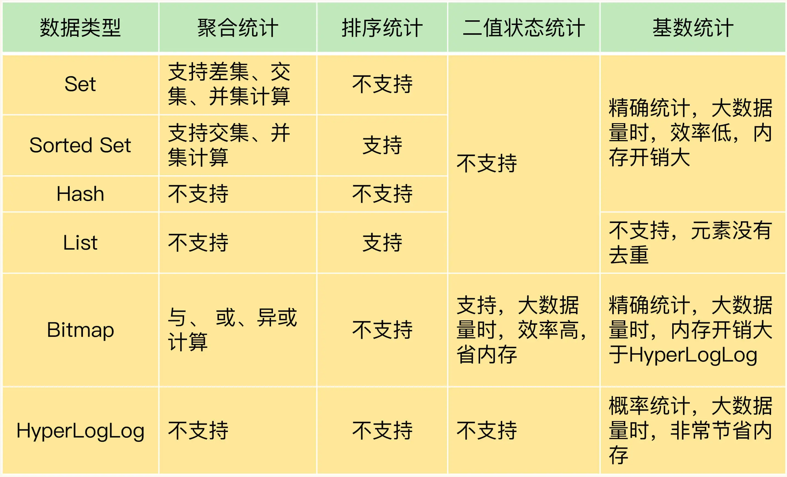

# Redis 数据结构

## 数据类型

- String（字符串）
- List（列表）
- Hash（哈希）
- Set（集合）
- Sorted Set（有序集合）
- Bitmap
- HyperLogLog
- GEO
- 自定义的数据类型

## 数据结构

简单动态字符串、双向链表、压缩列表、哈希表、跳表和整数数组

> 如何理解：数据类型=`接口`,数据结构=`接口实现`

## 全局哈希表

## 为何需要这些数据结构

- 性能
- 节省内存
- 支持排序
- 集合类型的操作

## Hash

- 哈希表的冲突问题
- rehash
- 链式哈希
- 渐进式 rehash

随着数据逐步增多，Redis 开始执行 rehash，这个过程分为三步：
- 给哈希表 2 分配更大的空间，例如是当前哈希表 1 大小的两倍；
- 把哈希表 1 中的数据重新映射并拷贝到哈希表 2 中；
- 释放哈希表 1 的空间。

## Bitmap HyperLogLog

- Bitmap
- HyperLogLog

## RedisObject

RedisObject 的内部组成包括了 type、encoding、lru 和 refcount 4 个元数据，以及 1 个*ptr指针。

- type：表示值的类型，涵盖了我们前面学习的五大基本类型；
- encoding：是值的编码方式，用来表示 Redis 中实现各个基本类型的底层数据结构，例如 SDS、压缩列表、哈希表、跳表等；
- lru：记录了这个对象最后一次被访问的时间，用于淘汰过期的键值对；
- refcount：记录了对象的引用计数；
- *ptr：是指向数据的指针。

## 数据结构

## Links 

- [Redis sorted Set](https://juejin.cn/post/6844903512413831181)