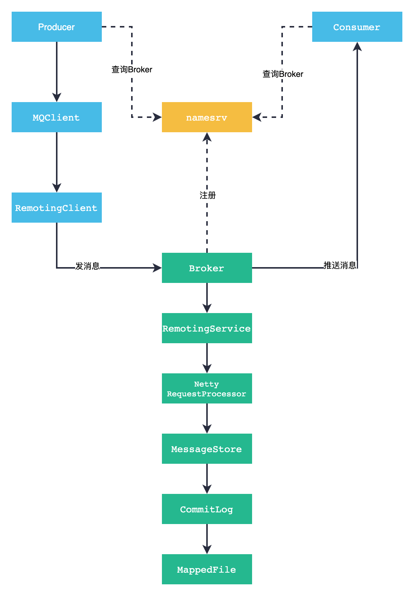

# Consumer

## Consumer start

消息消费者的启动过程：

```java
DefaultMQPushConsumer#start
    ->DefaultMQPushConsumerImpl#start
        -> this.consumeMessageService.start();
        -> this.mQClientFactory.start();// MQClientInstance
            -> this.mQClientAPIImpl.start();// MQClientInstance 启动 Netty client
            -> this.startScheduledTask();// MQClientInstance 定时任务
            -> this.pullMessageService.start();// PullMessageService 
            -> this.rebalanceService.start();// RebalanceService
            -> this.defaultMQProducer.getDefaultMQProducerImpl().start(false);
```

## Message Flow



## MQClientInstance

## DefaultLitePullConsumer

## DefaultMQPushConsumer

## PullMessageService

## Message Ack
