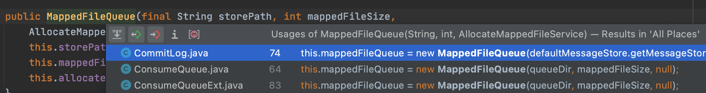

# MappedFile

`MappedFile` 的主要作用是对 `Message`(对应到具体的对象就是CommitLog) 进行持久化存储（存储到文件系统）。此外还用于存储conuserQueue信息

了解 `MappedFile` 可以知道 `RocketMQ` 为了提高持久化的性能都做了那些优化。

比如为了避免`IO`的瓶颈,使用了那些技术。如果服务器突然宕机，文件怎么恢复。

关键字：

- MappedFile 的初始化
- MappedFile 的文件格式
- MappedFile 的刷盘操作

- [MappedFile](#mappedfile)
  - [MappedFileQueue new](#mappedfilequeue-new)
  - [MappedFileQueue](#mappedfilequeue)
  - [MappedFileQueue#findMappedFileByOffset](#mappedfilequeuefindmappedfilebyoffset)
  - [MappedFile.init 初始化](#mappedfileinit-初始化)
  - [MappedFile commit](#mappedfile-commit)
  - [MappedFile flush](#mappedfile-flush)
  - [MappedFile isAbleToFlush and  isAbleToCommit](#mappedfile-isabletoflush-and--isabletocommit)
  - [MappedFile getLastMappedFile](#mappedfile-getlastmappedfile)
  - [MappedFile Position](#mappedfile-position)
  - [appendMessagesInner](#appendmessagesinner)
  - [Links](#links)

阅读此文之前，建议先阅读 [RocketMQ 持久化概述](rocketmq-store.md) 这篇文章。了解 `MappedFile` 在 `RocketMQ` 中扮演的角色和作用。

## MappedFileQueue new

`MappedFileQueue` 的创建 主要有三个地方，分别是 `CommitLog` `，ConsumeQueue`，`ConsumeQueueExt`



## MappedFileQueue

topicQueueTable

`MappedFileQueue` 用来维护多个 `MappedFile` 文件。负责 `MappedFile` 文件的`加载`,`维护`，`commit`,`flush`

## MappedFileQueue#findMappedFileByOffset

## MappedFile.init 初始化

在构建 `MappedFile` 的时候，有个 `init` 方法对应 `MappedFile` 的二个构造方法:

- 一个 `init` 没有 `TransientStorePool` 参数
- 一个 `init` 有 `TransientStorePool` 参数,有此参数的，会初始化 `writeBuffer` 和 `transientStorePool` 这对成员变量

这个两种初始化方式，最终体现是在执行 `commit` 和 `flush` 方法的结果不同。

这里底层使用`FileChannel`提供的内存映射类，提高IO的性能，具体原理可参考文末链接。

```java
// MappedFile#init 没有 TransientStorePool 参数的方法
private void init(final String fileName, final int fileSize) throws IOException {
    this.fileName = fileName;
    this.fileSize = fileSize;
    this.file = new File(fileName);
    this.fileFromOffset = Long.parseLong(this.file.getName());
    boolean ok = false;
    ensureDirOK(this.file.getParent());
    try {
        this.fileChannel = new RandomAccessFile(this.file, "rw").getChannel();
        this.mappedByteBuffer = this.fileChannel.map(MapMode.READ_WRITE, 0, fileSize);
        TOTAL_MAPPED_VIRTUAL_MEMORY.addAndGet(fileSize);
        TOTAL_MAPPED_FILES.incrementAndGet();
        ok = true;
    } catch (FileNotFoundException e) {
        log.error("Failed to create file " + this.fileName, e);
        throw e;
    } catch (IOException e) {
        log.error("Failed to map file " + this.fileName, e);
        throw e;
    } finally {
        if (!ok && this.fileChannel != null) {
            this.fileChannel.close();
        }
    }
}

// 有 transientStorePool 的方法
// 会对 writeBuffer 进行初始化
public void init(final String fileName, final int fileSize,
    final TransientStorePool transientStorePool) throws IOException {
    init(fileName, fileSize);// 执行init
    this.writeBuffer = transientStorePool.borrowBuffer();
    this.transientStorePool = transientStorePool;
}


```

```java
// AllocateMappedFileService 的代码片段
MappedFile mappedFile;
// 查询 配置是否启用了 TransientStorePool
if (messageStore.getMessageStoreConfig().isTransientStorePoolEnable()) {
    try {
        mappedFile = ServiceLoader.load(MappedFile.class).iterator().next();
        mappedFile.init(req.getFilePath(), req.getFileSize(), messageStore.getTransientStorePool());
    } catch (RuntimeException e) {
        log.warn("Use default implementation.");
        mappedFile = new MappedFile(req.getFilePath(), req.getFileSize(), messageStore.getTransientStorePool());
    }
} else {
    mappedFile = new MappedFile(req.getFilePath(), req.getFileSize());
}

//开启的条件 transientStorePoolEnable参数+ 异步刷盘 + Master节点
public boolean isTransientStorePoolEnable() {
     return transientStorePoolEnable && FlushDiskType.ASYNC_FLUSH == getFlushDiskType()
         && BrokerRole.SLAVE != getBrokerRole();
}
```

## MappedFile commit

`commit` 与 `flush` 相比，`commit` 只会执行文件的 `write` 操作，此操作并不会立即把内存中的数据下入到磁盘中。

而 `flush` 操作则会执行 `force`，强制把内存中的数据刷新到磁盘。

```java
public int commit(final int commitLeastPages) {
    if (writeBuffer == null) {// 这个参数由 init 方式决定有没有 writeBuffer
        //no need to commit data to file channel, so just regard wrotePosition as committedPosition.
        return this.wrotePosition.get();
    }
    if (this.isAbleToCommit(commitLeastPages)) {
        if (this.hold()) {
            commit0(commitLeastPages);
            this.release();
        } else {
            log.warn("in commit, hold failed, commit offset = " + this.committedPosition.get());
        }
    }
    // All dirty data has been committed to FileChannel.
    if (writeBuffer != null && this.transientStorePool != null && this.fileSize == this.committedPosition.get()) {
        this.transientStorePool.returnBuffer(writeBuffer);
        this.writeBuffer = null;
    }
    return this.committedPosition.get();
}

protected void commit0(final int commitLeastPages) {
    int writePos = this.wrotePosition.get();
    int lastCommittedPosition = this.committedPosition.get();
    if (writePos - lastCommittedPosition > commitLeastPages) {
        try {
            ByteBuffer byteBuffer = writeBuffer.slice();
            byteBuffer.position(lastCommittedPosition);
            byteBuffer.limit(writePos);
            this.fileChannel.position(lastCommittedPosition);
            this.fileChannel.write(byteBuffer);
            this.committedPosition.set(writePos);
        } catch (Throwable e) {
            log.error("Error occurred when commit data to FileChannel.", e);
        }
    }
}
```

## MappedFile flush

```java
// 把内存强制刷新到磁盘中，会更新 flushedPosition 的值
public int flush(final int flushLeastPages) {
    if (this.isAbleToFlush(flushLeastPages)) {// 这个方法也很重要，下面有说明
        if (this.hold()) {
            int value = getReadPosition();
            try {
                //We only append data to fileChannel or mappedByteBuffer, never both.
                if (writeBuffer != null || this.fileChannel.position() != 0) {
                    this.fileChannel.force(false);
                } else {
                    this.mappedByteBuffer.force();
                }
            } catch (Throwable e) {
                log.error("Error occurred when force data to disk.", e);
            }
            this.flushedPosition.set(value);
            this.release();
        } else {
            log.warn("in flush, hold failed, flush offset = " + this.flushedPosition.get());
            this.flushedPosition.set(getReadPosition());
        }
    }
    return this.getFlushedPosition();
}
```

## MappedFile isAbleToFlush and  isAbleToCommit

```java
// 判断数据是否够刷盘，在进行 MappedFile#flush 会进行判断
// commitLeastPages>0 时，需要计算下能刷盘的内存页数是否满足，OS_PAGE_SIZE=1024 * 4 =（4k）
// getReadPosition 获取数据已经写到的位置（有效数据的位置）
// 当 flushLeastPages=0 时，对写入的页数没有限制，只有满足 write > flush 即可，说明有数据可以刷盘
// 当 flushLeastPages>0 时，需要判断写入的数据页数是否满足 flushLeastPages 
// 满足则能用进行刷盘
private boolean isAbleToFlush(final int flushLeastPages) {
    int flush = this.flushedPosition.get();// 刷盘的位置
    int write = getReadPosition();// 数据已经写入到的位置
    if (this.isFull()) 
        return true;
    }
    if (flushLeastPages > 0) {// 计算页数，一页大小 1024 * 4 =（4k）
        return ((write / OS_PAGE_SIZE) - (flush / OS_PAGE_SIZE)) >= flushLeastPages;
    }
    return write > flush;
}

// isAbleToCommit 功能类似
protected boolean isAbleToCommit(final int commitLeastPages) {
    int flush = this.committedPosition.get();
    int write = this.wrotePosition.get();
    if (this.isFull()) {
        return true;
    }
    if (commitLeastPages > 0) {
        return ((write / OS_PAGE_SIZE) - (flush / OS_PAGE_SIZE)) >= commitLeastPages;
    }
    return write > flush;
}
```

## MappedFile getLastMappedFile

`MappedFile` 文件的创建过程

```java
// 从 CopyOnWriteArrayList<MappedFile> mappedFileSize 获取文件
public MappedFile getLastMappedFile() {

}
// 从 mappedFileSize 获取 MappedFile，如果没有则创建
public MappedFile getLastMappedFile(final long startOffset, boolean needCreate) {
        long createOffset = -1;
        MappedFile mappedFileLast = getLastMappedFile();

        if (mappedFileLast == null) {
            createOffset = startOffset - (startOffset % this.mappedFileSize);
        }

        if (mappedFileLast != null && mappedFileLast.isFull()) {
            createOffset = mappedFileLast.getFileFromOffset() + this.mappedFileSize;
        }

        if (createOffset != -1 && needCreate) {
            String nextFilePath = this.storePath + File.separator + UtilAll.offset2FileName(createOffset);
            String nextNextFilePath = this.storePath + File.separator
                + UtilAll.offset2FileName(createOffset + this.mappedFileSize);
            MappedFile mappedFile = null;

            if (this.allocateMappedFileService != null) {
                mappedFile = this.allocateMappedFileService.putRequestAndReturnMappedFile(nextFilePath,
                    nextNextFilePath, this.mappedFileSize);
            } else {
                try {
                    mappedFile = new MappedFile(nextFilePath, this.mappedFileSize);
                } catch (IOException e) {
                    log.error("create mappedFile exception", e);
                }
            }

            if (mappedFile != null) {
                if (this.mappedFiles.isEmpty()) {
                    mappedFile.setFirstCreateInQueue(true);
                }
                this.mappedFiles.add(mappedFile);
            }

            return mappedFile;
        }

        return mappedFileLast;
}
```

## MappedFile Position

```java
// wrotePosition 每次写入数据的时候，就会发生变化
protected final AtomicInteger wrotePosition = new AtomicInteger(0);
protected final AtomicInteger committedPosition = new AtomicInteger(0);
private final AtomicInteger flushedPosition = new AtomicInteger(0);
```

## appendMessagesInner

```java
// appendMessagesInner 追加消息到文件中
// 通过 AppendMessageCallback（回调）实现 
public AppendMessageResult appendMessagesInner(final MessageExt messageExt, final AppendMessageCallback cb) {
    assert messageExt != null;
    assert cb != null;
    int currentPos = this.wrotePosition.get();
    if (currentPos < this.fileSize) {
        ByteBuffer byteBuffer = writeBuffer != null ? writeBuffer.slice() : this.mappedByteBuffer.slice();
        byteBuffer.position(currentPos);
        AppendMessageResult result;
        if (messageExt instanceof MessageExtBrokerInner) {
            result = cb.doAppend(this.getFileFromOffset(), byteBuffer, this.fileSize - currentPos, (MessageExtBrokerInner) messageExt);
        } else if (messageExt instanceof MessageExtBatch) {
            result = cb.doAppend(this.getFileFromOffset(), byteBuffer, this.fileSize - currentPos, (MessageExtBatch) messageExt);
        } else {
            return new AppendMessageResult(AppendMessageStatus.UNKNOWN_ERROR);
        }
        this.wrotePosition.addAndGet(result.getWroteBytes());
        this.storeTimestamp = result.getStoreTimestamp();
        return result;
    }
    log.error("MappedFile.appendMessage return null, wrotePosition: {} fileSize: {}", currentPos, this.fileSize);
    return new AppendMessageResult(AppendMessageStatus.UNKNOWN_ERROR);
}
```

## Links

- [https://cloud.tencent.com/developer/article/1352677](https://cloud.tencent.com/developer/article/1352677)
- [FileChannel](https://www.cnblogs.com/lxyit/p/9170741.html)