# Message id




## MessageDecoder

```java
// 根据地址创建 messageId
public static String createMessageId(SocketAddress socketAddress, long transactionIdhashCode) {
        InetSocketAddress inetSocketAddress = (InetSocketAddress) socketAddress;
        int msgIDLength = inetSocketAddress.getAddress() instanceof Inet4Address ? 16 : 28;
        ByteBuffer byteBuffer = ByteBuffer.allocate(msgIDLength);
        byteBuffer.put(inetSocketAddress.getAddress().getAddress());
        byteBuffer.putInt(inetSocketAddress.getPort());
        byteBuffer.putLong(transactionIdhashCode);
        byteBuffer.flip();
        return UtilAll.bytes2string(byteBuffer.array());
}

// message id
public static MessageId decodeMessageId(final String msgId) throws UnknownHostException {
    byte[] bytes = UtilAll.string2bytes(msgId);
    ByteBuffer byteBuffer = ByteBuffer.wrap(bytes);
    // address(ip+port)
    byte[] ip = new byte[msgId.length() == 32 ? 4 : 16];
    byteBuffer.get(ip);
    int port = byteBuffer.getInt();
    SocketAddress address = new InetSocketAddress(InetAddress.getByAddress(ip), port);
    // offset
    long offset = byteBuffer.getLong();
    return new MessageId(address, offset);
}
```

## MQClientAPIImpl viewMessage

查询消息 `viewMessage`，的实现就是 根据 messageId 中的broker 地址和offset 进行 RPC调用，查询到消息体。

