# NameServer

NameServer 的主要目的是注册 Broker 信息，方便 Producer 和 Consumer 发现可用的 Broker。进行消息的发送和消费。

关键字：

- Broker 作用
- Broker 的注册(流程)
- Broker 的下线
- Broker 的路由信息维护
- Broker 存活检查


- [NameServer](#nameserver)
  - [启动](#启动)
  - [DefaultRequestProcessor](#defaultrequestprocessor)
  - [RouteInfoManager](#routeinfomanager)
  - [registerBroker](#registerbroker)
  - [unregisterBroker](#unregisterbroker)
  - [getRouteInfoByTopic](#getrouteinfobytopic)
  - [scanNotActiveBroker](#scannotactivebroker)
  - [Links](#links)

## 启动

`NamesrvController` 是负责 NameServer 启动的主要实现类。

主要逻辑都在 [NamesrvController#initialize](https://github.com/apache/rocketmq/blob/master/namesrv/src/main/java/org/apache/rocketmq/namesrv/NamesrvController.java#L76) 方法中。

下面简单概述在启动过程中做了什么动作。

```java
// initialize 的主要作用
// 1. 使用 kvConfigManager 加载配置
// 2. 启动 remotingServer Netty TCP 服务
// 3. 启动 remotingExecutor netty 的线程池服务
// 4. 启动 registerProcessor 注册 RemotingCommand 处理器,用来处理CMD命令
// 5. 启动扫描 Broker 的线程
// 6. 启动定期打印 kv config 的线程
// 7. 启动扫描 Tls 配置的线程
public boolean initialize() {
 // ...
}
```

## DefaultRequestProcessor

了解`DefaultRequestProcessor`此类可以知道 `NameServer` 支持哪些功能。

`org.apache.rocketmq.namesrv.processor.DefaultRequestProcessor` 的主要作用是处理 `RemotingCommand`，因此通过 `DefaultRequestProcessor` 就可以知道 NameServer 的作用包含哪些。[DefaultRequestProcessor#processRequest 代码片段](https://github.com/apache/rocketmq/blob/master/namesrv/src/main/java/org/apache/rocketmq/namesrv/processor/DefaultRequestProcessor.java#L71)

下面的的代码片段中有`19`个 Case,每个 Case 都处理不同的业务(可以从下面的命令中知道NameServer中维护了那些信息)。

核心的 `RequestCode`:

- REGISTER_BROKER
- UNREGISTER_BROKER
- GET_ROUTEINFO_BY_TOPIC

| RequestCode                        | 描述                    |
| ---------------------------------- | ----------------------- |
| PUT_KV_CONFIG                      |
| GET_KV_CONFIG                      |
| DELETE_KV_CONFIG                   |
| QUERY_DATA_VERSION                 |
| REGISTER_BROKER                    | 注册 Broker             |
| UNREGISTER_BROKER                  | 取消注册 Broker         |
| GET_ROUTEINFO_BY_TOPIC             | 根据 Topic 查询路由信息 |
| GET_BROKER_CLUSTER_INFO            |
| WIPE_WRITE_PERM_OF_BROKER          |
| GET_ALL_TOPIC_LIST_FROM_NAMESERVER | 获取所有的TOPIC列表
| DELETE_TOPIC_IN_NAMESRV            | 删除TOPIC
| GET_KVLIST_BY_NAMESPACE            |
| GET_TOPICS_BY_CLUSTER              |
| GET_SYSTEM_TOPIC_LIST_FROM_NS      | 获取系统的TOPIC
| GET_UNIT_TOPIC_LIST                |
| GET_HAS_UNIT_SUB_TOPIC_LIST        |
| GET_HAS_UNIT_SUB_UNUNIT_TOPIC_LIST |
| UPDATE_NAMESRV_CONFIG              |
| GET_NAMESRV_CONFIG                 |

## RouteInfoManager

> Broker 的路由信息维护(路由信息是 Consumer 进行重平衡的关键信息)

RouteInfoManager 的主要作用就是存储 Broker 集群相关的信息(元数据信息)。从下面的变量中就可以知道，NameServer 中存储了那些信息。



```java
// RouteInfoManager 的成员变量
public class RouteInfoManager {
    // 超时时间
    private final static long BROKER_CHANNEL_EXPIRED_TIME = 1000 * 60 * 2;

    private final HashMap<String/* topic */, List<QueueData>> topicQueueTable;
    private final HashMap<String/* brokerName */, BrokerData> brokerAddrTable;
    private final HashMap<String/* clusterName */, Set<String/* brokerName */>> clusterAddrTable;
    private final HashMap<String/* brokerAddr */, BrokerLiveInfo> brokerLiveTable;
    private final HashMap<String/* brokerAddr */, List<String>/* Filter Server */> filterServerTable;
}

// tpoic+队列信息，Consumer在消费消息重平衡的时候，会用到此信息
public class QueueData implements Comparable<QueueData> {
    private String brokerName;
    private int readQueueNums;
    private int writeQueueNums;
    private int perm;
    private int topicSynFlag;
}
// Broker 信息，主要存储IP地址等信息
// 按照 brokerName 维度存储,在主从模式下 brokerName 是相同的，因此brokerAddrs是一个Map
public class BrokerData implements Comparable<BrokerData> {
    private String cluster;
    private String brokerName;
    private HashMap<Long/* brokerId */, String/* broker address */> brokerAddrs;

    private final Random random = new Random();
}
// broker 的TCP连接维护。主要用来检测Broker是否存活
class BrokerLiveInfo {
    private long lastUpdateTimestamp;
    private DataVersion dataVersion;
    private Channel channel;
    private String haServerAddr;
}
```

| 信息              | 描述                                                        |
| ----------------- | ----------------------------------------------------------- |
| topicQueueTable   | topic 下面的 queue 的信息                                   |
| brokerAddrTable   | brokerName + cluster + brokerId + broker address 的集群信息 |
| clusterAddrTable  | clusterName + brokerName 的映射关系                         |
| brokerLiveTable   | brokerAddr + Channel TCP 连接信息                           |
| filterServerTable | brokerAddr + Filter Server 的映射信息                       |

这里说下 brokerAddrTable 列表这个变量。这里面存储的是 BrokerData ，而 BrokerData 里面维护了 `brokerId` + `broker address` 的映射关系
brokerAddrs 是一个 map,里面存储了名称相同的 brokerName 的 `brokerId` + `broker address`。
因此在执行`unregisterBroker`操作的时候，会根据 brokerName 拿到 BrokerData 的 map，在根据 brokerId 去移除具体的 Broker 信息。

看下 RocketMQ 集群模式下的相关配置[2m-2s-sync 的配置](https://github.com/apache/rocketmq/tree/master/distribution/conf/2m-2s-sync)(二个 Master,二个 Slave)

```properties
# cat broker-a.properties
brokerClusterName=DefaultCluster
brokerName=broker-a
brokerId=0
deleteWhen=04
fileReservedTime=48
brokerRole=SYNC_MASTER
flushDiskType=ASYNC_FLUSH

# broker-a-s.properties
brokerClusterName=DefaultCluster
brokerName=broker-a
brokerId=1
deleteWhen=04
fileReservedTime=48
brokerRole=SLAVE
flushDiskType=ASYNC_FLUSH

# broker-b.properties
brokerClusterName=DefaultCluster
brokerName=broker-b
brokerId=0
deleteWhen=04
fileReservedTime=48
brokerRole=SYNC_MASTER
flushDiskType=ASYNC_FLUSH

# broker-b-s.properties
brokerClusterName=DefaultCluster
brokerName=broker-b
brokerId=1
deleteWhen=04
fileReservedTime=48
brokerRole=SLAVE
flushDiskType=ASYNC_FLUSH
```

可见上述配置 `Master`&`Slave` 的配置中的`brokerName`是一样的。

下面的 registerBroker 和 unregisterBroker 都是去操作 RouteInfoManager 维护的信息。

## registerBroker

> Broker 的注册

```java
// DefaultRequestProcessor#registerBroker:300
RegisterBrokerResult result = this.namesrvController.getRouteInfoManager().registerBroker(
    requestHeader.getClusterName(),
    requestHeader.getBrokerAddr(),
    requestHeader.getBrokerName(),
    requestHeader.getBrokerId(),
    requestHeader.getHaServerAddr(),
    topicConfigWrapper,
    null,
    ctx.channel()
);

// 参数信息
public RegisterBrokerResult registerBroker(
    final String clusterName,
    final String brokerAddr,
    final String brokerName,
    final long brokerId,
    final String haServerAddr,
    final TopicConfigSerializeWrapper topicConfigWrapper,
    final List<String> filterServerList,
    final Channel channel) {

    }
```

Broker 注册的流程:

1. 依据 clusterName 和 brokerName 更新 clusterAddrTable
2. 更新 brokerAddrTable，`this.brokerAddrTable.put(brokerName, brokerData);`
3. 更新 BrokerData 中的 `HashMap<Long/* brokerId */, String/* broker address */>` Map(因为存在 Master,Slave 切换的场景，是需要更新地址的)
4. 如果是 MASTER,并且是第一次注册，那么就更新 topicQueueTable 信息
5. 注册 BrokerLiveInfo 信息
6. 更新 filterServerList 信息
7. 填充 masterAddr 信息，（Master 的 IP 信息）

## unregisterBroker

> Broker 的下线

```java
// DefaultRequestProcessor#unregisterBroker
this.namesrvController.getRouteInfoManager().unregisterBroker(
    requestHeader.getClusterName(),
    requestHeader.getBrokerAddr(),
    requestHeader.getBrokerName(),
    requestHeader.getBrokerId());

// RouteInfoManager#unregisterBroker
// 取消注册的参数
public void unregisterBroker(
    final String clusterName,
    final String brokerAddr,
    final String brokerName,
    final long brokerId) {

    }
```

Broker 的下线的流程：

1. 移除 filterServer `this.filterServerTable.remove(brokerAddr);`
2. 更新 brokerAddrTable 中的 BrokerData 信息，如果为空则移除 BrokerData
3. 更新 clusterAddrTable ，如果为空，则移除
4. 如果 Broker 信息有更新，则更新 Topic 信息（循环 QueueData 如果 BrokerName 相等，就移除）

## getRouteInfoByTopic

路由信息的查询，入口在 [DefaultRequestProcessor#getRouteInfoByTopic](https://github.com/apache/rocketmq/blob/master/namesrv/src/main/java/org/apache/rocketmq/namesrv/processor/DefaultRequestProcessor.java#L338)，具体的实现在中 [RouteInfoManager#pickupTopicRouteData](https://github.com/apache/rocketmq/blob/aaa92a2e53d773c7f1d9e9f25e41709f6948fa83/namesrv/src/main/java/org/apache/rocketmq/namesrv/routeinfo/RouteInfoManager.java#L374)

此处的实现逻辑比较简单。不在赘述。下面看下伪代码：

```java
// init 初始化
TopicRouteData topicRouteData = new TopicRouteData();
topicRouteData.setBrokerDatas(brokerDataList);
topicRouteData.setFilterServerTable(filterServerMap);
// ...
// 根据 topic 查询QueueData
List<QueueData> queueDataList = this.topicQueueTable.get(topic);
// 获取所有的Broker 存入 brokerNameSet
// 根据 brokerName 查询 BrokerData
BrokerData brokerData = this.brokerAddrTable.get(brokerName);
// 填充 brokerData
brokerDataList.add(brokerDataClone);
// 填充 filterServer
filterServerMap.put(brokerAddr, filterServerList);
// 返回 topicRouteData
return topicRouteData;
```

## scanNotActiveBroker

> Broker 的存活检查

```java
// 扫描不活动的Broker,从brokerLiveTable中移除
public void scanNotActiveBroker() {
    Iterator<Entry<String, BrokerLiveInfo>> it = this.brokerLiveTable.entrySet().iterator();
    while (it.hasNext()) {
        Entry<String, BrokerLiveInfo> next = it.next();
        long last = next.getValue().getLastUpdateTimestamp();
        if ((last + BROKER_CHANNEL_EXPIRED_TIME) < System.currentTimeMillis()) {
            RemotingUtil.closeChannel(next.getValue().getChannel());
            it.remove();
            log.warn("The broker channel expired, {} {}ms", next.getKey(), BROKER_CHANNEL_EXPIRED_TIME);
            // 执行此方法移除 Broker信息，路由信息等等。
            this.onChannelDestroy(next.getKey(), next.getValue().getChannel());
        }
    }
}
```

## Links

- [rocketmq-remoting-command.md](rocketmq-remoting-command.md)
