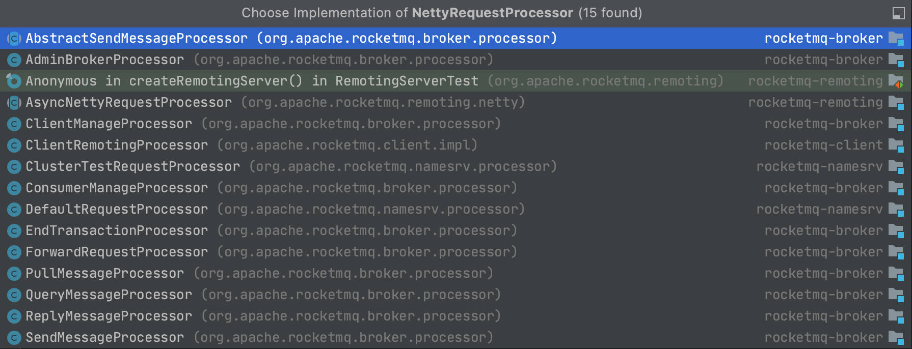

# RemotingCommand

RockemtMQ 的 `Client`(Consumer,Producer) 与 `Server`(Broker) 的交互都是使用`RemotingCommand`对象进行序列化和反序列化的。

## CommandCustomHeader

CommandCustomHeader 是RemotingCommand消息体中消息Head的包装

```java
// Demo 例子
public RemotingCommand processRequest(ChannelHandlerContext ctx, RemotingCommand request) throws
    RemotingCommandException {
    final RemotingCommand response = RemotingCommand.createResponseCommand(null);
    // 从request 中解码出RequestHeader 
    final EndTransactionRequestHeader requestHeader =
        (EndTransactionRequestHeader)request.decodeCommandCustomHeader(EndTransactionRequestHeader.class);
}
```

常用的 CommandCustomHeader

| RequestCode           | Request Header              | Respone Header            | 描述               |
| --------------------- | --------------------------- | ------------------------- | ------------------ |
| SEND_REPLY_MESSAGE_V2 | SendMessageRequestHeaderV2  | SendMessageResponseHeader | 发消息的请求和响应 |
| SEND_REPLY_MESSAGE    | SendMessageRequestHeader    | SendMessageResponseHeader | 发消息的请求和响应 |
| SEND_MESSAGE          | --                          | --                        | 没有 Reply的消息   |
| PULL_MESSAGE          | PullMessageRequestHeader    | PullMessageResponseHeader | 拉消息的请求和响应 |
| --                    | EndTransactionRequestHeader | --                        | 事物结束消息       |

## RequestCode

常见的RequestCode

- SEND_BATCH_MESSAGE
- SEND_REPLY_MESSAGE_V2
- SEND_REPLY_MESSAGE
- PULL_MESSAGE

## RequestCode And NettyRequestProcessor

一种 `NettyRequestProcessor` 会处理一种或者多种RequestCode。是所有走RPC的入口。

```java
// 注册 RequestCode 与RequestProcessor 的关系
this.remotingServer.registerProcessor(RequestCode.SEND_MESSAGE, sendProcessor, this.sendMessageExecutor);
// 最终会被放入到 processorTable 中
public void registerProcessor(int requestCode, NettyRequestProcessor processor, ExecutorService executor) {
    ExecutorService executorThis = executor;
    if (null == executor) {
        executorThis = this.publicExecutor;
    }
    Pair<NettyRequestProcessor, ExecutorService> pair = new Pair<NettyRequestProcessor, ExecutorService>(processor, executorThis);
    this.processorTable.put(requestCode, pair);
}
```

`NettyRequestProcessor` 最终的使用：

```java
// org.apache.rocketmq.remoting.netty.NettyRemotingServer.NettyServerHandler -> NettyRemotingAbstract
// NettyRemotingAbstract
public void processRequestCommand(final ChannelHandlerContext ctx, final RemotingCommand cmd) {
        // 从processorTable 根据code 也就是RequestCode 取到NettyRequestProcessor
        final Pair<NettyRequestProcessor, ExecutorService> matched = this.processorTable.get(cmd.getCode());
}
```

`NettyRequestProcessor` 的实现类


