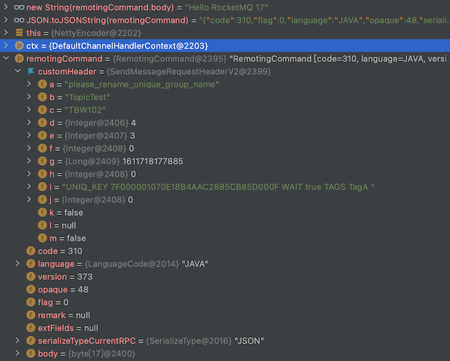

# Serialize

RocketMQ 序列化

## RocketMQ 序列化协议

RocketMQ 序列化协议规定了进行网络通信的 `byte[]` 数据格式,协议由`head` + `body` 组成的变长消息，支持扩展字段。

支持 `JSON` 和 `ROCKETMQ` 二种序列化方式

```java
// org.apache.rocketmq.remoting.protocol.SerializeType
JSON((byte) 0),
ROCKETMQ((byte) 1);
```

## 序列化的 Head 和 Body

序列化协议的主要实现类是 `RemotingCommand`，代码片段如下：

```java
// org.apache.rocketmq.remoting.protocol.RemotingCommand
// head
private int code;
private LanguageCode language = LanguageCode.JAVA;
private int version = 0;
private int opaque = requestId.getAndIncrement();
private int flag = 0;
private String remark;
private HashMap<String, String> extFields;
private transient CommandCustomHeader customHeader;
private SerializeType serializeTypeCurrentRPC = serializeTypeConfigInThisServer;
// body
private transient byte[] body;
```

字段说明：

| 字段                    | 描述                                                                                                                                         |
| ----------------------- | -------------------------------------------------------------------------------------------------------------------------------------------- |
| code                    | RequestCode，ResponseCode 可作做为 事务消息，普通消息的区分标记                                                                              |
| language                | 使用的开发语言，如：java,c++,golang                                                                                                          |
| version                 | 消息版本                                                                                                                                     |
| opaque                  | 消息的 seq num                                                                                                                               |
| flag                    | RPC 的类型  支持二种类型：REQUEST_COMMAND(请求响应模式) RPC_ONEWAY                                                                           |
| remark                  | 备注                                                                                                                                         |
| extFields               | 扩展字段，基本每一种 RPC 通信都会有的字段，用来传输自定义信息                                                                                |
| customHeader            | 消息head的格式，种类有很多个(code 不同，对应的customHeader 也不同),包含了消息的 group,topic,tags 等信息，常用的有 SendMessageRequestHeaderV2 |
| serializeTypeCurrentRPC | 序列化的格式，支持 `json` 和 `ROCKETMQ`                                                                                                      |
| body                    | 消息体，例如发送 `Hello` 到某一个 tpoic 里面只包含 `Hello` 信息，不包含tpoic,tag 信息                                                        |

## code 字段

`code` 是用来区分消息的类型的，根据不同的类型会有不同的处理

- RequestCode 发送的消息类型

```java
// 常用的code
public static final int SEND_MESSAGE_V2 = 310;
```

- ResponseCode 响应的消息类型

## ROCKETMQ Decode

反序列化(解码)：`byte[]` 转化成 `RemotingCommand` 对象

入口在 `org.apache.rocketmq.remoting.netty.NettyDecoder`

```java
// NettyDecoder#decode
//      -> RemotingCommand#decode -> headerDecode
//          -> RocketMQSerializable#rocketMQProtocolDecode
// RocketMQSerializable#rocketMQProtocolDecode
// 下面是 head 的解析过程
public static RemotingCommand rocketMQProtocolDecode(final byte[] headerArray) {
    RemotingCommand cmd = new RemotingCommand();
    ByteBuffer headerBuffer = ByteBuffer.wrap(headerArray);
    // int code(~32767)
    cmd.setCode(headerBuffer.getShort());
    // LanguageCode language
    cmd.setLanguage(LanguageCode.valueOf(headerBuffer.get()));
    // int version(~32767)
    cmd.setVersion(headerBuffer.getShort());
    // int opaque
    cmd.setOpaque(headerBuffer.getInt());
    // int flag
    cmd.setFlag(headerBuffer.getInt());
    // String remark
    int remarkLength = headerBuffer.getInt();
    if (remarkLength > 0) {
        byte[] remarkContent = new byte[remarkLength];
        headerBuffer.get(remarkContent);
        cmd.setRemark(new String(remarkContent, CHARSET_UTF8));
    }
    // HashMap<String, String> extFields
    int extFieldsLength = headerBuffer.getInt();
    if (extFieldsLength > 0) {
        byte[] extFieldsBytes = new byte[extFieldsLength];
        headerBuffer.get(extFieldsBytes);
        cmd.setExtFields(mapDeserialize(extFieldsBytes));
    }
    return cmd;
}
// RemotingCommand#decode
// head 解析之后的 body 解析
public static RemotingCommand decode(final ByteBuffer byteBuffer) {
    int length = byteBuffer.limit();
    int oriHeaderLen = byteBuffer.getInt();
    int headerLength = getHeaderLength(oriHeaderLen);
    byte[] headerData = new byte[headerLength];
    byteBuffer.get(headerData);
    RemotingCommand cmd = headerDecode(headerData, getProtocolType(oriHeaderLen));
    int bodyLength = length - 4 - headerLength;
    byte[] bodyData = null;
    if (bodyLength > 0) {
        bodyData = new byte[bodyLength];
        byteBuffer.get(bodyData);
    }
    cmd.body = bodyData;
    return cmd;
}
```

## ROCKETMQ Encode

序列化(编码)：`RemotingCommand` 转化成 `byte[]`对象

入口在 `org.apache.rocketmq.remoting.netty.NettyEncoder`

```java
// RemotingCommand#encodeHeader
//      -> RemotingCommand#headerEncode
//          -> RocketMQSerializable.rocketMQProtocolEncode
// NettyEncoder 的代码片段
// 先写 head 再写 body
ByteBuffer header = remotingCommand.encodeHeader();
out.writeBytes(header);// 写 head
byte[] body = remotingCommand.getBody();
if (body != null) {
    out.writeBytes(body);// 写 body
}
```

```java
public static byte[] rocketMQProtocolEncode(RemotingCommand cmd) {
       // String remark
       byte[] remarkBytes = null;
       int remarkLen = 0;
       if (cmd.getRemark() != null && cmd.getRemark().length() > 0) {
           remarkBytes = cmd.getRemark().getBytes(CHARSET_UTF8);
           remarkLen = remarkBytes.length;
       }
       // HashMap<String, String> extFields
       byte[] extFieldsBytes = null;
       int extLen = 0;
       if (cmd.getExtFields() != null && !cmd.getExtFields().isEmpty()) {
           extFieldsBytes = mapSerialize(cmd.getExtFields());
           extLen = extFieldsBytes.length;
       }
       int totalLen = calTotalLen(remarkLen, extLen);
       ByteBuffer headerBuffer = ByteBuffer.allocate(totalLen);
       // int code(~32767)
       headerBuffer.putShort((short) cmd.getCode());
       // LanguageCode language
       headerBuffer.put(cmd.getLanguage().getCode());
       // int version(~32767)
       headerBuffer.putShort((short) cmd.getVersion());
       // int opaque
       headerBuffer.putInt(cmd.getOpaque());
       // int flag
       headerBuffer.putInt(cmd.getFlag());
       // String remark
       if (remarkBytes != null) {
           headerBuffer.putInt(remarkBytes.length);
           headerBuffer.put(remarkBytes);
       } else {
           headerBuffer.putInt(0);
       }
       // HashMap<String, String> extFields;
       if (extFieldsBytes != null) {
           headerBuffer.putInt(extFieldsBytes.length);
           headerBuffer.put(extFieldsBytes);
       } else {
           headerBuffer.putInt(0);
       }
       return headerBuffer.array();
   }
```

## CommandCustomHeader

`org.apache.rocketmq.common.protocol.header.SendMessageRequestHeaderV2`

```java
// SendMessageRequestHeaderV2
@CFNotNull
private String a; // producerGroup;
@CFNotNull
private String b; // topic;
@CFNotNull
private String c; // defaultTopic;
@CFNotNull
private Integer d; // defaultTopicQueueNums;
@CFNotNull
private Integer e; // queueId;
@CFNotNull
private Integer f; // sysFlag;
@CFNotNull
private Long g; // bornTimestamp;
@CFNotNull
private Integer h; // flag;
@CFNullable
private String i; // properties;
@CFNullable
private Integer j; // reconsumeTimes;
@CFNullable
private boolean k; // unitMode = false;
private Integer l; // consumeRetryTimes
@CFNullable
private boolean m; //batch
```

发送普通消息的截图：

