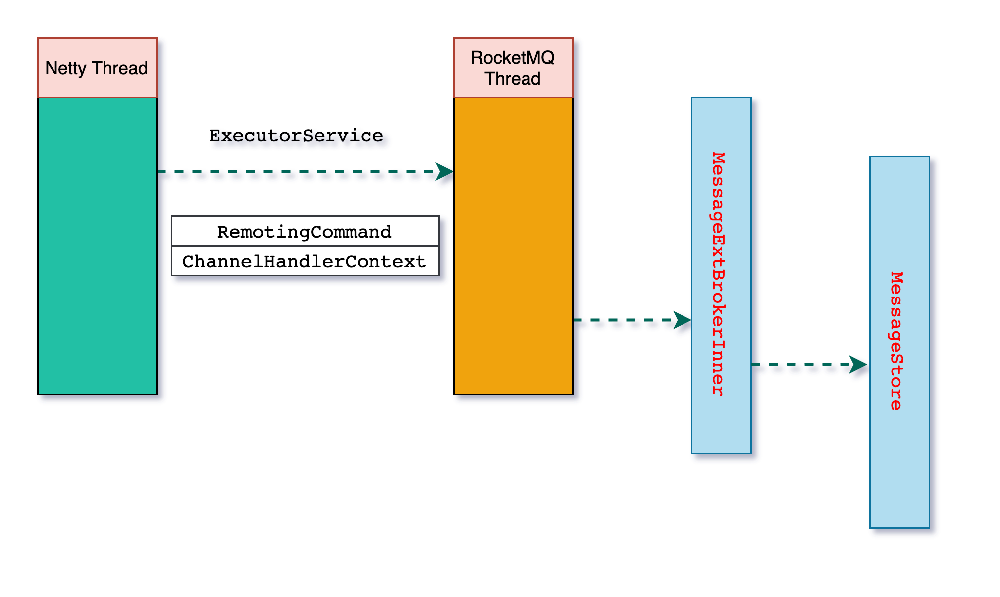

# RocketMQ Store

`RocketMQ` 的存储实现概述

- [RocketMQ Store](#rocketmq-store)
  - [MQ 请求处理流程](#mq-请求处理流程)
  - [存储核心类](#存储核心类)
  - [DefaultMessageStore](#defaultmessagestore)
  - [CommitLog](#commitlog)
  - [MappedFileQueue](#mappedfilequeue)
  - [MappedFile](#mappedfile)
  - [IndexService and IndexFile](#indexservice-and-indexfile)
  - [Store dir](#store-dir)

## MQ 请求处理流程

```java
NettyDecoder ->
    NettyServerHandler -> channelRead0 -> processMessageReceived -> processRequestCommand
        -> NettyRemotingAbstract -> ExecutorService
            -> AsyncNettyRequestProcessor -> asyncProcessRequest
                -> SendMessageProcessor -> asyncProcessRequest -> asyncSendMessage
                    -> DefaultMessageStore#asyncPutMessage
                        -> CommitLog#asyncPutMessage
                            -> MappedFile#appendMessage
                                -> FileChannel
```

上面的流程的核心思想就是把网络请求通过 `ExecutorService` 进行异步化处理，最终存储到文件中。



> `SendMessageProcessor` 代码片段：

```java
// 非事务消息，调用 MessageStore 存储消息
// 事务消息，调用 TransactionalMessageService 进行事务消息的逻辑处理
// SendMessageProcessor
if (transFlag != null && Boolean.parseBoolean(transFlag)) {
    if (this.brokerController.getBrokerConfig().isRejectTransactionMessage()) {
        response.setCode(ResponseCode.NO_PERMISSION);
        response.setRemark(
                "the broker[" + this.brokerController.getBrokerConfig().getBrokerIP1()
                        + "] sending transaction message is forbidden");
        return CompletableFuture.completedFuture(response);
    }// 事务消息
    putMessageResult = this.brokerController.getTransactionalMessageService().asyncPrepareMessage(msgInner);
} else {// 非事务消息
    putMessageResult = this.brokerController.getMessageStore().asyncPutMessage(msgInner);
}
```

## 存储核心类

| 类                  | 描述                                                                               |
| ------------------- | ---------------------------------------------------------------------------------- |
| DefaultMessageStore | `存储`的服务入口，提供 IndexService（索引服务） HAService(高高可用，分布式) 等功能 |
| CommitLog           | 存储日志，文件恢复。维护 MappedFileQueue 和 FlushCommitLogService                  |
| MappedFile          | 日志文件，使用 FileChannel 进行过文件 map 的文件                                   |
| MappedFileQueue     | 文件队列的管理 MappedFile（所有的消息最终会被写入到 日志文件中）                   |

## DefaultMessageStore

`DefaultMessageStore` 实现了 `MessageStore` 总共有 `46` 个方法，如下：

| 方法                          | 描述 |
| ----------------------------- | ---- |
| load                          |
| start                         |
| shutdown                      |
| destroy                       |
| asyncPutMessage               |
| asyncPutMessages              |
| putMessage                    |
| putMessages                   |
| getMessage                    |
| getMaxOffsetInQueue           |
| getMinOffsetInQueue           |
| getCommitLogOffsetInQueue     |
| getOffsetInQueueByTime        |
| lookMessageByOffset           |
| selectOneMessageByOffset      |
| selectOneMessageByOffset      |
| getRunningDataInfo            |
| getRuntimeInfo                |
| getMaxPhyOffset               |
| getMinPhyOffset               |
| getEarliestMessageTime        |
| getEarliestMessageTime        |
| getMessageStoreTimeStamp      |
| getMessageTotalInQueue        |
| getCommitLogData              |
| appendToCommitLog             |
| executeDeleteFilesManually    |
| queryMessage                  |
| updateHaMasterAddress         |
| slaveFallBehindMuch           |
| now                           |
| cleanUnusedTopic              |
| cleanExpiredConsumerQueue     |
| checkInDiskByConsumeOffset    |
| dispatchBehindBytes           |
| flush                         |
| resetWriteOffset              |
| getConfirmOffset              |
| setConfirmOffset              |
| isOSPageCacheBusy             |
| lockTimeMills                 |
| isTransientStorePoolDeficient |
| getDispatcherList             |
| getConsumeQueue               |
| getBrokerStatsManager         |
| handleScheduleMessageService  |


`DefaultMessageStore` 的成员变量

```java
public class DefaultMessageStore implements MessageStore {
    private static final InternalLogger log = InternalLoggerFactory.getLogger(LoggerName.STORE_LOGGER_NAME);

    private final MessageStoreConfig messageStoreConfig;
    // CommitLog
    private final CommitLog commitLog;

    private final ConcurrentMap<String/* topic */, ConcurrentMap<Integer/* queueId */, ConsumeQueue>> consumeQueueTable;

    private final FlushConsumeQueueService flushConsumeQueueService;

    private final CleanCommitLogService cleanCommitLogService;

    private final CleanConsumeQueueService cleanConsumeQueueService;

    private final IndexService indexService;

    private final AllocateMappedFileService allocateMappedFileService;

    private final ReputMessageService reputMessageService;

    private final HAService haService;

    private final ScheduleMessageService scheduleMessageService;

    private final StoreStatsService storeStatsService;

    private final TransientStorePool transientStorePool;

    private final RunningFlags runningFlags = new RunningFlags();
    private final SystemClock systemClock = new SystemClock();

    private final ScheduledExecutorService scheduledExecutorService =
        Executors.newSingleThreadScheduledExecutor(new ThreadFactoryImpl("StoreScheduledThread"));
    private final BrokerStatsManager brokerStatsManager;
    private final MessageArrivingListener messageArrivingListener;
    private final BrokerConfig brokerConfig;

    private volatile boolean shutdown = true;

    private StoreCheckpoint storeCheckpoint;

    private AtomicLong printTimes = new AtomicLong(0);

    private final LinkedList<CommitLogDispatcher> dispatcherList;

    private RandomAccessFile lockFile;

    private FileLock lock;

    boolean shutDownNormal = false;

    private final ScheduledExecutorService diskCheckScheduledExecutorService =
            Executors.newSingleThreadScheduledExecutor(new ThreadFactoryImpl("DiskCheckScheduledThread"));
}
```

## CommitLog

方法列表：

| 方法                           | 描述 |
| ------------------------------ | ---- |
| CommitLog                      |
| load                           |
| start                          |
| shutdown                       |
| flush                          |
| getMaxOffset                   |
| remainHowManyDataToCommit      |
| remainHowManyDataToFlush       |
| deleteExpiredFile              |
| getData                        |
| getData                        |
| recoverNormally                |
| checkMessageAndReturnSize      |
| checkMessageAndReturnSize      |
| getConfirmOffset               |
| setConfirmOffset               |
| recoverAbnormally              |
| resetOffset                    |
| getBeginTimeInLock             |
| asyncPutMessage                |
| asyncPutMessages               |
| putMessage                     |
| submitFlushRequest             |
| submitReplicaRequest           |
| handleDiskFlush                |
| handleHA                       |
| putMessages                    |
| pickupStoreTimestamp           |
| getMinOffset                   |
| getMessage                     |
| rollNextFile                   |
| getTopicQueueTable             |
| setTopicQueueTable             |
| destroy                        |
| appendData                     |
| retryDeleteFirstFile           |
| removeQueueFromTopicQueueTable |
| checkSelf                      |
| lockTimeMills                  |

`CommitLog` 的成员变量

```java
public class CommitLog {
    // Message's MAGIC CODE daa320a7
    public final static int MESSAGE_MAGIC_CODE = -626843481;
    protected static final InternalLogger log = InternalLoggerFactory.getLogger(LoggerName.STORE_LOGGER_NAME);
    // End of file empty MAGIC CODE cbd43194
    protected final static int BLANK_MAGIC_CODE = -875286124;
    protected final MappedFileQueue mappedFileQueue;
    protected final DefaultMessageStore defaultMessageStore;
    private final FlushCommitLogService flushCommitLogService;

    //If TransientStorePool enabled, we must flush message to FileChannel at fixed periods
    private final FlushCommitLogService commitLogService;

    private final AppendMessageCallback appendMessageCallback;
    private final ThreadLocal<MessageExtBatchEncoder> batchEncoderThreadLocal;
    protected HashMap<String/* topic-queueid */, Long/* offset */> topicQueueTable = new HashMap<String, Long>(1024);
    protected volatile long confirmOffset = -1L;

    private volatile long beginTimeInLock = 0;

    protected final PutMessageLock putMessageLock;
    // 省略其他代码
}
```

## MappedFileQueue

方法列表：

| 方法                      | 描述 |
| ------------------------- | ---- |
| MappedFileQueue           |
| checkSelf                 |
| getMappedFileByTime       |
| truncateDirtyFiles        |
| load                      |
| howMuchFallBehind         |
| getLastMappedFile         |
| getLastMappedFile         |
| getLastMappedFile         |
| resetOffset               |
| getMinOffset              |
| getMaxOffset              |
| getMaxWrotePosition       |
| remainHowManyDataToCommit |
| remainHowManyDataToFlush  |
| deleteLastMappedFile      |
| deleteExpiredFileByTime   |
| deleteExpiredFileByOffset |
| flush                     |
| commit                    |
| findMappedFileByOffset    |
| getFirstMappedFile        |
| findMappedFileByOffset    |
| getMappedMemorySize       |
| retryDeleteFirstFile      |
| shutdown                  |
| destroy                   |
| getFlushedWhere           |
| setFlushedWhere           |
| getStoreTimestamp         |
| getMappedFiles            |
| getMappedFileSize         |
| getCommittedWhere         |
| setCommittedWhere         |

`MappedFileQueue` 成员变量

```java
public class MappedFileQueue {
   
    private static final int DELETE_FILES_BATCH_MAX = 10;

    private final String storePath;

    private final int mappedFileSize;

    private final CopyOnWriteArrayList<MappedFile> mappedFiles = new CopyOnWriteArrayList<MappedFile>();

    private final AllocateMappedFileService allocateMappedFileService;

    private long flushedWhere = 0;
    private long committedWhere = 0;

    private volatile long storeTimestamp = 0;
}
```

## MappedFile

方法列表：

| 方法                        | 描述 |
| --------------------------- | ---- |
| MappedFile                  |
| MappedFile                  |
| MappedFile                  |
| ensureDirOK                 |
| clean                       |
| getTotalMappedFiles         |
| getTotalMappedVirtualMemory |
| init                        |
| getLastModifiedTimestamp    |
| getFileSize                 |
| getFileChannel              |
| appendMessage               |
| appendMessages              |
| appendMessagesInner         |
| getFileFromOffset           |
| appendMessage               |
| appendMessage               |
| flush                       |
| commit                      |
| getFlushedPosition          |
| setFlushedPosition          |
| isFull                      |
| selectMappedBuffer          |
| selectMappedBuffer          |
| cleanup                     |
| destroy                     |
| getWrotePosition            |
| setWrotePosition            |
| getReadPosition             |
| setCommittedPosition        |
| warmMappedFile              |
| getFileName                 |
| getMappedByteBuffer         |
| sliceByteBuffer             |
| getStoreTimestamp           |
| isFirstCreateInQueue        |
| setFirstCreateInQueue       |
| mlock                       |
| munlock                     |

`MappedFile` 的成变量

```java
public class MappedFile extends ReferenceResource {
    public static final int OS_PAGE_SIZE = 1024 * 4;
    protected static final InternalLogger log = InternalLoggerFactory.getLogger(LoggerName.STORE_LOGGER_NAME);

    private static final AtomicLong TOTAL_MAPPED_VIRTUAL_MEMORY = new AtomicLong(0);

    private static final AtomicInteger TOTAL_MAPPED_FILES = new AtomicInteger(0);
    protected final AtomicInteger wrotePosition = new AtomicInteger(0);
    protected final AtomicInteger committedPosition = new AtomicInteger(0);
    private final AtomicInteger flushedPosition = new AtomicInteger(0);
    protected int fileSize;
    protected FileChannel fileChannel;
    /**
     * Message will put to here first, and then reput to FileChannel if writeBuffer is not null.
     */
    protected ByteBuffer writeBuffer = null;
    protected TransientStorePool transientStorePool = null;
    private String fileName;
    private long fileFromOffset;
    private File file;
    private MappedByteBuffer mappedByteBuffer;
    private volatile long storeTimestamp = 0;
    private boolean firstCreateInQueue = false;
}
```

## IndexService and IndexFile

`IndexService` 用来管理 `IndexFile`

```java
// IndexService
public class IndexService {
    private static final InternalLogger log = InternalLoggerFactory.getLogger(LoggerName.STORE_LOGGER_NAME);
    /**
     * Maximum times to attempt index file creation.
     */
    private static final int MAX_TRY_IDX_CREATE = 3;
    private final DefaultMessageStore defaultMessageStore;
    private final int hashSlotNum;
    private final int indexNum;
    private final String storePath;
    private final ArrayList<IndexFile> indexFileList = new ArrayList<IndexFile>();
    private final ReadWriteLock readWriteLock = new ReentrantReadWriteLock();
}

// IndexFile
public class IndexFile {
    private static final InternalLogger log = InternalLoggerFactory.getLogger(LoggerName.STORE_LOGGER_NAME);
    private static int hashSlotSize = 4;
    private static int indexSize = 20;
    private static int invalidIndex = 0;
    private final int hashSlotNum;
    private final int indexNum;
    private final MappedFile mappedFile;
    private final FileChannel fileChannel;
    private final MappedByteBuffer mappedByteBuffer;
    private final IndexHeader indexHeader;
}
```

## Store dir

```sh
# 加入存储目录在 /Users/xxx/store
# 在 store 目录下面执行
tree
```

输出

```sh
.
├── checkpoint
├── commitlog
│   └── 00000000000000000000
├── config
│   ├── consumerFilter.json
│   ├── consumerFilter.json.bak
│   ├── consumerOffset.json
│   ├── consumerOffset.json.bak
│   ├── delayOffset.json
│   ├── delayOffset.json.bak
│   ├── subscriptionGroup.json
│   ├── subscriptionGroup.json.bak
│   ├── topics.json
│   └── topics.json.bak
├── consumequeue
│   ├── RMQ_SYS_TRACE_TOPIC
│   │   ├── 0
│   │   │   └── 00000000000000000000
│   │   ├── 1
│   │   │   └── 00000000000000000000
│   │   ├── 2
│   │   │   └── 00000000000000000000
│   │   └── 3
│   │       └── 00000000000000000000
│   ├── RMQ_SYS_TRANS_HALF_TOPIC
│   │   └── 0
│   │       └── 00000000000000000000
│   ├── RMQ_SYS_TRANS_OP_HALF_TOPIC
│   │   └── 0
│   │       └── 00000000000000000000
│   ├── TBW102
│   │   ├── 0
│   │   │   └── 00000000000000000000
│   │   ├── 1
│   │   │   └── 00000000000000000000
│   │   ├── 2
│   │   │   └── 00000000000000000000
│   │   ├── 3
│   │   │   └── 00000000000000000000
│   │   ├── 4
│   │   │   └── 00000000000000000000
│   │   ├── 5
│   │   │   └── 00000000000000000000
│   │   ├── 6
│   │   │   └── 00000000000000000000
│   │   └── 7
│   │       └── 00000000000000000000
│   ├── TRANS_CHECK_MAX_TIME_TOPIC
│   │   └── 0
│   │       └── 00000000000000000000
│   ├── TopicTest
│   │   ├── 0
│   │   │   └── 00000000000000000000
│   │   ├── 1
│   │   │   └── 00000000000000000000
│   │   ├── 10
│   │   │   └── 00000000000000000000
│   │   ├── 11
│   │   │   └── 00000000000000000000
│   │   ├── 12
│   │   │   └── 00000000000000000000
│   │   ├── 13
│   │   │   └── 00000000000000000000
│   │   ├── 14
│   │   │   └── 00000000000000000000
│   │   ├── 15
│   │   │   └── 00000000000000000000
│   │   ├── 2
│   │   │   └── 00000000000000000000
│   │   ├── 3
│   │   │   └── 00000000000000000000
│   │   ├── 4
│   │   │   └── 00000000000000000000
│   │   ├── 5
│   │   │   └── 00000000000000000000
│   │   ├── 6
│   │   │   └── 00000000000000000000
│   │   ├── 7
│   │   │   └── 00000000000000000000
│   │   ├── 8
│   │   │   └── 00000000000000000000
│   │   └── 9
│   │       └── 00000000000000000000
│   └── TopicTest1234
│       ├── 0
│       │   └── 00000000000000000000
│       ├── 1
│       │   └── 00000000000000000000
│       ├── 2
│       │   └── 00000000000000000000
│       └── 3
│           └── 00000000000000000000
├── index
│   └── 20210204155232591
└── lock

46 directories, 49 files
```
