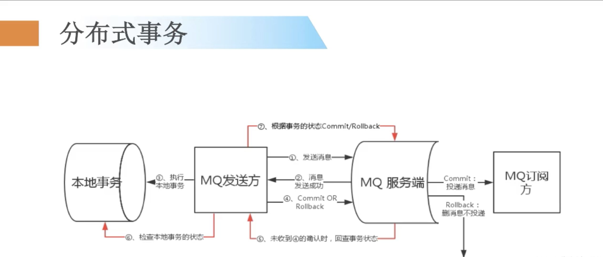

# rocketmq tx

- [rocketmq tx](#rocketmq-tx)
  - [概述](#概述)
  - [TransactionalMessageService](#transactionalmessageservice)
  - [Send transactional message](#send-transactional-message)
  - [TransactionalMessageService asyncPrepareMessage](#transactionalmessageservice-asyncpreparemessage)
  - [DefaultMQProducerImpl#endTransaction](#defaultmqproducerimplendtransaction)
  - [EndTransactionProcessor](#endtransactionprocessor)
  - [TransactionalMessageBridge](#transactionalmessagebridge)
  - [事物状态查询](#事物状态查询)

## 概述



- [https://rocketmq.apache.org/docs/transaction-example/](https://rocketmq.apache.org/docs/transaction-example/)

## TransactionalMessageService

`TransactionalMessageService` 的方法列表

| 方法                 | 描述                                   |
| -------------------- | -------------------------------------- |
| prepareMessage       | 发送事物消息的时候执行的方法           |
| asyncPrepareMessage  | 异步的发送事物消息                     |
| deletePrepareMessage | 删除事物消息，事物失败，就会执行此方法 |
| commitMessage        | 事物的提交                             |
| rollbackMessage      | 事物的回滚                             |
| check                | 检查事物的状态                         |
| open                 | nop                                    |
| close                | nop                                    |

下面从下面的几个维度去看事物消息的实现细节：

- Client 对事物消息的发送，处理
- Broker 对事物消息的特殊处理
- Clinet 事物结束（提交or回滚）的实现逻辑
- Broker 事物的回查询（查询事物状态）的实现路基

## Send transactional message

需要使用事物消息，则需要两个步骤：

- Create the transactional producer 使用事物 Producer 发送消息
- Implement the TransactionListener interface 实现 TransactionListener 来处理事物回调和查询

```java
// DefaultMQProducerImpl#sendMessageInTransaction
// 事物消息的发送
public TransactionSendResult sendMessageInTransaction(final Message msg,
    final LocalTransactionExecuter localTransactionExecuter, final Object arg)
    throws MQClientException {
    TransactionListener transactionListener = getCheckListener();
    if (null == localTransactionExecuter && null == transactionListener) {
        throw new MQClientException("tranExecutor is null", null);
    }
    // ignore DelayTimeLevel parameter
    if (msg.getDelayTimeLevel() != 0) {
        MessageAccessor.clearProperty(msg, MessageConst.PROPERTY_DELAY_TIME_LEVEL);
    }
    // ...
    Validators.checkMessage(msg, this.defaultMQProducer);
    SendResult sendResult = null;
    // 事物消息的特殊处理
    MessageAccessor.putProperty(msg, MessageConst.PROPERTY_TRANSACTION_PREPARED, "true");// 新增 prop
    MessageAccessor.putProperty(msg, MessageConst.PROPERTY_PRODUCER_GROUP, this.defaultMQProducer.getProducerGroup());
    // ... 发送消息
    sendResult = this.send(msg);
    // ...
    this.endTransaction(sendResult, localTransactionState, localException);
    TransactionSendResult transactionSendResult = new TransactionSendResult();
    transactionSendResult.setSendStatus(sendResult.getSendStatus());
    transactionSendResult.setMessageQueue(sendResult.getMessageQueue());
    transactionSendResult.setMsgId(sendResult.getMsgId());
    transactionSendResult.setQueueOffset(sendResult.getQueueOffset());
    transactionSendResult.setTransactionId(sendResult.getTransactionId());
    transactionSendResult.setLocalTransactionState(localTransactionState);
    return transactionSendResult;
}
```

[sendMessageInTransaction 完整的代码](https://github.com/apache/rocketmq/blob/master/client/src/main/java/org/apache/rocketmq/client/impl/producer/DefaultMQProducerImpl.java#L1202)

```java
// DefaultMQProducerImpl#sendKernelImpl
// 如果是事物消息，那么就添加事物消息的标记，
final String tranMsg = msg.getProperty(MessageConst.PROPERTY_TRANSACTION_PREPARED);// 校验 prop
if (tranMsg != null && Boolean.parseBoolean(tranMsg)) {
    sysFlag |= MessageSysFlag.TRANSACTION_PREPARED_TYPE;  
}
```

发送事物消息的时候，会在 prop 中添加 `PROPERTY_TRANSACTION_PREPARED` 属性，同时根据此属性来设置 `sysFlag` 标记此消息是事物消息。
上面的代码执行之后，消息就会通过 `sendKernelImpl` 方法，发送到了 Borker,下面的代码是 Borker 执行事物消息存储的逻辑

## TransactionalMessageService asyncPrepareMessage

```java
// SendMessageProcessor#asyncSendMessage
// 事物消息 prop 的判断
String transFlag = origProps.get(MessageConst.PROPERTY_TRANSACTION_PREPARED);
if (transFlag != null && Boolean.parseBoolean(transFlag)) {// 判断标记
    // 执行事物消息的逻辑
    putMessageResult = this.brokerController.getTransactionalMessageService().asyncPrepareMessage(msgInner);
} else {
    // 普通消息的逻辑
    putMessageResult = this.brokerController.getMessageStore().asyncPutMessage(msgInner);
}

// 下面的代码 是 Broker 处理事物消息的代码步骤：
// putMessageResult = this.brokerController.getTransactionalMessageService().asyncPrepareMessage(msgInner);
// put 消息 步骤1
public CompletableFuture<PutMessageResult> asyncPrepareMessage(MessageExtBrokerInner messageInner) {
    return transactionalMessageBridge.asyncPutHalfMessage(messageInner);
}
// put 消息 步骤2
public CompletableFuture<PutMessageResult> asyncPutHalfMessage(MessageExtBrokerInner messageInner) {
    return store.asyncPutMessage(parseHalfMessageInner(messageInner));// 包装消息，并使调用 store 存储
}
// put 消息 步骤3
private MessageExtBrokerInner parseHalfMessageInner(MessageExtBrokerInner msgInner) {
    MessageAccessor.putProperty(msgInner, MessageConst.PROPERTY_REAL_TOPIC, msgInner.getTopic());
    MessageAccessor.putProperty(msgInner, MessageConst.PROPERTY_REAL_QUEUE_ID,
        String.valueOf(msgInner.getQueueId()));
    msgInner.setSysFlag(
        MessageSysFlag.resetTransactionValue(msgInner.getSysFlag(), MessageSysFlag.TRANSACTION_NOT_TYPE));
    msgInner.setTopic(TransactionalMessageUtil.buildHalfTopic());// RMQ_SYS_TRANS_HALF_TOPIC 修改 topic
    msgInner.setQueueId(0);
    msgInner.setPropertiesString(MessageDecoder.messageProperties2String(msgInner.getProperties()));
    return msgInner;
}
```

通过上面的代码可知，事物消息，最终会把消息存储在 `RMQ_SYS_TRANS_HALF_TOPIC` Topic 中。
事物和非事物消息 最终都会通过 `MessageStore` -> `CommitLog` -> `MappedFile` -> `File` 存储在文件系统中。

## DefaultMQProducerImpl#endTransaction

当事物消息被发送到 Broker 之后，Client 就开始去校验本地事物的状态，然后来确定是`提交`还是`回滚`事物。
下面是处理本地事物的逻辑。

```java
// DefaultMQProducerImpl#endTransaction
// 根据本地事物的状态，去结束事物
public void endTransaction(
    final SendResult sendResult,
    final LocalTransactionState localTransactionState,
    final Throwable localException) throws RemotingException, MQBrokerException, InterruptedException, UnknownHostException {

    EndTransactionRequestHeader requestHeader = new EndTransactionRequestHeader();
    requestHeader.setTransactionId(transactionId);
    requestHeader.setCommitLogOffset(id.getOffset());
    // 本地事物的状态
    switch (localTransactionState) {
        case COMMIT_MESSAGE:// 事物提交
            requestHeader.setCommitOrRollback(MessageSysFlag.TRANSACTION_COMMIT_TYPE);
            break;
        case ROLLBACK_MESSAGE:// 事物回滚
            requestHeader.setCommitOrRollback(MessageSysFlag.TRANSACTION_ROLLBACK_TYPE);
            break;
        case UNKNOW:// 未知
            requestHeader.setCommitOrRollback(MessageSysFlag.TRANSACTION_NOT_TYPE);
            break;
        default:
            break;
    }
    requestHeader.setProducerGroup(this.defaultMQProducer.getProducerGroup());
    requestHeader.setTranStateTableOffset(sendResult.getQueueOffset());
    requestHeader.setMsgId(sendResult.getMsgId());
    String remark = localException != null ? ("executeLocalTransactionBranch exception: " + localException.toString()) : null;
    // 事物结束
    this.mQClientFactory.getMQClientAPIImpl().endTransactionOneway(brokerAddr, requestHeader, remark,
        this.defaultMQProducer.getSendMsgTimeout());
}

// DefaultMQProducerImpl#endTransaction
// 下面的代码把 事物结束的信息通过  RemotingCommand 发送到 borker, RequestCode=END_TRANSACTION
public void endTransactionOneway(
    final String addr,
    final EndTransactionRequestHeader requestHeader,
    final String remark,
    final long timeoutMillis
) throws RemotingException, MQBrokerException, InterruptedException {
    RemotingCommand request = RemotingCommand.createRequestCommand(RequestCode.END_TRANSACTION, requestHeader);
    request.setRemark(remark);
    this.remotingClient.invokeOneway(addr, request, timeoutMillis);// 发送到 broker
}
```

## EndTransactionProcessor

Broker 会处理事物消息的提交 / 事物消息的回滚。 `EndTransactionProcessor` 是 Borker 处理事物消息回滚和提交的入口。

```java
// EndTransactionProcessor#processRequest
@Override
public RemotingCommand processRequest(ChannelHandlerContext ctx, RemotingCommand request) throws
    RemotingCommandException {
    final RemotingCommand response = RemotingCommand.createResponseCommand(null);
    final EndTransactionRequestHeader requestHeader =
        (EndTransactionRequestHeader)request.decodeCommandCustomHeader(EndTransactionRequestHeader.class);
    // 省略一些检查
    OperationResult result = new OperationResult();
    if (MessageSysFlag.TRANSACTION_COMMIT_TYPE == requestHeader.getCommitOrRollback()) {
        // ...省略 
        result = this.brokerController.getTransactionalMessageService().commitMessage(requestHeader); // 事物提交
        if (res.getCode() == ResponseCode.SUCCESS) {
            MessageExtBrokerInner msgInner = endMessageTransaction(result.getPrepareMessage());
            msgInner.setSysFlag(MessageSysFlag.resetTransactionValue(msgInner.getSysFlag(), requestHeader.getCommitOrRollback()));
            msgInner.setQueueOffset(requestHeader.getTranStateTableOffset());
            msgInner.setPreparedTransactionOffset(requestHeader.getCommitLogOffset());
            msgInner.setStoreTimestamp(result.getPrepareMessage().getStoreTimestamp());
            MessageAccessor.clearProperty(msgInner, MessageConst.PROPERTY_TRANSACTION_PREPARED);
            RemotingCommand sendResult = sendFinalMessage(msgInner);// 发送消息
            // this.brokerController.getMessageStore().putMessage(msgInner);
            if (sendResult.getCode() == ResponseCode.SUCCESS) {
                this.brokerController.getTransactionalMessageService().deletePrepareMessage(result.getPrepareMessage());
            }
            return sendResult;
        }
    } else if (MessageSysFlag.TRANSACTION_ROLLBACK_TYPE == requestHeader.getCommitOrRollback()) {
         // ...省略 
        result = this.brokerController.getTransactionalMessageService().rollbackMessage(requestHeader);// 事物回滚
        if (result.getResponseCode() == ResponseCode.SUCCESS) {
            RemotingCommand res = checkPrepareMessage(result.getPrepareMessage(), requestHeader);
            if (res.getCode() == ResponseCode.SUCCESS) {
                // 删除消息
                this.brokerController.getTransactionalMessageService().deletePrepareMessage(result.getPrepareMessage());
            }
            return res;
        }
    }
    response.setCode(result.getResponseCode());
    response.setRemark(result.getResponseRemark());
    return response;
}
```

从上面的代码片段可知：事物的提交，最终是(再次发送消息)把消息发送到了真正的 topic 中，从 `RMQ_SYS_TRANS_HALF_TOPIC` tpoic 到真正的 topic
而事物回滚则是`删除消息`。

## TransactionalMessageBridge

## 事物状态查询

```java
// AbstractTransactionalMessageCheckListener
public void sendCheckMessage(MessageExt msgExt) throws Exception {
    CheckTransactionStateRequestHeader checkTransactionStateRequestHeader = new CheckTransactionStateRequestHeader();
    checkTransactionStateRequestHeader.setCommitLogOffset(msgExt.getCommitLogOffset());
    checkTransactionStateRequestHeader.setOffsetMsgId(msgExt.getMsgId());
    checkTransactionStateRequestHeader.setMsgId(msgExt.getUserProperty(MessageConst.PROPERTY_UNIQ_CLIENT_MESSAGE_ID_KEYIDX));
    checkTransactionStateRequestHeader.setTransactionId(checkTransactionStateRequestHeader.getMsgId());
    checkTransactionStateRequestHeader.setTranStateTableOffset(msgExt.getQueueOffset());
    msgExt.setTopic(msgExt.getUserProperty(MessageConst.PROPERTY_REAL_TOPIC));
    msgExt.setQueueId(Integer.parseInt(msgExt.getUserProperty(MessageConst.PROPERTY_REAL_QUEUE_ID)));
    msgExt.setStoreSize(0);
    String groupId = msgExt.getProperty(MessageConst.PROPERTY_PRODUCER_GROUP);
    Channel channel = brokerController.getProducerManager().getAvailableChannel(groupId);
    if (channel != null) {
        brokerController.getBroker2Client().checkProducerTransactionState(groupId, channel, checkTransactionStateRequestHeader, msgExt);
    } else {
        LOGGER.warn("Check transaction failed, channel is null. groupId={}", groupId);
    }
}
```
