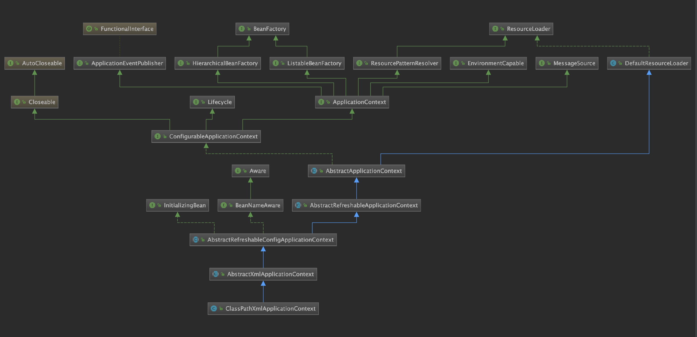
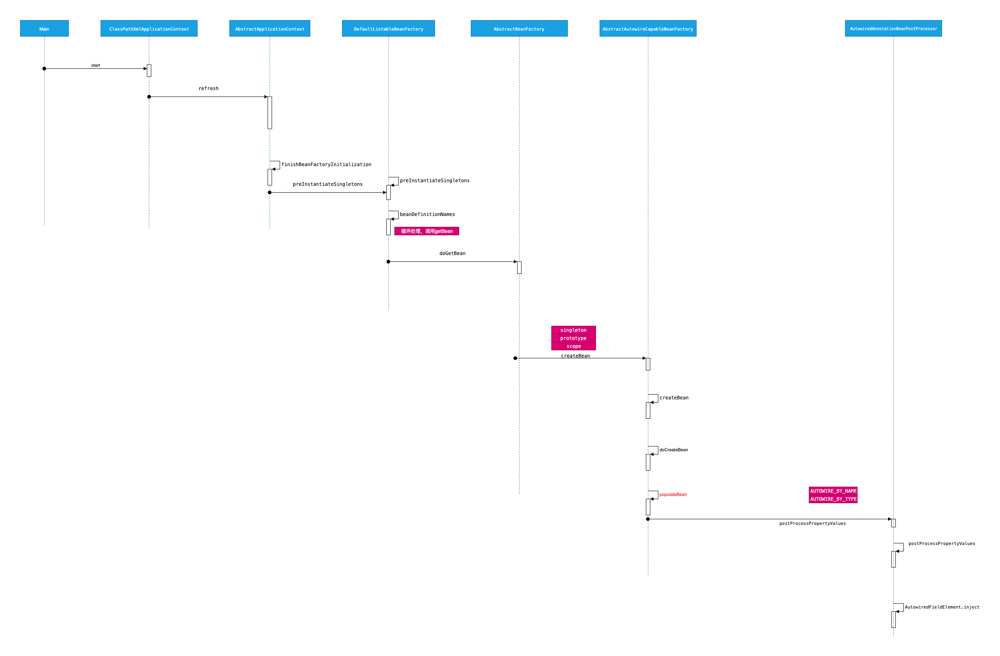

# ClassPathXmlApplicationContext

- [ClassPathXmlApplicationContext](#classpathxmlapplicationcontext)
  - [UML](#uml)
  - [start](#start)
  - [spring load bean](#spring-load-bean)
  - [spring bean init](#spring-bean-init)

## UML



## start

```java
private static final Logger logger = LoggerFactory.getLogger(ClassPathXmlApplicationContext.class);
public static void main(String[] args) {
    ClassPathXmlApplicationContext context=null;

    try {
        context = new ClassPathXmlApplicationContext("classpath:spring-context.xml");
        context.start();
        logger.info(">>>>>>>>>>> Service started!");
        System.in.read();
    } catch (IOException e) {
        logger.error(e.getLocalizedMessage(), e);
    } finally {
        if (null != context && context.isActive()) {
            try {
                context.stop();
            } catch (Exception e) {
                logger.error(e.getLocalizedMessage(), e);
            }
        }
    }
}
```

## spring load bean


## spring bean init


