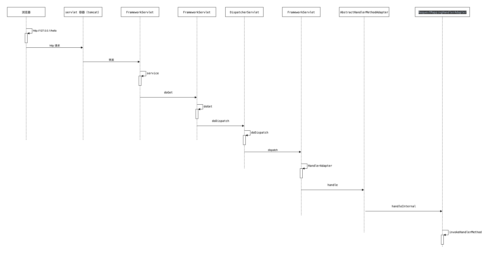

# DispatcherServlet

首先说下什么是 [Servlet](https://www.cnblogs.com/whgk/p/6399262.html) ?

Java Servlet 是运行在 Web 服务器或应用服务器上的程序，它是作为来自 Web 浏览器或其他 HTTP 客户端的请求和 HTTP 服务器上的数据库或应用程序之间的中间层

简单理解就是：从 `http` 访问 `Servlet`。通过 `Servlet` 访问 java 代码，从而访问MySQL(数据库),`Servlet` 作为通过 `web` 访问应用数据的 `中间人`

而 `Servlet` 只是一个规范，具体的实现有 `Tomcat` 就是可以 `Servlet` 容器，把所有所有的 `web` 请求交给 `Servlet` 

> `DispatcherServlet` 会拦截所有 `url-pattern` 配置的路径的请求，把这写请求转发个具体的 Controller 进行处理,是整个 `spring mvc` 的 `入口`

- [DispatcherServlet](#dispatcherservlet)
  - [Class define](#class-define)
    - [DispatcherServlet vs FrameworkServlet](#dispatcherservlet-vs-frameworkservlet)
  - [FrameworkServlet.initServletBean](#frameworkservletinitservletbean)
  - [FrameworkServlet.initWebApplicationContext](#frameworkservletinitwebapplicationcontext)
    - [FrameworkServlet.createWebApplicationContext](#frameworkservletcreatewebapplicationcontext)
  - [DispatcherServlet.properties](#dispatcherservletproperties)
  - [FrameworkServlet.service](#frameworkservletservice)
  - [FrameworkServlet.processRequest](#frameworkservletprocessrequest)
  - [DispatcherServlet.doService](#dispatcherservletdoservice)
  - [DispatcherServlet.doDispatch](#dispatcherservletdodispatch)
  - [DispatcherServlet.checkMultipart](#dispatcherservletcheckmultipart)
  - [DispatcherServlet.getHandler](#dispatcherservletgethandler)
  - [DispatcherServlet.getHandlerAdapter](#dispatcherservletgethandleradapter)
  - [DispatcherServlet.processDispatchResult](#dispatcherservletprocessdispatchresult)
  - [HandlerExecutionChain.applyPreHandle](#handlerexecutionchainapplyprehandle)
  - [HandlerExecutionChain.applyPostHandle](#handlerexecutionchainapplyposthandle)
  - [DispatcherServlet.processHandlerException](#dispatcherservletprocesshandlerexception)
  - [HandlerMethod](#handlermethod)
  - [HttpMethod](#httpmethod)

## Class define

下面是 `DispatcherServlet` 类的定义和继承关系

```java
public class DispatcherServlet extends FrameworkServlet {

}
public abstract class FrameworkServlet extends HttpServletBean implements ApplicationContextAware {

}
public abstract class HttpServletBean extends HttpServlet implements EnvironmentCapable, EnvironmentAware {

}
```

`DispatcherServlet` 处理 `http` 请求, `FrameworkServlet` 是一个抽象类，负责与 `spring`  容器集成，提供查询 `spring  bean` 的功能

当 `DispatcherServlet` 接受到 http 请求的时候，查找根据`请求路径`查找到具体的 `Contoller` 进行方法的调用(具体的调用会在后面解释)

### DispatcherServlet vs FrameworkServlet

`DispatcherServlet` 与 `FrameworkServlet` 的区别：

- `DispatcherServlet` 侧重 `spring mvc` 相关的默认配置
- `FrameworkServlet` 侧重 `WebApplicationContext` 的初始化工作

可以从 java docs 找到很详细的解释,`DispatcherServlet` 的默认配置可以参考 [DispatcherServlet.properties](#dispatcherservletproperties)

## FrameworkServlet.initServletBean

> 在 `servlet` 启动的时候 进行 `appliaction context` 的初始化

```java
// 方法调用链
GenericServlet.init -> FrameworkServlet.initServletBean -> FrameworkServlet.initWebApplicationContext
```

## FrameworkServlet.initWebApplicationContext

`servlet` 中 `WebApplicationContext` 的初始化，首先会从 `ServletContext` 查询是否已经存在了 `WebApplicationContext`,如果不存在就会进行创建新的 `WebApplicationContext`

### FrameworkServlet.createWebApplicationContext

`createWebApplicationContext` 的方法逻辑比较简单就是创建 `XmlWebApplicationContext` 并调用 `refresh` 方法，初始化 `spring` 容器

当通过 `Servlet` 初始化 `spring` 之后，就可以对外提供 `http` 服务了，下面就是与 `http` 相关的内容：

## DispatcherServlet.properties

> spring mvc 中一些默认的配置

```properties
# Default implementation classes for DispatcherServlet's strategy interfaces.
# Used as fallback when no matching beans are found in the DispatcherServlet context.
# Not meant to be customized by application developers.

org.springframework.web.servlet.LocaleResolver=org.springframework.web.servlet.i18n.AcceptHeaderLocaleResolver

org.springframework.web.servlet.ThemeResolver=org.springframework.web.servlet.theme.FixedThemeResolver

org.springframework.web.servlet.HandlerMapping=org.springframework.web.servlet.handler.BeanNameUrlHandlerMapping,\
   org.springframework.web.servlet.mvc.method.annotation.RequestMappingHandlerMapping

org.springframework.web.servlet.HandlerAdapter=org.springframework.web.servlet.mvc.HttpRequestHandlerAdapter,\
   org.springframework.web.servlet.mvc.SimpleControllerHandlerAdapter,\
   org.springframework.web.servlet.mvc.method.annotation.RequestMappingHandlerAdapter

org.springframework.web.servlet.HandlerExceptionResolver=org.springframework.web.servlet.mvc.method.annotation.ExceptionHandlerExceptionResolver,\
   org.springframework.web.servlet.mvc.annotation.ResponseStatusExceptionResolver,\
   org.springframework.web.servlet.mvc.support.DefaultHandlerExceptionResolver

org.springframework.web.servlet.RequestToViewNameTranslator=org.springframework.web.servlet.view.DefaultRequestToViewNameTranslator

org.springframework.web.servlet.ViewResolver=org.springframework.web.servlet.view.InternalResourceViewResolver

org.springframework.web.servlet.FlashMapManager=org.springframework.web.servlet.support.SessionFlashMapManager
```

- [BeanNameUrlHandlerMapping]
- [RequestMappingHandlerMapping]
- [HttpRequestHandlerAdapter]
- [SimpleControllerHandlerAdapter]
- [RequestMappingHandlerAdapter]
- [ExceptionHandlerExceptionResolver]
- [ResponseStatusExceptionResolver]
- [DefaultHandlerExceptionResolver]
- [DefaultRequestToViewNameTranslator]
- [InternalResourceViewResolver]

## FrameworkServlet.service

在 `web.xml` 中配置了 `DispatcherServlet` 之后，所有的  `web http` 请求都会给到 `FrameworkServlet` 的 `service` 方法, `service` 方法就是 `Spring web` 的请求的入口

> 一个 `Servlet` 配置代码片段如下

```xml
 <!-- servlet 文件配置 -->
 <servlet>
     <servlet-name>dispatcherServlet</servlet-name>
     <servlet-class>org.springframework.web.servlet.DispatcherServlet</servlet-class>
     <init-param>
         <param-name>contextConfigLocation</param-name>
         <param-value>classpath:spring/spring-servlet.xml</param-value>
     </init-param>
     <load-on-startup>1</load-on-startup>
 </servlet>
 <servlet-mapping>
     <servlet-name>dispatcherServlet</servlet-name>
     <url-pattern>/</url-pattern>
 </servlet-mapping>
```



## FrameworkServlet.processRequest

`doGet` `doPost` `doPut` `doDelete` `doOptions` `doTrace`

## DispatcherServlet.doService

## DispatcherServlet.doDispatch

## DispatcherServlet.checkMultipart

## DispatcherServlet.getHandler

## DispatcherServlet.getHandlerAdapter

## DispatcherServlet.processDispatchResult

## HandlerExecutionChain.applyPreHandle

## HandlerExecutionChain.applyPostHandle

## DispatcherServlet.processHandlerException

## HandlerMethod

## HttpMethod
