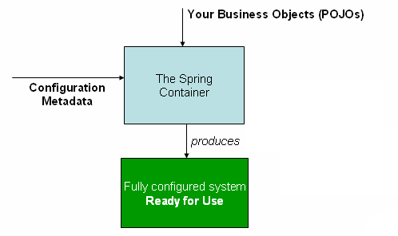

# Core Technologies

- 1 [container-overview](#container-overview)
- 2 [instantiating-a-container](#instantiating-a-container)
- 3 [using-the-container](#using-the-container)
- 4 [java.beans.introspector.decapitalize](#java.beans.introspector.decapitalize)
- 5 [dependency-injection](#dependency-injection)
- 6 [setter-based-dependency-injection](#setter-based-dependency-injection)
- 7 [constructor-based-or-setter-based-di](#constructor-based-or-setter-based-di)
- 8 [dependency-resolution-process](#dependency-resolution-process)
- 9 [circular-dependencies](#circular-dependencies)
- 10 [examples-of-dependency-injection](#examples-of-dependency-injection)
- 11 [dependencies-and-configuration-in-detail](#dependencies-and-configuration-in-detail)
- 12 [collections](#collections)
- 13 [references-to-other-beans-collaborators](#references-to-other-beans-collaborators)
- 14 [lazy-initialized-beans](#lazy-initialized-beans)
- 15 [autowiring-collaborators](#autowiring-collaborators)
- 16 [autowiring-modes](#autowiring-modes)
- 17 [singleton-beans-with-prototype-bean-dependencies](#singleton-beans-with-prototype-bean-dependencies)
- 18 [applicationcontextaware](#applicationcontextaware)
- 19 [method-injection](#method-injection)
- 20 [arbitrary-method-replacement](#arbitrary-method-replacement)
- 21 [dependency-injection](#dependency-injection)
- 22 [the-singleton-scope](#the-singleton-scope)
- 23 [the-prototype-scope](#the-prototype-scope)
- 24 [request-scope](#request-scope)
- 25 [session-scope](#session-scope)
- 26 [global-session-scope](#global-session-scope)
- 27 [application-scope](#application-scope)
- 28 [custom-scopes](#custom-scopes)
- 29 [using-a-custom-scope](#using-a-custom-scope)
- 30 [lifecycle-callbacks](#lifecycle-callbacks)
- 31 [initialization-callbacks](#initialization-callbacks)
- 32 [destruction-callbacks](#destruction-callbacks)
- 33 [default-initialization-and-destroy-methods](#default-initialization-and-destroy-methods)
- 34 [combining-lifecycle-mechanisms](#combining-lifecycle-mechanisms)
- 35 [applicationcontextaware-and-beannameaware](#applicationcontextaware-and-beannameaware)
- 36 [bean-definition-inheritance](#bean-definition-inheritance)
- 37 [customizing-beans-using-a-beanpostprocessor](#customizing-beans-using-a-beanpostprocessor)
- 38 [customizing-configuration-metadata-with-a-beanfactorypostprocessor](#customizing-configuration-metadata-with-a-beanfactorypostprocessor)
- 39 [example:-the-class-name-substitution-propertyplaceholderconfigurer](#example:-the-class-name-substitution-propertyplaceholderconfigurer)
- 40 [resource](#resource)
- 41 [autowired-vs-resource](#autowired-vs-resource)
- 42 [aop:scoped-proxy](#aop:scoped-proxy)
- 43 [postconstruct-and-predestroy](#postconstruct-and-predestroy)
- 44 [component](#component)
- 45 [bean-and-configuration](#bean-and-configuration)
- 46 [annotationconfigapplicationcontext](#annotationconfigapplicationcontext)
- 47 [enabling-component-scanning-with-scanstring…​](#enabling-component-scanning-with-scanstring…​)
- 48 [support-for-web-applications-with-annotationconfigwebapplicationcontext](#support-for-web-applications-with-annotationconfigwebapplicationcontext)
- 49 [declaring-a-bean](#declaring-a-bean)
- 50 [using-the-scope-annotation](#using-the-scope-annotation)
- 51 [using-the-configuration-annotation](#using-the-configuration-annotation)
- 52 [propertysource-abstraction](#propertysource-abstraction)
- 53 [propertysource](#propertysource)
- 54 [additional-capabilities-of-the-applicationcontext](#additional-capabilities-of-the-applicationcontext)
- 55 [standard-and-custom-events](#standard-and-custom-events)


## Container overview



## Instantiating a container

Instantiating a Spring IoC container is straightforward. The location path or paths supplied to an ApplicationContext constructor are actually resource strings that allow the container to load configuration metadata from a variety of external resources such as the local file system, from the Java CLASSPATH, and so on

```java
ApplicationContext context = new ClassPathXmlApplicationContext("services.xml", "daos.xml");
```

## Using the container

The `ApplicationContext` is the interface for an advanced factory capable of maintaining a registry of different beans and their dependencies. Using the method `T getBean(String name, Class<T> requiredType)` you can retrieve instances of your beans.

The `ApplicationContext` enables you to read bean definitions and access them as follows:

```java
// create and configure beans
ApplicationContext context = new ClassPathXmlApplicationContext("services.xml", "daos.xml");

// retrieve configured instance
PetStoreService service = context.getBean("petStore", PetStoreService.class);

// use configured instance
List<String> userList = service.getUsernameList();
```

## java.beans.Introspector.decapitalize

`java.beans.Introspector.decapitalize` a util to gen bean name

## Dependency Injection

```xml
<beans>
    <bean id="foo" class="x.y.Foo">
        <constructor-arg ref="bar"/>
        <constructor-arg ref="baz"/>
    </bean>

    <bean id="bar" class="x.y.Bar"/>

    <bean id="baz" class="x.y.Baz"/>
</beans>
```

```xml
<bean id="exampleBean" class="examples.ExampleBean">
    <constructor-arg type="int" value="7500000"/>
    <constructor-arg type="java.lang.String" value="42"/>
</bean>

<bean id="exampleBean" class="examples.ExampleBean">
    <constructor-arg index="0" value="7500000"/>
    <constructor-arg index="1" value="42"/>
</bean>

```

## Setter-based dependency injection

```java
public class SimpleMovieLister {

    // the SimpleMovieLister has a dependency on the MovieFinder
    private MovieFinder movieFinder;

    // a setter method so that the Spring container can inject a MovieFinder
    public void setMovieFinder(MovieFinder movieFinder) {
        this.movieFinder = movieFinder;
    }

    // business logic that actually uses the injected MovieFinder is omitted...
}
```

The ApplicationContext supports constructor-based and setter-based DI for the beans it manages. It also supports setter-based DI after some dependencies have already been injected through the constructor approach. You configure the dependencies in the form of a BeanDefinition, which you use in conjunction with PropertyEditor instances to convert properties from one format to another. However, most Spring users do not work with these classes directly (i.e., programmatically) but rather with XML bean definitions, annotated components (i.e., classes annotated with @Component, @Controller, etc.), or @Bean methods in Java-based @Configuration classes. These sources are then converted internally into instances of BeanDefinition and used to load an entire Spring IoC container instance.

## Constructor-based or setter-based DI

Since you can mix constructor-based and setter-based DI, it is a good rule of thumb to use constructors for mandatory dependencies and setter methods or configuration methods for optional dependencies. Note that use of the @Required annotation on a setter method can be used to make the property a required dependency.

The Spring team generally advocates constructor injection as it enables one to implement application components as immutable objects and to ensure that required dependencies are not null. Furthermore constructor-injected components are always returned to client (calling) code in a fully initialized state. As a side note, `a large number of constructor arguments is a bad code smell, implying that the class likely has too many responsibilities and should be refactored to better address proper separation of concerns`.

Setter injection should primarily only be used for optional dependencies that can be assigned reasonable default values within the class. Otherwise, not-null checks must be performed everywhere the code uses the dependency. One benefit of setter injection is that setter methods make objects of that class amenable to reconfiguration or re-injection later. Management through JMX MBeans is therefore a compelling use case for setter injection.

Use the DI style that makes the most sense for a particular class. Sometimes, when dealing with third-party classes for which you do not have the source, the choice is made for you. For example, if a third-party class does not expose any setter methods, then constructor injection may be the only available form of DI.

## Dependency resolution process

The container performs bean dependency resolution as follows:

- The `ApplicationContext` is created and initialized with configuration metadata that describes all the beans. Configuration metadata can be specified via XML, Java code, or annotations.
- For each bean, its dependencies are expressed in the form of properties, constructor arguments, or arguments to the static-factory method if you are using that instead of a normal constructor. These dependencies are provided to the bean, when the bean is actually created.
- Each property or constructor argument is an actual definition of the value to set, or a reference to another bean in the container.
- Each property or constructor argument which is a value is converted from its specified format to the actual type of that property or constructor argument. By default Spring can convert a value supplied in string format to all built-in types, such as `int`, `long`, `String`, `boolean`, etc.

The Spring container validates the configuration of each bean as the container is created. However, the bean properties themselves are not set until the bean is actually created. Beans that are singleton-scoped and set to be pre-instantiated (the default) are created when the container is created. Scopes are defined in Section 7.5, “Bean scopes”. Otherwise, the bean is created only when it is requested. Creation of a bean potentially causes a graph of beans to be created, as the bean’s dependencies and its dependencies' dependencies (and so on) are created and assigned. Note that resolution mismatches among those dependencies may show up late, i.e. on first creation of the affected bean.

## Circular dependencies

If you use predominantly constructor injection, it is possible to create an unresolvable circular dependency scenario.

For example: Class A requires an instance of class B through constructor injection, and class B requires an instance of class A through constructor injection. If you configure beans for classes A and B to be injected into each other, the Spring IoC container detects this circular reference at runtime, and throws a BeanCurrentlyInCreationException.

One possible solution is to edit the source code of some classes to be configured by setters rather than constructors. Alternatively, avoid constructor injection and use setter injection only. In other words, although it is not recommended, you can configure circular dependencies with setter injection.

Unlike the typical case (with no circular dependencies), a circular dependency between bean A and bean B forces one of the beans to be injected into the other prior to being fully initialized itself (a classic chicken/egg scenario).

## Examples of dependency injection

The following example uses XML-based configuration metadata for setter-based DI. A small part of a Spring XML configuration file specifies some bean definitions:

```xml
<bean id="exampleBean" class="examples.ExampleBean">
    <!-- setter injection using the nested ref element -->
    <property name="beanOne">
        <ref bean="anotherExampleBean"/>
    </property>

    <!-- setter injection using the neater ref attribute -->
    <property name="beanTwo" ref="yetAnotherBean"/>
    <property name="integerProperty" value="1"/>
</bean>

<bean id="anotherExampleBean" class="examples.AnotherBean"/>
<bean id="yetAnotherBean" class="examples.YetAnotherBean"/>
```

In the preceding example, setters are declared to match against the properties specified in the XML file. The following example uses constructor-based DI:

```xml
<bean id="exampleBean" class="examples.ExampleBean">
    <!-- constructor injection using the nested ref element -->
    <constructor-arg>
        <ref bean="anotherExampleBean"/>
    </constructor-arg>

    <!-- constructor injection using the neater ref attribute -->
    <constructor-arg ref="yetAnotherBean"/>

    <constructor-arg type="int" value="1"/>
</bean>

<bean id="anotherExampleBean" class="examples.AnotherBean"/>
<bean id="yetAnotherBean" class="examples.YetAnotherBean"/>

```

## Dependencies and configuration in detail

[link](https://docs.spring.io/spring/docs/4.3.x/spring-framework-reference/htmlsingle/#beans-factory-properties-detailed)

## Collections


In the <list/>, <set/>, <map/>, and <props/> elements, you set the properties and arguments of the Java Collection types List, Set, Map, and Properties, respectively.

```xml
<bean id="moreComplexObject" class="example.ComplexObject">
    <!-- results in a setAdminEmails(java.util.Properties) call -->
    <property name="adminEmails">
        <props>
            <prop key="administrator">administrator@example.org</prop>
            <prop key="support">support@example.org</prop>
            <prop key="development">development@example.org</prop>
        </props>
    </property>
    <!-- results in a setSomeList(java.util.List) call -->
    <property name="someList">
        <list>
            <value>a list element followed by a reference</value>
            <ref bean="myDataSource" />
        </list>
    </property>
    <!-- results in a setSomeMap(java.util.Map) call -->
    <property name="someMap">
        <map>
            <entry key="an entry" value="just some string"/>
            <entry key ="a ref" value-ref="myDataSource"/>
        </map>
    </property>
    <!-- results in a setSomeSet(java.util.Set) call -->
    <property name="someSet">
        <set>
            <value>just some string</value>
            <ref bean="myDataSource" />
        </set>
    </property>
</bean>

```
The value of a map key or value, or a set value, can also again be any of the following elements:

> bean | ref | idref | list | set | map | props | value | null


## References to other beans (collaborators)


## Lazy-initialized beans

spring  延时加载
[Lazy-initialized beans](https://docs.spring.io/spring/docs/4.3.x/spring-framework-reference/htmlsingle/#beans-factory-lazy-init)

In XML, this behavior is controlled by the lazy-init attribute on the <bean/> element; for example:

```xml
<bean id="lazy" class="com.foo.ExpensiveToCreateBean" lazy-init="true"/>
<bean name="not.lazy" class="com.foo.AnotherBean"/>
```

However, when a lazy-initialized bean is a dependency of a singleton bean that is not lazy-initialized, the ApplicationContext creates the lazy-initialized bean at startup, because it must satisfy the singleton’s dependencies. The lazy-initialized bean is injected into a singleton bean elsewhere that is not lazy-initialized.

## Autowiring collaborators


### Autowiring modes

[Link](https://docs.spring.io/spring/docs/4.3.x/spring-framework-reference/htmlsingle/#beans-factory-autowire)

|Mode		|	Explanation |
|-------	| ------------- |
|no     	|  (Default) No autowiring. Bean references must be defined via a ref element. Changing the default setting is not recommended for larger deployments, because specifying collaborators explicitly gives greater control and clarity. To some extent, it documents the structure of a system.             |
|byName	 	|   Autowiring by property name. Spring looks for a bean with the same name as the property that needs to be autowired. For example, if a bean definition is set to autowire by name, and it contains a master property (that is, it has a setMaster(..) method), Spring looks for a bean definition named master, and uses it to set the property.            |
|byType 	|   Allows a property to be autowired if exactly one bean of the property type exists in the container. If more than one exists, a fatal exception is thrown, which indicates that you may not use byType autowiring for that bean. If there are no matching beans, nothing happens; the property is not set.            |
|constructor|   Analogous to byType, but applies to constructor arguments. If there is not exactly one bean of the constructor argument type in the container, a fatal error is raised.             |

## Singleton beans with prototype-bean dependencies

Singleton  bean 依赖 prototype bean

[Link→](https://docs.spring.io/spring/docs/4.3.x/spring-framework-reference/htmlsingle/#beans-factory-scopes-sing-prot-interaction)

当Singleton的bean依赖prototype bean 时，Singleton bean 中 prototype bean 其实还是只有一个的，因为Singleton 在初始时，已经确定了依赖，prototype bean 总是Singleton bean 初始化的那个bean

prototype scope(原型bean) 每次你从容器中 通过 `getBean()` 获取bean 的时候，拿到的都是新的bean(新的对象),可以使用 [Method injection](#4-method-injection) 来解决这种情况.

> When you use singleton-scoped beans with dependencies on prototype beans, be aware that dependencies are resolved at instantiation time. Thus if you dependency-inject a prototype-scoped bean into a singleton-scoped bean, a new prototype bean is instantiated and then dependency-injected into the singleton bean. The prototype instance is the sole instance that is ever supplied to the singleton-scoped bean.
> However, suppose you want the singleton-scoped bean to acquire a new instance of the prototype-scoped bean repeatedly at runtime. You cannot dependency-inject a prototype-scoped bean into your singleton bean, `because that injection occurs only once`, when the Spring container is instantiating the singleton bean and resolving and injecting its dependencies. If you need a new instance of a prototype bean at runtime more than once, see Section 7.4.6, “Method injection”

## ApplicationContextAware

```java
// a class that uses a stateful Command-style class to perform some processing
package fiona.apple;

// Spring-API imports
import org.springframework.beans.BeansException;
import org.springframework.context.ApplicationContext;
import org.springframework.context.ApplicationContextAware;

public class CommandManager implements ApplicationContextAware {

    private ApplicationContext applicationContext;

    public Object process(Map commandState) {
        // grab a new instance of the appropriate Command
        Command command = createCommand();
        // set the state on the (hopefully brand new) Command instance
        command.setState(commandState);
        return command.execute();
    }

    protected Command createCommand() {
        // notice the Spring API dependency!
        return this.applicationContext.getBean("command", Command.class);
    }

    public void setApplicationContext(
            ApplicationContext applicationContext) throws BeansException {
        this.applicationContext = applicationContext;
    }
}

```
## Method injection

[Link](https://docs.spring.io/spring/docs/4.3.x/spring-framework-reference/htmlsingle/#beans-factory-method-injection)

方法注入可以解决`Singleton`bean依赖`prototype`bean 的情况 [Singleton beans with prototype-bean dependencies](#2-singleton-beans-with-prototype-bean-dependencies)

> lookup-method [Link](https://docs.spring.io/spring/docs/4.3.x/spring-framework-reference/htmlsingle/#beans-factory-lookup-method-injection)

```xml
<!-- a stateful bean deployed as a prototype (non-singleton) -->
<bean id="myCommand" class="fiona.apple.AsyncCommand" scope="prototype">
    <!-- inject dependencies here as required -->
</bean>

<!-- commandProcessor uses statefulCommandHelper -->
<bean id="commandManager" class="fiona.apple.CommandManager">
    <lookup-method name="createCommand" bean="myCommand"/>
</bean>
```

> replaced-method [Link](https://docs.spring.io/spring/docs/4.3.x/spring-framework-reference/htmlsingle/#beans-factory-arbitrary-method-replacement)

```xml
<bean id="myValueCalculator" class="x.y.z.MyValueCalculator">
    <!-- arbitrary method replacement -->
    <replaced-method name="computeValue" replacer="replacementComputeValue">
        <arg-type>String</arg-type>
    </replaced-method>
</bean>

<bean id="replacementComputeValue" class="a.b.c.ReplacementComputeValue"/>
```

## Arbitrary method replacement


## Dependency Injection

- Constructor-based dependency injection [Link](https://docs.spring.io/spring/docs/4.3.x/spring-framework-reference/htmlsingle/#beans-constructor-injection)
- Setter-based dependency injection [Link](https://docs.spring.io/spring/docs/4.3.x/spring-framework-reference/htmlsingle/#beans-setter-injection)


## The singleton scope


## The prototype scope


In contrast to the other scopes, Spring does not manage the complete lifecycle of a prototype bean: the container instantiates, configures, and otherwise assembles a prototype object, and hands it to the client, with no further record of that prototype instance. Thus, although initialization lifecycle callback methods are called on all objects regardless of scope, in the case of prototypes, configured destruction lifecycle callbacks are not called. The client code must clean up prototype-scoped objects and release expensive resources that the prototype bean(s) are holding. To get the Spring container to release resources held by prototype-scoped beans, try using a custom bean post-processor, which holds a reference to beans that need to be cleaned up.

In some respects, the Spring container’s role in regard to a prototype-scoped bean is a replacement for the Java new operator. All lifecycle management past that point must be handled by the client. (For details on the lifecycle of a bean in the Spring container, see Section 7.6.1, “Lifecycle callbacks”.)

## Request scope

every HTTP request

## Session scope

a single HTTP Session.

## Global session scope

a single portlet web application

## Application scope

It is a singleton per ServletContext,

## Custom scopes

`org.springframework.beans.factory.config.Scope`

```java
    Object get(String name, ObjectFactory objectFactory)
    Object remove(String name)
    void registerDestructionCallback(String name, Runnable destructionCallback)
    String getConversationId()
```

## Using a custom scope

```xml
<?xml version="1.0" encoding="UTF-8"?>
<beans xmlns="http://www.springframework.org/schema/beans"
    xmlns:xsi="http://www.w3.org/2001/XMLSchema-instance"
    xmlns:aop="http://www.springframework.org/schema/aop"
    xsi:schemaLocation="http://www.springframework.org/schema/beans
        http://www.springframework.org/schema/beans/spring-beans.xsd
        http://www.springframework.org/schema/aop
        http://www.springframework.org/schema/aop/spring-aop.xsd">

    <bean class="org.springframework.beans.factory.config.CustomScopeConfigurer">
        <property name="scopes">
            <map>
                <entry key="thread">
                    <bean class="org.springframework.context.support.SimpleThreadScope"/>
                </entry>
            </map>
        </property>
    </bean>

    <bean id="bar" class="x.y.Bar" scope="thread">
        <property name="name" value="Rick"/>
        <aop:scoped-proxy/>
    </bean>

    <bean id="foo" class="x.y.Foo">
        <property name="bar" ref="bar"/>
    </bean>

</beans>

```

## Lifecycle callbacks

`InitializingBean`
`DisposableBean`
`@PostConstruct`
`@PreDestroy`
`BeanPostProcessor`
`Lifecycle`

Internally, the Spring Framework uses BeanPostProcessor implementations to process any callback interfaces it can find and call the appropriate methods. If you need custom features or other lifecycle behavior Spring does not offer out-of-the-box, you can implement a BeanPostProcessor yourself. For more information, see Section 7.8, “Container Extension Points”.

In addition to the initialization and destruction callbacks, Spring-managed objects may also implement the Lifecycle interface so that those objects can participate in the startup and shutdown process as driven by the container’s own lifecycle.

The lifecycle callback interfaces are described in this section.

## Initialization callbacks

```java
org.springframework.beans.factory.InitializingBean

void afterPropertiesSet() throws Exception;

```

```xml
<bean id="exampleInitBean" class="examples.ExampleBean" init-method="init"/>
public class ExampleBean {

    public void init() {
        // do some initialization work
    }
}
```

…​is exactly the same as…​

```xml
<bean id="exampleInitBean" class="examples.AnotherExampleBean"/>
```

```java
public class AnotherExampleBean implements InitializingBean {

    public void afterPropertiesSet() {
        // do some initialization work
    }
}
```

but does not couple the code to Spring.

## Destruction callbacks
```xml
<bean id="exampleInitBean" class="examples.ExampleBean" destroy-method="cleanup"/>
```
```java
public class ExampleBean {

    public void cleanup() {
        // do some destruction work (like releasing pooled connections)
    }
}
```

is exactly the same as:

```xml
<bean id="exampleInitBean" class="examples.AnotherExampleBean"/>
```
```java
public class AnotherExampleBean implements DisposableBean {

    public void destroy() {
        // do some destruction work (like releasing pooled connections)
    }
}
```
but does not couple the code to Spring.


## Default initialization and destroy methods

You can configure the Spring container to look for named initialization and destroy callback method names on every bean. This means that you, as an application developer, can write your application classes and use an initialization callback called init(), without having to configure an init-method="init" attribute with each bean definition. The Spring IoC container calls that method when the bean is created (and in accordance with the standard lifecycle callback contract described previously). This feature also enforces a consistent naming convention for initialization and destroy method callbacks.


```xml
<beans default-init-method="init">

    <bean id="blogService" class="com.foo.DefaultBlogService">
        <property name="blogDao" ref="blogDao" />
    </bean>

</beans>

```

## Combining lifecycle mechanisms

Multiple lifecycle mechanisms configured for the same bean, with different initialization methods, are called as follows:

Methods annotated with @PostConstruct
afterPropertiesSet() as defined by the InitializingBean callback interface
A custom configured init() method
Destroy methods are called in the same order:

Methods annotated with @PreDestroy
destroy() as defined by the DisposableBean callback interface
A custom configured destroy() method


## ApplicationContextAware and BeanNameAware

`org.springframework.context.ApplicationContextAware`

```java
public interface ApplicationContextAware {

    void setApplicationContext(ApplicationContext applicationContext) throws BeansException;
}

public interface BeanNameAware {

    void setBeanName(String name) throws BeansException;
}

```

Note again that usage of these interfaces ties your code to the Spring API and does not follow the Inversion of Control style. As such, they are recommended for `infrastructure` beans that require programmatic access to the container.

## Bean definition inheritance

A bean definition can contain a lot of configuration information, including constructor arguments, property values, and container-specific information such as initialization method, static factory method name, and so on. A child bean definition inherits configuration data from a parent definition. The child definition can override some values, or add others, as needed. Using parent and child bean definitions can save a lot of typing. Effectively, this is a form of templating.

```xml
<bean id="inheritedTestBean" abstract="true"
        class="org.springframework.beans.TestBean">
    <property name="name" value="parent"/>
    <property name="age" value="1"/>
</bean>
<bean id="inheritsWithDifferentClass"
        class="org.springframework.beans.DerivedTestBean"
        parent="inheritedTestBean" init-method="initialize">
    <property name="name" value="override"/>
    <!-- the age property value of 1 will be inherited from parent -->
</bean>

```
## Customizing beans using a BeanPostProcessor

`RequiredAnnotationBeanPostProcessor`

[example](https://docs.spring.io/spring/docs/4.3.x/spring-framework-reference/htmlsingle/#beans-factory-extension-bpp-examples-hw)


## Customizing configuration metadata with a BeanFactoryPostProcessor

- `PropertyOverrideConfigurer`
- `PropertyPlaceholderConfigurer`

## Example: the Class name substitution PropertyPlaceholderConfigurer


```XML
<bean class="org.springframework.beans.factory.config.PropertyPlaceholderConfigurer">
    <property name="locations" value="classpath:com/foo/jdbc.properties"/>
</bean>

<bean id="dataSource" destroy-method="close"
        class="org.apache.commons.dbcp.BasicDataSource">
    <property name="driverClassName" value="${jdbc.driverClassName}"/>
    <property name="url" value="${jdbc.url}"/>
    <property name="username" value="${jdbc.username}"/>
    <property name="password" value="${jdbc.password}"/>
</bean>

<context:property-placeholder location="classpath:com/foo/jdbc.properties"/>

```

## Customizing instantiation logic with a FactoryBean

`FactoryBean`

The FactoryBean interface provides three methods:

Object getObject(): returns an instance of the object this factory creates. The instance can possibly be shared, depending on whether this factory returns singletons or prototypes.
boolean isSingleton(): returns true if this FactoryBean returns singletons, false otherwise.
Class getObjectType(): returns the object type returned by the getObject() method or null if the type is not known in advance.

## Annotation-based container configuration

```xml
<?xml version="1.0" encoding="UTF-8"?>
<beans xmlns="http://www.springframework.org/schema/beans"
    xmlns:xsi="http://www.w3.org/2001/XMLSchema-instance"
    xmlns:context="http://www.springframework.org/schema/context"
    xsi:schemaLocation="http://www.springframework.org/schema/beans
        http://www.springframework.org/schema/beans/spring-beans.xsd
        http://www.springframework.org/schema/context
        http://www.springframework.org/schema/context/spring-context.xsd">

    <context:annotation-config/>

</beans>

```
(The implicitly registered post-processors include `AutowiredAnnotationBeanPostProcessor`, `CommonAnnotationBeanPostProcessor`, `PersistenceAnnotationBeanPostProcessor`, as well as the aforementioned `RequiredAnnotationBeanPostProcessor`.)

<context:annotation-config/> only looks for annotations on beans in the same application context in which it is defined. This means that, if you put <context:annotation-config/> in a WebApplicationContext for a DispatcherServlet, it only checks for @Autowired beans in your controllers, and not your services. See Section 22.2, “The DispatcherServlet” for more information.

## @Resource

[Link](https://docs.spring.io/spring/docs/4.3.x/spring-framework-reference/htmlsingle/#beans-resource-annotation)

```java
public class SimpleMovieLister {

    private MovieFinder movieFinder;

    //@Resource(name="myMovieFinder")
    // 如果使用了name,那么就去查找name 是 myMovieFinder的bean,
    // 如果没有name,那么就去找属性(movieFinder)后者set方法(setMovieFinder)对应的bean 名字
    @Resource
    public void setMovieFinder(MovieFinder movieFinder) {
        this.movieFinder = movieFinder;
    }
}
```

## Autowired VS Resource

> @Autowired applies to fields, constructors, and multi-argument methods, allowing for narrowing through qualifier annotations at the parameter level. By contrast, @Resource is supported only for fields and bean property setter methods with a single argument. As a consequence, stick with qualifiers if your injection target is a constructor or a multi-argument method.

Autowired

```java
@Target({ElementType.CONSTRUCTOR, ElementType.FIELD, ElementType.METHOD, ElementType.ANNOTATION_TYPE})
@Retention(RetentionPolicy.RUNTIME)
@Documented
public @interface Autowired {
    boolean required() default true;
```

Resource

```java
@Target({TYPE, FIELD, METHOD})
@Retention(RUNTIME)
public @interface Resource {
    String name() default "";
    String lookup() default "";
    Class<?> type() default java.lang.Object.class;
    enum AuthenticationType {
            CONTAINER,
            APPLICATION
    }
    AuthenticationType authenticationType() default AuthenticationType.CONTAINER;
    boolean shareable() default true;
    String mappedName() default "";
    String description() default "";
}
```

## aop:scoped-proxy

[Link](https://docs.spring.io/spring/docs/4.3.x/spring-framework-reference/htmlsingle/#beans-factory-scopes-other-injection)

当单例的bean 依赖`request`, `session`, `globalSession`bean时,单例的bean只初始化一次，那么它依赖的`request`, `session`, `globalSession` 也仅仅初始化一次
就需要使用`aop:scoped-proxy`来解决这种情况

```xml
<bean id="userPreferences" class="com.foo.UserPreferences" scope="session">
    <aop:scoped-proxy/>
</bean>

<bean id="userManager" class="com.foo.UserManager">
    <property name="userPreferences" ref="userPreferences"/>
</bean>
```

如果没有`<aop:scoped-proxy/>` spring 在启动的时候会报错

## @PostConstruct and @PreDestroy

[Link](https://docs.spring.io/spring/docs/4.3.x/spring-framework-reference/htmlsingle/#beans-postconstruct-and-predestroy-annotations)

@PostConstruct  `<bean class="" init-method="init">`

@PreDestroy  `<bean class="" destroy-method="shutdown">`

## @Component

[Link](https://docs.spring.io/spring/docs/4.3.x/spring-framework-reference/htmlsingle/#beans-stereotype-annotations)

Spring @Repository, @Service, and @Controller 都是基于@Component的，分开处理是为了分配切面和后续扩展

Therefore, you can annotate your component classes with @Component, but by annotating them with @Repository, @Service, or @Controller instead, your classes are more properly suited for processing by tools or associating with aspects

## @Bean and @Configuration

[Link](https://docs.spring.io/spring/docs/4.3.x/spring-framework-reference/htmlsingle/#beans-java-basic-concepts)

## AnnotationConfigApplicationContext

> Building the container programmatically using register(Class<?>…​)

An AnnotationConfigApplicationContext may be instantiated using a no-arg constructor and then configured using the register() method. This approach is particularly useful when programmatically building an AnnotationConfigApplicationContext.

```java
public static void main(String[] args) {
    AnnotationConfigApplicationContext ctx = new AnnotationConfigApplicationContext();
    ctx.register(AppConfig.class, OtherConfig.class);
    ctx.register(AdditionalConfig.class);
    ctx.refresh();
    MyService myService = ctx.getBean(MyService.class);
    myService.doStuff();
}
```

## Enabling component scanning with scan(String…​)


```java
Configuration
@ComponentScan(basePackages = "com.acme")
public class AppConfig  {
    ...
}

```

> Experienced Spring users will be familiar with the XML declaration equivalent from Spring’s context: namespace

```xml
<beans>
    <context:component-scan base-package="com.acme"/>
</beans>

```

Remember that @Configuration classes are meta-annotated with @Component, so they are candidates for component-scanning! In the example above, assuming that AppConfig is declared within the com.acme package (or any package underneath), it will be picked up during the call to scan(), and upon refresh() all its @Bean methods will be processed and registered as bean definitions within the container.

## Support for web applications with AnnotationConfigWebApplicationContext


## Declaring a bean

```java
@Configuration
public class AppConfig {

    @Bean
    public TransferServiceImpl transferService() {
        return new TransferServiceImpl();
    }
}

```

## Using the @Scope annotation

The default scope is singleton, but you can override this with the @Scope annotation

```java
@Configuration
public class MyConfiguration {

    @Bean
    @Scope("prototype")
    public Encryptor encryptor() {
        // ...
    }
}

```

## Using the @Configuration annotation

## PropertySource abstraction


```java
ApplicationContext ctx = new GenericApplicationContext();
Environment env = ctx.getEnvironment();
boolean containsFoo = env.containsProperty("foo");
System.out.println("Does my environment contain the 'foo' property? " + containsFoo);

```

In the snippet above, we see a high-level way of asking Spring whether the foo property is defined for the current environment. To answer this question, the Environment object performs a search over a set of PropertySource objects. A PropertySource is a simple abstraction over any source of key-value pairs, and Spring’s StandardEnvironment is configured with two PropertySource objects — one representing the set of JVM system properties (a la System.getProperties()) and one representing the set of system environment variables (a la System.getenv()).

- ServletConfig parameters (if applicable, e.g. in case of a DispatcherServlet context)
- ServletContext parameters (web.xml context-param entries)
- JNDI environment variables ("java:comp/env/" entries)
- JVM system properties ("-D" command-line arguments)
- JVM system environment (operating system environment variables)


## PropertySource

```java
@Configuration
@PropertySource("classpath:/com/myco/app.properties")
public class AppConfig {

    @Autowired
    Environment env;

    @Bean
    public TestBean testBean() {
        TestBean testBean = new TestBean();
        testBean.setName(env.getProperty("testbean.name"));
        return testBean;
    }
}

```


> Placeholder resolution in statements


```xml
<beans>
    <import resource="com/bank/service/${customer}-config.xml"/>
</beans>

```

## Additional capabilities of the ApplicationContext

The ApplicationContext interface extends an interface called MessageSource, and therefore provides internationalization (i18n) functionality. Spring also provides the interface HierarchicalMessageSource, which can resolve messages hierarchically. Together these interfaces provide the foundation upon which Spring effects message resolution. The methods defined on these interfaces include:

- String getMessage(String code, Object[] args, String default, Locale loc): The basic method used to retrieve a message from the MessageSource. When no message is found for the specified locale, the default message is used. Any arguments passed in become replacement values, using the MessageFormat functionality provided by the standard library.
- String getMessage(String code, Object[] args, Locale loc): Essentially the same as the previous method, but with one difference: no default message can be specified; if the message cannot be found, a NoSuchMessageException is thrown.
- String getMessage(MessageSourceResolvable resolvable, Locale locale): All properties used in the preceding methods are also wrapped in a class named MessageSourceResolvable, which you can use with this method.

```xml
<beans>
    <bean id="messageSource"
            class="org.springframework.context.support.ResourceBundleMessageSource">
        <property name="basenames">
            <list>
                <value>format</value>
                <value>exceptions</value>
                <value>windows</value>
            </list>
        </property>
    </bean>
</beans>

```

```properties
# in format.properties
message=Alligators rock!
# in exceptions.properties
argument.required=The {0} argument is required.
```

```java
public static void main(String[] args) {
    MessageSource resources = new ClassPathXmlApplicationContext("beans.xml");
    String message = resources.getMessage("message", null, "Default", null);
    System.out.println(message);
}

```

example

```xml
<beans>

    <!-- this MessageSource is being used in a web application -->
    <bean id="messageSource" class="org.springframework.context.support.ResourceBundleMessageSource">
        <property name="basename" value="exceptions"/>
    </bean>

    <!-- lets inject the above MessageSource into this POJO -->
    <bean id="example" class="com.foo.Example">
        <property name="messages" ref="messageSource"/>
    </bean>

</beans>

```

```java
public class Example {

    private MessageSource messages;

    public void setMessages(MessageSource messages) {
        this.messages = messages;
    }

    public void execute() {
        String message = this.messages.getMessage("argument.required",
            new Object [] {"userDao"}, "Required", null);
        System.out.println(message);
    }
}

```

The resulting output from the invocation of the execute() method will be…​

> The userDao argument is required.

> in exceptions_en_GB.properties
> argument.required=Ebagum lad, the {0} argument is required, I say, required.

The resulting output from the running of the above program will be…​

Ebagum lad, the 'userDao' argument is required, I say, required.

`ReloadableResourceBundleMessageSource`

## Standard and custom events

- `ApplicationListener`
- `ApplicationEvent`
- `ContextRefreshedEvent`
- `ContextStartedEvent`
- `ContextStoppedEvent`
- `ContextClosedEvent`
- `RequestHandledEvent`

Spring’s eventing mechanism is designed for simple communication between Spring beans within the same application context. However, for more sophisticated enterprise integration needs, the separately-maintained Spring Integration project provides complete support for building lightweight, pattern-oriented, event-driven architectures that build upon the well-known Spring programming model.
