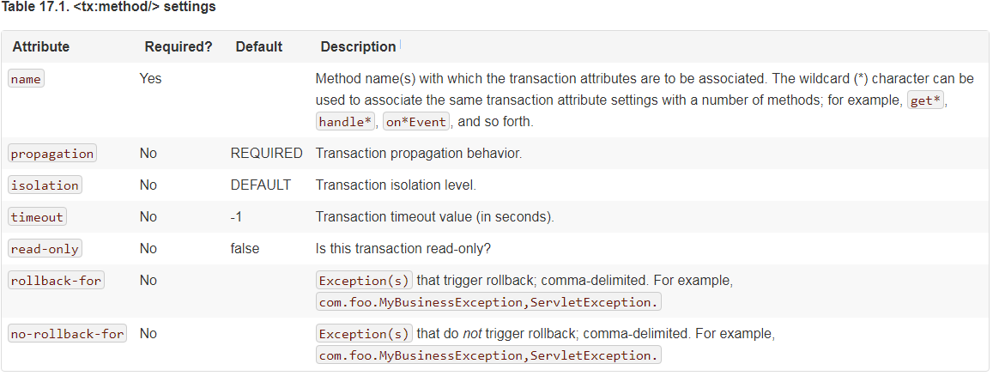
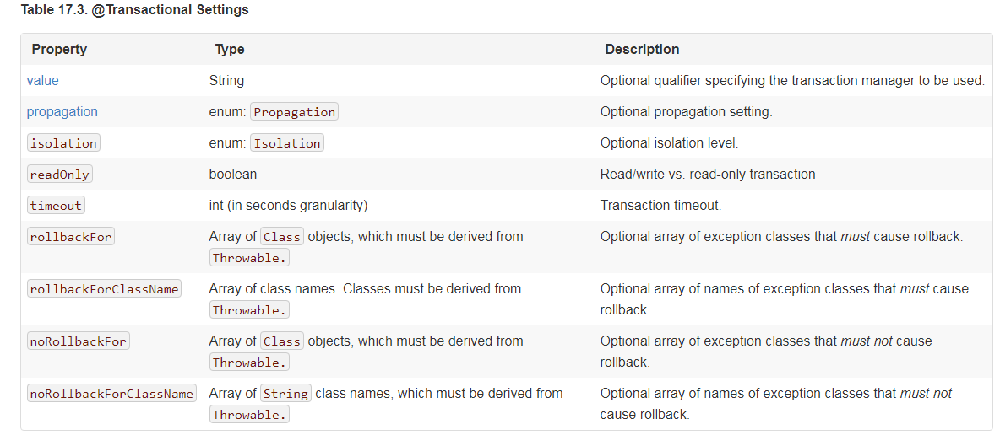
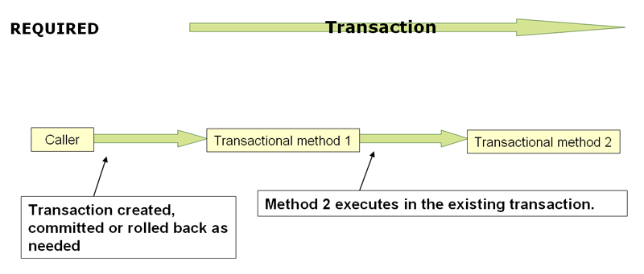
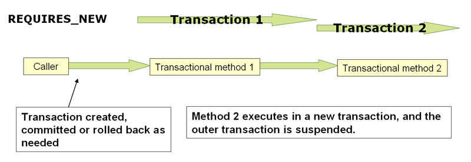

# Transaction Management

- 01 [PlatformTransactionManager](#1-platformtransactionmanager)
- 02 [TransactionDefinition](#2-transactiondefinition )
- 03 [TransactionStatus](#3-transactionstatus)
- 04 [tx:advice settings](#4-tx-advice-settings)
- 05 [@Transactional](#5-Transactional)
- 06 [@Transactional settings](#6-transactional-settings)
- 07 [Transaction propagation](#7-transaction-propagation)
- 08 [Advising transactional operations](#8-advising-transactional-operations)
- 09 [Programmatic transaction management](#9-programmatic-transaction-management)

## Introduction to Spring Framework transaction management

Consistent programming model across different transaction APIs such as Java Transaction API (JTA), JDBC, Hibernate, Java Persistence API (JPA), and Java Data Objects (JDO).
Support for declarative transaction management.
Simpler API for programmatic transaction management than complex transaction APIs such as JTA.
Excellent integration with Spring’s data access abstractions.


- Consistent programming model across different transaction APIs such as Java Transaction API (JTA), JDBC, Hibernate, Java Persistence API (JPA), and Java Data Objects (JDO).
- Support for declarative transaction management.
- Simpler API for programmatic transaction management than complex transaction APIs such as JTA.
- Excellent integration with Spring’s data access abstractions.

## Global transactions

Global transactions enable you to work with multiple transactional resources, typically relational databases and message queues

## Local transactions

Local transactions are resource-specific, such as a transaction associated with a JDBC connection. Local transactions may be easier to use, but have significant disadvantages: they cannot work across multiple transactional resources. For example, code that manages transactions using a JDBC connection cannot run within a global JTA transaction. Because the application server is not involved in transaction management, it cannot help ensure correctness across multiple resources. (It is worth noting that most applications use a single transaction resource.) Another downside is that local transactions are invasive to the programming model.


## Understanding the Spring Framework transaction abstraction

The key to the Spring transaction abstraction is the notion of a transaction strategy. A transaction strategy is defined by the org.springframework.transaction.PlatformTransactionManager interface:


[Link](https://docs.spring.io/spring/docs/4.3.x/spring-framework-reference/htmlsingle/#transaction-strategies)

```java
public interface PlatformTransactionManager {

    TransactionStatus getTransaction(TransactionDefinition definition) throws TransactionException;

    void commit(TransactionStatus status) throws TransactionException;

    void rollback(TransactionStatus status) throws TransactionException;
}
```

## 2 TransactionDefinition

[Link](https://docs.spring.io/spring/docs/4.3.x/spring-framework-reference/htmlsingle/#transaction-strategies)

The TransactionDefinition interface specifies:

- Isolation: The degree to which this transaction is isolated from the work of other transactions. For example, can this transaction see uncommitted writes from other transactions?
- Propagation: Typically, all code executed within a transaction scope will run in that transaction. However, you have the option of specifying the behavior in the event that a transactional method is executed when a transaction context already exists. For example, code can continue running in the existing transaction (the common case); or the existing transaction can be suspended and a new transaction created. Spring offers all of the transaction propagation options familiar from EJB CMT. To read about the semantics of transaction propagation in Spring, see Section 17.5.7, “Transaction propagation”.
- Timeout: How long this transaction runs before timing out and being rolled back automatically by the underlying transaction infrastructure.
- Read-only status: A read-only transaction can be used when your code reads but does not modify data. Read-only transactions can be a useful optimization in some cases, such as when you are using Hibernate.

## 3 TransactionStatus

[Link](https://docs.spring.io/spring/docs/4.3.x/spring-framework-reference/htmlsingle/#transaction-strategies)

```java
public interface TransactionStatus extends SavepointManager {

    boolean isNewTransaction();

    boolean hasSavepoint();

    void setRollbackOnly();

    boolean isRollbackOnly();

    void flush();

    boolean isCompleted();

}
```

## DataSourceTransactionManager

PlatformTransactionManager implementations normally require knowledge of the environment in which they work: JDBC, JTA, Hibernate, and so on. The following examples show how you can define a local PlatformTransactionManager implementation. (This example works with plain JDBC.)

You define a JDBC DataSource

```xml
<bean id="dataSource" class="org.apache.commons.dbcp.BasicDataSource" destroy-method="close">
    <property name="driverClassName" value="${jdbc.driverClassName}" />
    <property name="url" value="${jdbc.url}" />
    <property name="username" value="${jdbc.username}" />
    <property name="password" value="${jdbc.password}" />
</bean>
```

The related PlatformTransactionManager bean definition will then have a reference to the DataSource definition. It will look like this:

```xml
<bean id="txManager" class="org.springframework.jdbc.datasource.DataSourceTransactionManager">
    <property name="dataSource" ref="dataSource"/>
</bean>
```

## Declarative transaction management

The concept of rollback rules is important: they enable you to specify which exceptions (and throwables) should cause automatic rollback. You specify this declaratively, in configuration, not in Java code. So, although you can still call setRollbackOnly() on the TransactionStatus object to roll back the current transaction back, most often you can specify a rule that MyApplicationException must always result in rollback. The significant advantage to this option is that business objects do not depend on the transaction infrastructure. For example, they typically do not need to import Spring transaction APIs or other Spring APIs.

Although EJB container default behavior automatically rolls back the transaction on a system exception (usually a runtime exception), EJB CMT does not roll back the transaction automatically on anapplication exception (that is, a checked exception other than java.rmi.RemoteException). While the Spring default behavior for declarative transaction management follows EJB convention (roll back is automatic only on unchecked exceptions), it is often useful to customize this behavior.

## Understanding the Spring Framework’s declarative transaction implementation


## 4 tx-advice-settings

[Link](https://docs.spring.io/spring/docs/4.3.x/spring-framework-reference/htmlsingle/#transaction-declarative-txadvice-settings)

- Propagation setting is REQUIRED.
- Isolation level is DEFAULT.
- Transaction is read/write.
- Transaction timeout defaults to the default timeout of the underlying transaction system, or none if timeouts are not supported.
- Any RuntimeException triggers rollback, and any checked Exception does not.



## 5 @Transactional

[Link](https://docs.spring.io/spring/docs/4.3.x/spring-framework-reference/htmlsingle/#transaction-declarative-annotations)

配置：

```xml
 <!-- this is the service object that we want to make transactional -->
    <bean id="fooService" class="x.y.service.DefaultFooService"/>

    <!-- enable the configuration of transactional behavior based on annotations -->
    <tx:annotation-driven transaction-manager="txManager"/><!-- a PlatformTransactionManager is still required -->
    <bean id="txManager" class="org.springframework.jdbc.datasource.DataSourceTransactionManager">
        <!-- (this dependency is defined somewhere else) -->
        <property name="dataSource" ref="dataSource"/>
    </bean>

    <!-- other <bean/> definitions here -->
```

注意点：

- @Transactional 注解修饰的方法必须是`public`的
- In proxy mode (which is the default), only external method calls coming in through the proxy are intercepted (like `@PostConstruct`)
- Spring recommends that you only annotate concrete classes (and methods of concrete classes) with the @Transactional annotation, as opposed to annotating interfaces. You certainly can place the @Transactional annotation on an interface (or an interface method), but this works only as you would expect it to if you are using interface-based proxies. The fact that Java annotations are not inherited from interfaces means that if you are using class-based proxies ( proxy-target-class="true") or the weaving-based aspect ( mode="aspectj"), then the transaction settings are not recognized by the proxying and weaving infrastructure, and the object will not be wrapped in a transactional proxy, which would be decidedly bad.

## 6 @Transactional settings

[Link](https://docs.spring.io/spring/docs/4.3.x/spring-framework-reference/htmlsingle/#transaction-declarative-attransactional-settings)

The @Transactional annotation is metadata that specifies that an interface, class, or method must have transactional semantics; for example, "start a brand new read-only transaction when this method is invoked, suspending any existing transaction". The default @Transactional settings are as follows:

- Propagation setting is PROPAGATION_REQUIRED.
- Isolation level is ISOLATION_DEFAULT.
- Transaction is read/write.
- Transaction timeout defaults to the default timeout of the underlying transaction system, or to none if timeouts are not supported.
- Any RuntimeException triggers rollback, and any checked Exception does not.



## 7 Transaction propagation

事物的传播属性

### Required

PROPAGATION_REQUIRED



### RequiresNew

PROPAGATION_REQUIRES_NEW



> PROPAGATION_REQUIRES_NEW, in contrast to PROPAGATION_REQUIRED, uses a completely independent transaction for each affected transaction scope. In that case, the underlying physical transactions are different and hence can commit or roll back independently, with an outer transaction not affected by an inner transaction’s rollback status.

## 8 Advising transactional operations

通知 + 事务（顺序可控） 实现`Ordered`接口

[Link](https://docs.spring.io/spring/docs/4.3.x/spring-framework-reference/htmlsingle/#transaction-declarative-applying-more-than-just-tx-advice)

## 9 Programmatic transaction management

- Using the TransactionTemplate. [Link](https://docs.spring.io/spring/docs/4.3.x/spring-framework-reference/htmlsingle/#tx-prog-template)
- Using a PlatformTransactionManager implementation directly. [Link](https://docs.spring.io/spring/docs/4.3.x/spring-framework-reference/htmlsingle/#transaction-programmatic-ptm)