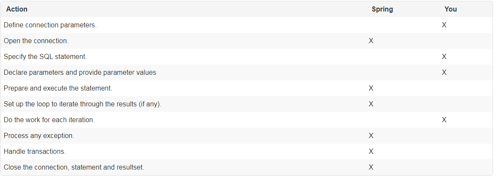

# Data access with JDBC

The value-add provided by the Spring Framework JDBC abstraction is perhaps best shown by the sequence of actions outlined in the table below. The table shows what actions Spring will take care of and which actions are the responsibility of you, the application developer.



## Choosing an approach for JDBC database access

- `JdbcTemplate` is the classic Spring JDBC approach and the most popular. This "lowest level" approach and all others use a JdbcTemplate under the covers.

- `NamedParameterJdbcTemplate` wraps a JdbcTemplate to provide named parameters instead of the traditional JDBC "?" placeholders. This approach provides better documentation and ease of use when you have multiple parameters for an SQL statement.

- `SimpleJdbcInsert` and `SimpleJdbcCall` optimize database metadata to limit the amount of necessary configuration. This approach simplifies coding so that you only need to provide the name of the table or procedure and provide a map of parameters matching the column names. This only works if the database provides adequate metadata. If the database doesn’t provide this metadata, you will have to provide explicit configuration of the parameters.

- RDBMS Objects including `MappingSqlQuery`, `SqlUpdate` and `StoredProcedure` requires you to create reusable and thread-safe objects during initialization of your data access layer. This approach is modeled after JDO Query wherein you define your query string, declare parameters, and compile the query. Once you do that, execute methods can be called multiple times with various parameter values passed in.

## Package hierarchy

- `org.springframework.jdbc.core` `JdbcTemplate`
- `org.springframework.jdbc.core.simple` `SimpleJdbcInsert` `SimpleJdbcCall`
- `org.springframework.jdbc.core.namedparam` `NamedParameterJdbcTemplate`
- `org.springframework.jdbc.datasource`
- `org.springframework.jdbc.object`
- `org.springframework.jdbc.support`

## JdbcTemplate

[link](https://docs.spring.io/spring/docs/4.3.x/spring-framework-reference/htmlsingle/#jdbc-JdbcTemplate)


queryObject

```java
import javax.sql.DataSource;
import org.springframework.jdbc.core.JdbcTemplate;

public class RunAQuery {

    private JdbcTemplate jdbcTemplate;

    public void setDataSource(DataSource dataSource) {
        this.jdbcTemplate = new JdbcTemplate(dataSource);
    }

    public int getCount() {
        return this.jdbcTemplate.queryForObject("select count(*) from mytable", Integer.class);
    }

    public String getName() {
        return this.jdbcTemplate.queryForObject("select name from mytable", String.class);
    }
}
```

queryList

````java
private JdbcTemplate jdbcTemplate;

public void setDataSource(DataSource dataSource) {
    this.jdbcTemplate = new JdbcTemplate(dataSource);
}

public List<Map<String, Object>> getList() {
    return this.jdbcTemplate.queryForList("select * from mytable");
}
```

update

```java
import javax.sql.DataSource;

import org.springframework.jdbc.core.JdbcTemplate;

public class ExecuteAnUpdate {

    private JdbcTemplate jdbcTemplate;

    public void setDataSource(DataSource dataSource) {
        this.jdbcTemplate = new JdbcTemplate(dataSource);
    }

    public void setName(int id, String name) {
        this.jdbcTemplate.update("update mytable set name = ? where id = ?", name, id);
    }
}
```

## Controlling database connections

DBCP configuration

```xml
<bean id="dataSource" class="org.apache.commons.dbcp.BasicDataSource" destroy-method="close">
    <property name="driverClassName" value="${jdbc.driverClassName}"/>
    <property name="url" value="${jdbc.url}"/>
    <property name="username" value="${jdbc.username}"/>
    <property name="password" value="${jdbc.password}"/>
</bean>

<context:property-placeholder location="jdbc.properties"/>
```

C3P0 configuration

```xml
<bean id="dataSource" class="com.mchange.v2.c3p0.ComboPooledDataSource" destroy-method="close">
    <property name="driverClass" value="${jdbc.driverClassName}"/>
    <property name="jdbcUrl" value="${jdbc.url}"/>
    <property name="user" value="${jdbc.username}"/>
    <property name="password" value="${jdbc.password}"/>
</bean>

<context:property-placeholder location="jdbc.properties"/>
```

- DataSourceUtils
- SmartDataSource
- AbstractDataSource -> 抽象
- SingleConnectionDataSource
- DriverManagerDataSource -> for test 测试使用
- TransactionAwareDataSourceProxy
- DataSourceTransactionManager -> support timeout 
- NativeJdbcExtractor