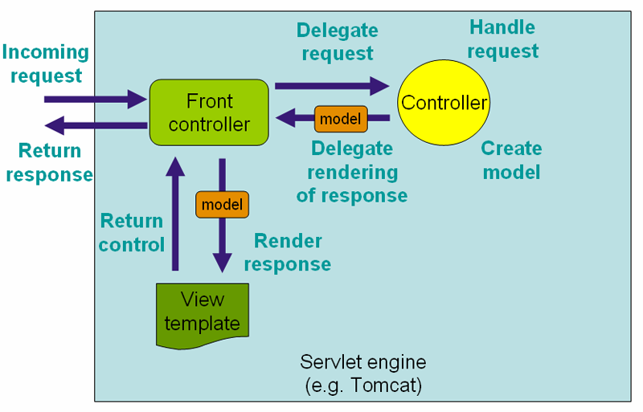
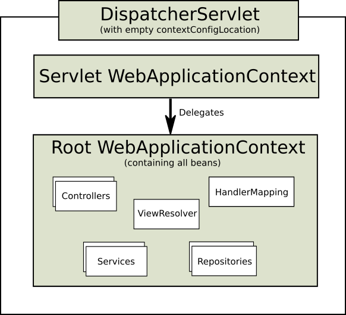

# Web MVC framework

The Spring Web model-view-controller (MVC) framework is designed around a DispatcherServlet that dispatches requests to handlers, with configurable handler mappings, view resolution, locale, time zone and theme resolution as well as support for uploading files. The default handler is based on the @Controller and @RequestMapping annotations, offering a wide range of flexible handling methods. With the introduction of Spring 3.0, the @Controller mechanism also allows you to create RESTful Web sites and applications, through the @PathVariable annotation and other features.

"Open for extension…​" A key design principle in Spring Web MVC and in Spring in general is the "Open for extension, closed for modification" principle.

Some methods in the core classes of Spring Web MVC are marked final. As a developer you cannot override these methods to supply your own behavior. This has not been done arbitrarily, but specifically with this principle in mind.

For an explanation of this principle, refer to Expert Spring Web MVC and Web Flow by Seth Ladd and others; specifically see the section "A Look At Design," on page 117 of the first edition. Alternatively, see

[Bob Martin, The Open-Closed Principle (PDF)](https://www.cs.duke.edu/courses/fall07/cps108/papers/ocp.pdf)
You cannot add advice to final methods when you use Spring MVC. For example, you cannot add advice to the AbstractController.setSynchronizeOnSession() method. Refer to Section 11.6.1, “Understanding AOP proxies” for more information on AOP proxies and why you cannot add advice to final methods.

## Features of Spring Web MVC

Spring’s web module includes many unique web support features:

`Clear separation of roles.` Each role — controller, validator, command object, form object, model object, DispatcherServlet, handler mapping, view resolver, and so on — can be fulfilled by a specialized object.
Powerful and straightforward configuration of both framework and application classes as JavaBeans. This configuration capability includes easy referencing across contexts, such as from web controllers to business objects and validators.
Adaptability, non-intrusiveness, and flexibility. Define any controller method signature you need, possibly using one of the parameter annotations (such as @RequestParam, @RequestHeader, @PathVariable, and more) for a given scenario.
Reusable business code, no need for duplication. Use existing business objects as command or form objects instead of mirroring them to extend a particular framework base class.
Customizable binding and validation. Type mismatches as application-level validation errors that keep the offending value, localized date and number binding, and so on instead of String-only form objects with manual parsing and conversion to business objects.
Customizable handler mapping and view resolution. Handler mapping and view resolution strategies range from simple URL-based configuration, to sophisticated, purpose-built resolution strategies. Spring is more flexible than web MVC frameworks that mandate a particular technique.
Flexible model transfer. Model transfer with a name/value Map supports easy integration with any view technology.
Customizable locale, time zone and theme resolution, support for JSPs with or without Spring tag library, support for JSTL, support for Velocity without the need for extra bridges, and so on.
A simple yet powerful JSP tag library known as the Spring tag library that provides support for features such as data binding and themes. The custom tags allow for maximum flexibility in terms of markup code. For information on the tag library descriptor, see the appendix entitled Chapter 43, spring JSP Tag Library
A JSP form tag library, introduced in Spring 2.0, that makes writing forms in JSP pages much easier. For information on the tag library descriptor, see the appendix entitled Chapter 44, spring-form JSP Tag Library
Beans whose lifecycle is scoped to the current HTTP request or HTTP Session. This is not a specific feature of Spring MVC itself, but rather of the WebApplicationContext container(s) that Spring MVC uses. These bean scopes are described in Section 7.5.4, “Request, session, global session, application, and WebSocket scopes”

- Pluggability of other MVC implementations

## The DispatcherServlet



> confg

```xml
<web-app>
    <servlet>
        <servlet-name>example</servlet-name>
        <servlet-class>org.springframework.web.servlet.DispatcherServlet</servlet-class>
        <load-on-startup>1</load-on-startup>
    </servlet>

    <servlet-mapping>
        <servlet-name>example</servlet-name>
        <url-pattern>/example/*</url-pattern>
    </servlet-mapping>

</web-app>
```

## Typical context hierarchy in Spring Web MVC


## Single root context in Spring Web MVC



This can be configured by setting an empty contextConfigLocation servlet init parameter, as shown below

```xml
<web-app>
    <context-param>
        <param-name>contextConfigLocation</param-name>
        <param-value>/WEB-INF/root-context.xml</param-value>
    </context-param>
    <servlet>
        <servlet-name>dispatcher</servlet-name>
        <servlet-class>org.springframework.web.servlet.DispatcherServlet</servlet-class>
        <init-param>
            <param-name>contextConfigLocation</param-name>
            <param-value></param-value>
        </init-param>
        <load-on-startup>1</load-on-startup>
    </servlet>
    <servlet-mapping>
        <servlet-name>dispatcher</servlet-name>
        <url-pattern>/*</url-pattern>
    </servlet-mapping>
    <listener>
        <listener-class>org.springframework.web.context.ContextLoaderListener</listener-class>
    </listener>
</web-app>
```

```java
public class GolfingWebAppInitializer extends AbstractAnnotationConfigDispatcherServletInitializer {

    @Override
    protected Class<?>[] getRootConfigClasses() {
        // GolfingAppConfig defines beans that would be in root-context.xml
        return new Class[] { GolfingAppConfig.class };
    }

    @Override
    protected Class<?>[] getServletConfigClasses() {
        // GolfingWebConfig defines beans that would be in golfing-servlet.xml
        return new Class[] { GolfingWebConfig.class };
    }

    @Override
    protected String[] getServletMappings() {
        return new String[] { "/golfing/*" };
    }
}
```

## Special bean types in the WebApplicationContext

- HandlerMapping
- HandlerAdapter
- HandlerExceptionResolver
- ViewResolver
- LocaleResolver & LocaleContextResolver
- ThemeResolver
- MultipartResolver
- FlashMapManager

## Default DispatcherServlet Configuration

[Section 22.16, Configuring Spring MVC](https://docs.spring.io/spring/docs/4.3.x/spring-framework-reference/htmlsingle/#mvc-config)

`DispatcherServlet.properties`

## DispatcherServlet initialization parameters

- contextClass
- contextConfigLocation
- namespace

## Defining a controller with @Controller

[Link](https://docs.spring.io/spring/docs/4.3.x/spring-framework-reference/htmlsingle/#mvc-ann-controller)

```xml
<?xml version="1.0" encoding="UTF-8"?>
<beans xmlns="http://www.springframework.org/schema/beans"
    xmlns:xsi="http://www.w3.org/2001/XMLSchema-instance"
    xmlns:p="http://www.springframework.org/schema/p"
    xmlns:context="http://www.springframework.org/schema/context"
    xsi:schemaLocation="
        http://www.springframework.org/schema/beans
        http://www.springframework.org/schema/beans/spring-beans.xsd
        http://www.springframework.org/schema/context
        http://www.springframework.org/schema/context/spring-context.xsd">

    <context:component-scan base-package="org.springframework.samples.petclinic.web"/>

    <!-- ... -->

</beans>
```

## Mapping Requests With @RequestMapping

## Composed @RequestMapping Variants

- @GetMapping
- @PostMapping
- @PutMapping
- @DeleteMapping
- @PatchMapping

## URI Template Patterns

`@PathVariable`

## Matrix Variables

## Consumable Media Types

```java
@PostMapping(path = "/pets", consumes = "application/json")
public void addPet(@RequestBody Pet pet, Model model) {
    // implementation omitted
}
```

>The consumes condition is supported on the type and on the method level. Unlike most other conditions, when used at the type level, method-level consumable types override rather than extend type-level consumable types

## Producible Media Types

```java
@GetMapping(path = "/pets/{petId}", produces = MediaType.APPLICATION_JSON_UTF8_VALUE)
@ResponseBody
public Pet getPet(@PathVariable String petId, Model model) {
    // implementation omitted
}
```

> The produces condition is supported on the type and on the method level. Unlike most other conditions, when used at the type level, method-level producible types override rather than extend type-level producible types

## Request Parameters and Header Values

```java
@Controller
@RequestMapping("/owners/{ownerId}")
public class RelativePathUriTemplateController {

    @GetMapping(path = "/pets/{petId}", params = "myParam=myValue")
    public void findPet(@PathVariable String ownerId, @PathVariable String petId, Model model) {
        // implementation omitted
    }

}
```

```java
@Controller
@RequestMapping("/owners/{ownerId}")
public class RelativePathUriTemplateController {

    @GetMapping(path = "/pets", headers = "myHeader=myValue")
    public void findPet(@PathVariable String ownerId, @PathVariable String petId, Model model) {
        // implementation omitted
    }

}
```

## Defining @RequestMapping handler methods

[link](https://docs.spring.io/spring/docs/4.3.x/spring-framework-reference/htmlsingle/#mvc-ann-methods)

## Supported method argument types

[link](https://docs.spring.io/spring/docs/4.3.x/spring-framework-reference/htmlsingle/#mvc-ann-arguments)

## Asynchronous Request Processing

Spring MVC 3.2 introduced Servlet 3 based asynchronous request processing. Instead of returning a value, as usual, a controller method can now return a `java.util.concurrent.Callable`and produce the return value from a Spring MVC managed thread. Meanwhile the main Servlet container thread is exited and released and allowed to process other requests. Spring MVC invokes the `Callable` in a separate thread with the help of a `TaskExecutor` and when the `Callable` returns, the request is dispatched back to the Servlet container to resume processing using the value returned by the `Callable`. Here is an example of such a controller method:

```java
@PostMapping
public Callable<String> processUpload(final MultipartFile file) {

    return new Callable<String>() {
        public String call() throws Exception {
            // ...
            return "someView";
        }
    };

}
```

> This may be difficult to understand without any knowledge of the Servlet 3.0 asynchronous request processing features. It would certainly help to read up on that. Here are a few basic facts about the underlying mechanism:

- A ServletRequest can be put in asynchronous mode by calling request.startAsync(). The main effect of doing so is that the Servlet, as well as any Filters, can exit but the response will remain open to allow processing to complete later.
- The call to request.startAsync() returns AsyncContext which can be used for further control over async processing. For example it provides the method dispatch, that is similar to a forward from the Servlet API except it allows an application to resume request processing on a Servlet container thread.
- The ServletRequest provides access to the current DispatcherType that can be used to distinguish between processing the initial request, an async dispatch, a forward, and other dispatcher types.

With the above in mind, the following is the sequence of events for async request processing with a Callable:

- Controller returns a Callable.
- Spring MVC starts asynchronous processing and submits the Callable to a TaskExecutor for processing in a separate thread.
- The DispatcherServlet and all Filter’s exit the Servlet container thread but the response remains open.
- The Callable produces a result and Spring MVC dispatches the request back to the Servlet container to resume processing.
- The DispatcherServlet is invoked again and processing resumes with the asynchronously produced result from the Callable.

The sequence for DeferredResult is very similar except it’s up to the application to produce the asynchronous result from any thread:

- Controller returns a DeferredResult and saves it in some in-memory queue or list where it can be accessed.
- Spring MVC starts async processing.
- The DispatcherServlet and all configured Filter’s exit the request processing thread but the response remains open.
- The application sets the DeferredResult from some thread and Spring MVC dispatches the request back to the Servlet container.
- The DispatcherServlet is invoked again and processing resumes with the asynchronously produced result.
- For further background on the motivation for async request processing and when or why to use it please read this blog post series.

Another option is for the controller method to return an instance of DeferredResult. In this case the return value will also be produced from any thread, i.e. one that is not managed by Spring MVC. For example the result may be produced in response to some external event such as a JMS message, a scheduled task, and so on. Here is an example of such a controller method:

```java
@RequestMapping("/quotes")
@ResponseBody
public DeferredResult<String> quotes() {
    DeferredResult<String> deferredResult = new DeferredResult<String>();
    // Save the deferredResult somewhere..
    return deferredResult;
}

// In some other thread...
deferredResult.setResult(data);
```

## HTTP Streaming

```java
@RequestMapping("/events")
public ResponseBodyEmitter handle() {
    ResponseBodyEmitter emitter = new ResponseBodyEmitter();
    // Save the emitter somewhere..
    return emitter;
}

// In some other thread
emitter.send("Hello once");

// and again later on
emitter.send("Hello again");

// and done at some point
emitter.complete();
```

## Configuring Asynchronous Request Processing

```xml
<web-app xmlns="http://java.sun.com/xml/ns/javaee"
    xmlns:xsi="http://www.w3.org/2001/XMLSchema-instance"
    xsi:schemaLocation="
            http://java.sun.com/xml/ns/javaee
            http://java.sun.com/xml/ns/javaee/web-app_3_0.xsd"
    version="3.0">

    <filter>
        <filter-name>Spring OpenEntityManagerInViewFilter</filter-name>
        <filter-class>org.springframework.~.OpenEntityManagerInViewFilter</filter-class>
        <async-supported>true</async-supported>
    </filter>

    <filter-mapping>
        <filter-name>Spring OpenEntityManagerInViewFilter</filter-name>
        <url-pattern>/*</url-pattern>
        <dispatcher>REQUEST</dispatcher>
        <dispatcher>ASYNC</dispatcher>
    </filter-mapping>

</web-app>
```

## Intercepting requests with a HandlerInterceptor

```xml
<beans>
    <bean id="handlerMapping"
            class="org.springframework.web.servlet.mvc.method.annotation.RequestMappingHandlerMapping">
        <property name="interceptors">
            <list>
                <ref bean="officeHoursInterceptor"/>
            </list>
        </property>
    </bean>

    <bean id="officeHoursInterceptor"
            class="samples.TimeBasedAccessInterceptor">
        <property name="openingTime" value="9"/>
        <property name="closingTime" value="18"/>
    </bean>
</beans>
```

## Resolving views

> ViewResolver

- AbstractCachingViewResolver
- XmlViewResolver
- ResourceBundleViewResolver
- UrlBasedViewResolver
- InternalResourceViewResolver
- VelocityViewResolver
- FreeMarkerViewResolver
- ContentNegotiatingViewResolver

### Chaining ViewResolvers

### Redirecting to Views

### ContentNegotiatingViewResolver

The ContentNegotiatingViewResolver does not resolve views itself but rather delegates to other view resolvers, selecting the view that resembles the representation requested by the client. Two strategies exist for a client to request a representation from the server:

- Use a distinct URI for each resource, typically by using a different file extension in the URI. For example, the URI http://www.example.com/users/fred.pdf requests a PDF representation of the user fred, and http://www.example.com/users/fred.xml requests an XML representation.

- Use the same URI for the client to locate the resource, but set the Accept HTTP request header to list the media types that it understands. For example, an HTTP request for http://www.example.com/users/fred with an Accept header set to application/pdf requests a PDF representation of the user fred, while http://www.example.com/users/fred with an Accept header set to text/xml requests an XML representation. This strategy is known as content negotiation.

To support multiple representations of a resource, Spring provides the ContentNegotiatingViewResolver to resolve a view based on the file extension or Accept header of the HTTP request. ContentNegotiatingViewResolver does not perform the view resolution itself but instead delegates to a list of view resolvers that you specify through the bean property ViewResolvers.

Here is an example configuration of a ContentNegotiatingViewResolver:

```xml
<bean class="org.springframework.web.servlet.view.ContentNegotiatingViewResolver">
    <property name="viewResolvers">
        <list>
            <bean class="org.springframework.web.servlet.view.BeanNameViewResolver"/>
            <bean class="org.springframework.web.servlet.view.InternalResourceViewResolver">
                <property name="prefix" value="/WEB-INF/jsp/"/>
                <property name="suffix" value=".jsp"/>
            </bean>
        </list>
    </property>
    <property name="defaultViews">
        <list>
            <bean class="org.springframework.web.servlet.view.json.MappingJackson2JsonView"/>
        </list>
    </property>
</bean>

<bean id="content" class="com.foo.samples.rest.SampleContentAtomView"/>
```

### Building URIs

```java
UriComponents uriComponents = UriComponentsBuilder.fromUriString(
        "http://example.com/hotels/{hotel}/bookings/{booking}").build();

URI uri = uriComponents.expand("42", "21").encode().toUri();
```

### Building URIs to Controllers and methods

Spring MVC also provides a mechanism for building links to controller methods. For example, given:

```java
@Controller
@RequestMapping("/hotels/{hotel}")
public class BookingController {

    @GetMapping("/bookings/{booking}")
    public String getBooking(@PathVariable Long booking) {
        // ...
    }
}
```

You can prepare a link by referring to the method by name:

```java
UriComponents uriComponents = MvcUriComponentsBuilder
    .fromMethodName(BookingController.class, "getBooking", 21).buildAndExpand(42);

URI uri = uriComponents.encode().toUri();
```