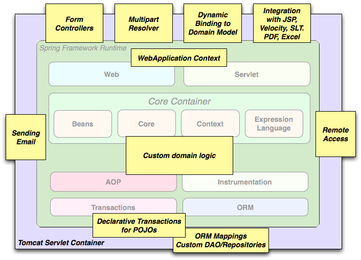

# spring-reference-001

- [spring-reference-001](#spring-reference-001)
  - [spring bom](#spring-bom)
  - [spring log](#spring-log)
  - [spring 应用场景](#spring-%e5%ba%94%e7%94%a8%e5%9c%ba%e6%99%af)

## spring bom

> 更方便快捷的引入Spring的依赖（jar）[bom(Bill Of Materials)](https://docs.spring.io/spring/docs/4.3.x/spring-framework-reference/htmlsingle/#overview-maven-bom)

```xml
<dependencyManagement>
    <dependencies>
        <dependency>
            <groupId>org.springframework</groupId>
            <artifactId>spring-framework-bom</artifactId>
            <version>4.3.12.RELEASE</version>
            <type>pom</type>
            <scope>import</scope>
        </dependency>
    </dependencies>
</dependencyManagement>
```

## spring log

> [日志框架 use logback](https://docs.spring.io/spring/docs/4.3.x/spring-framework-reference/htmlsingle/#overview-logging-slf4j)

```xml
<dependencies>
    <dependency>
        <groupId>org.slf4j</groupId>
        <artifactId>jcl-over-slf4j</artifactId>
        <version>1.7.21</version>
    </dependency>
    <dependency>
        <groupId>ch.qos.logback</groupId>
        <artifactId>logback-classic</artifactId>
        <version>1.1.7</version>
    </dependency>
</dependencies>
```

## spring 应用场景

[Usage scenarios](https://docs.spring.io/spring/docs/4.3.x/spring-framework-reference/htmlsingle/#overview-usagescenarios)

