# 第1章Http概述

- MIME type 媒体类型
- Content-type:image/jpeg
- Content-lenght
- HTML格式的文本文档由text/html类型来标记。
- 普通的ASCII文本文档由text/plain类型来标记。
- JPEG版本的图片为image/jpeg类型。
- GIF格式的图片为image/gif类型。
- Apple的QuickTime电影为video/quicktime类型。
- 微软的PowerPoint演示文件为app1 ication/vnd.ms-powerpoint类型。
- URI
- 统一资源标识符(Uniform Resource Identifier, URI)。
- URI的第二种形式就是统一资源名(URN)。
- Http报文 Http Message
- Http Method
- 状态码
- 报文
- 请求报文(request message)
- 响应报文 (response message)
- ( Transmission Control Protocol, TCP )
- 用网络术语来说，HTTP协议位于TCP的上层。HTTP使用TCP来传输其报文数据。与之类似。
- telent 链接http
- netcat (nc)

## MIME类型

MIME类型是一种文本标记，表示一种主要的对象类型和一个特定的子类型，中间由一条斜杠来分隔。

## URI

URI有两种形式，分别称为URL和URN。

统一资源定位符(URL)是资源标识符最常见的形式。URL描述了一台特定服务器上某资源的特定位置。它们可以明确说明如何从一个精确、固定的位置获取资源。

大部分URL都遵循一种标准格式，这种格式包含三个部分。
- URL的第一部分 被称为方案(scheme), 说明了访问资源所使用的协议类型。这，部分通常就是HTTP协议(http://)。
- 第二部分给出了服务器的因特网地址(比如，www .joes -hardware.com)。
- 其余部分指定了Web服务器上的某个资源(比如，/specials/saw-blade.gif)现在，几乎所有的URI都是URL。

## Http Method

|HTTP方法|描述|
|--------|----|
|GET|从服务器向客户端发送命名资源
|PUT|将来自客户端的数据存储到一个命名的服务器资源中
|DELETE|从服务器中影除命名资源
|POST|将客户端数据发送到一个服务器网关应用程序
|HEAD|仅发送命名资源响应中的HTTP首部

## Http 状态码

|HTTP状态码|描述|
|----------|---|
|200|OK。文档正确返回
|302|Redirect (重定向)。到其他地方去获取资源
|404|Not Found ( 没找到)。无法找到这个资源

## 报文

HTTP报文是由一行一行的简单字符串组成的。HTTP报文都是纯文本，不是二进制代码，所以人们可以很方便地对其进行读写。

HTTP报文包括以下三个部分。
- 起始行
报文的第一行就是起始行，在请求报文中用来说明要做些什么，在响应报文中说明出现了什么情况。
- 首部字段
起始行后面有零个或多个首部字段。每个首部字段都包含一个名字和一个值，为.了便于解析，两者之间用冒号(:)来分隔。首部以一一个空行结束。添加一个首部字段和添加新行一样简单。
- 主体
空行之后就是可选的报文主体了，其中包含了所有类型的数据。请求主体中包括.了要发送给Web服务器的数据;响应主体中装载了要返回给客户端的数据。起
始行和首部都是文本形式且都是结构化的，而主体则不同，主体中可以包含任意的二进制数据(比如图片、视频、音轨、软件程序)。当然，主体中也可以包含文本。

## TCP

TCP 提供了

- 无差错的数据传输;
- 按序传输(数据总是会按照发送的顺序到达) ;
- 未分段的数据流(可以在任意时刻以任意尺寸将数据发送出去)。

## Http 链接

浏览器处理链接：

- (a)浏览器从URL中解析出服务器的主机名;
- (b)浏览器将服务器的主机名转换成服务器的IP地址;
- (c)浏览器将端口号(如果有的话)从URL中解析出来;
- (d)浏览器建立一条与Web服务器的TCP连接;
- (e)浏览器向服务器发送一条HTTP请求报文;
- (f)服务器向浏览器回送-一条HTTP响应报文，
- (g)关闭连接，浏览器显示文档。

## Web 结构组件

- 代理
位于客户端和服务器之间的HTTP中间实体。
- 缓存
HTTP的仓库，使常用页面的副本可以保存在离客户端更近的地方。
- 网关
连接其他应用程序的特殊Web服务器。
- 隧道
对HTTP通信报文进行盲转发的特殊代理。
- Agent代理
发起自动HTTP请求的半智能Web客户端。

