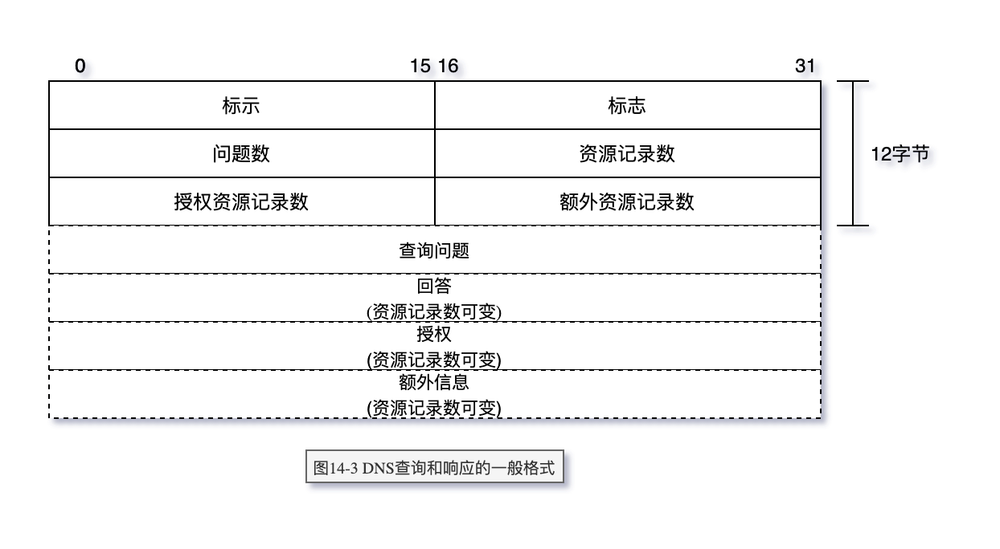

# DNS：域名系统

在一个应用程序请求 TCP 打开一个连接或使用
UDP 发送一个数据报之前。心须将一个主机名转换为一个 IP 地址。操作系统内核中的 TCP/IP
协议族对于 DNS 一点都不知道。

本章我们将了解地址解析器如何使用 TCP/IP 协议（主要是 UDP）与名字服务器通信

RFC1034 说明了 DNS 的概念和功能，RFC1035 详细说明了 DNS 的规范和实现

- DNS 的层次组织
- FQDN (Full Qualified Domain Name）
- DNS 查询报文中的问题部分
- DNS 响应报文中的资源记录部分 RR（Resource Record）
- gethostbyname
- gethostbyaddr
- 指针查询
- 标志字段

> FQDN

以点“.”结尾的域名称为`绝对域名`或`完全合格的域名` FQDN（Full Qualified Domain Name）
例如`sun.tuc.noao.edu.`。如果一个域名不以点结尾，则认为该域名是不完全的。
如何使域名完整依赖于使用的`DNS`软件。如果不完整的域名由两个或两个以上的标号组成，则认为它是完整的；
或者在该域名的右边加入一个局部后缀。例如域名 sun 通过加上局部后缀`.tuc.noao.edu.`成为完整的。

> 指针查询

最常用的查询类型是 A 类型，表示期望获得查询名的 IP 地址。一个 PTR 查询则请求获得一
个 IP 地址对应的域名。这是一个指针查询，

DNS 中一直难于理解的部分就是指针查询方式，即给定一个 IP 地址，返回与该地址对应的域名

但应牢记的是 DNS 名字是由 DNS 树的底部逐步向上书写的。这意味着
对于 IP 地址为 140.252.13.33 的 sun 主机，它的 DNS 名字为 33.13.252.140.in-addr.arpa。

> 资源记录

- A
- PTR
- CNAME
- HINFO
- MX

> 命令

- host
- dig
- nslookup
- whois

```log
➜  ~ host blog.web1992.cn
blog.web1992.cn is an alias for web1992.github.io.
web1992.github.io has address 185.199.109.153
web1992.github.io has address 185.199.110.153
web1992.github.io has address 185.199.111.153
web1992.github.io has address 185.199.108.153
```

```log
➜  ~ nslookup blog.web1992.cn
Server:		10.0.0.251
Address:	10.0.0.251#53

Non-authoritative answer:
blog.web1992.cn	canonical name = web1992.github.io.
Name:	web1992.github.io
Address: 185.199.110.153
Name:	web1992.github.io
Address: 185.199.111.153
Name:	web1992.github.io
Address: 185.199.108.153
Name:	web1992.github.io
Address: 185.199.109.153
```

```log
➜  ~ dig blog.web1992.cn

; <<>> DiG 9.10.6 <<>> blog.web1992.cn
;; global options: +cmd
;; Got answer:
;; ->>HEADER<<- opcode: QUERY, status: NOERROR, id: 5630
;; flags: qr rd ra; QUERY: 1, ANSWER: 5, AUTHORITY: 0, ADDITIONAL: 1

;; OPT PSEUDOSECTION:
; EDNS: version: 0, flags:; udp: 4000
;; QUESTION SECTION:
;blog.web1992.cn.		IN	A

;; ANSWER SECTION:
blog.web1992.cn.	261	IN	CNAME	web1992.github.io.
web1992.github.io.	3261	IN	A	185.199.111.153
web1992.github.io.	3261	IN	A	185.199.108.153
web1992.github.io.	3261	IN	A	185.199.109.153
web1992.github.io.	3261	IN	A	185.199.110.153

;; Query time: 37 msec
;; SERVER: 10.0.0.251#53(10.0.0.251)
;; WHEN: Tue Jul 27 10:14:29 CST 2021
;; MSG SIZE  rcvd: 139
```

> 图 14-3 DNS 查询和响应的一般格式



## Links

- [阮一峰 DNS 原理入门](http://ruanyifeng.com/blog/2016/06/dns.html)
- [https://mp.weixin.qq.com/s/Dj3jQSnV_kLx6-9yT7yOwg](https://mp.weixin.qq.com/s/Dj3jQSnV_kLx6-9yT7yOwg)
