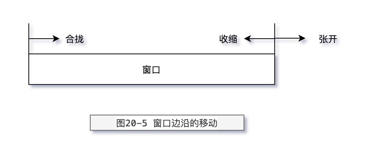

# TCP 的成块数据流

关键字：

- 滑动窗口协议 另一种形式的流量控制方法
- MSS
- 慢启动 (slow start)
- 拥塞窗口(congestion window)，记为 cwnd。
- 拥塞
- the slow start threshold (ssthresh)

## 滑动窗口协议

该协议允许发送方在停止并等待确认前可以连续发送多个分组。由于
发送方不必每发一个分组就停下来等待确认，因此该协议可以加速数据的传输。

> 图 20-4 TCP 滑动窗口的可视化表示

在这个图中，我们将字节从 1 至 12 进行标号。接收方通告的窗口称为提出的窗口（offered
window），它覆盖了从第 4 字节到第 10 字节的区域，表明接收方已经确认了包括第 3 字节在内的
数据，且通告窗口大小为 7。回顾第 17 章，我们知道窗口大小是与确认序号相对应的。发送方
计算它的可用窗口，该窗口表明多少数据可以立即被发送。

当接收方确认数据后，这个滑动窗口不时地向右移动。窗口两个边沿的相对运动增加或
减少了窗口的大小。我们使用三个术语来描述窗口左右边沿的运动：

1)称窗口左边沿向右边沿靠近为窗口合拢。这种现象发生在数据被发送和确认时。 2)当窗口右边沿向右移动时将允许发送更多的数据，我们称之为窗口张开。这种现象发
生在另一端的接收进程读取已经确认的数据并释放了 TCP 的接收缓存时。 3)当右边沿向左移动时，我们称之为窗口收缩。HostRequirementsRFC 强烈建议不要使
用这种方式。但 TCP 必须能够在某一端产生这种情况时进行处理。第 22.3 节给出了这样的一个
例子，一端希望向左移动右边沿来收缩窗口，但没能够这样做。

> 图 20-5 窗口边沿的移动

图 20-5 表示了这三种情况。因为窗口的左边沿受另一端发送的确认序号的控制，因此不可能
向左边移动。如果接收到一个指示窗口左边沿向左移动的 ACK，则它被认为是一个重复 ACK，并被丢弃。

如果左边沿到达右边沿，则称其为一个零窗口，此时发送方不能够发送任何数据。

## 窗口大小

由接收方提供的窗口的大小通常可以由接收进程控制，这将影响 TCP 的性能。

插口 API 允许进程设置发送和接收缓存的大小。接收缓存的大小是该连接上所能
够通告的最大窗口大小。有一些应用程序通过修改插口缓存大小来增加性能。

## PUSH 标志

在每一个 TCP 例子中，我们都看到了 PUSH 标志，但一直没有介绍它的用途。发送方使用
该标志通知接收方将所收到的数据全部提交给接收进程。这里的数据包括与 PUSH 一起传送的
数据以及接收方 TCP 已经为接收进程收到的其他数据。

## 慢启动

迄今为止，在本章所有的例子中，发送方一开始便向网络发送多个报文段，直至达到接
收方通告的窗口大小为止。当发送方和接收方处于同一个局域网时，这种方式是可以的。但
是如果在发送方和接收方之间存在多个路由器和速率较慢的链路时，就有可能出现一些问题。
一些中间路由器必须缓存分组，并有可能耗尽存储器的空间。[Jacobson1988]证明了这种连
接方式是如何严重降低了 TCP 连接的吞吐量的。

现在，TCP 需要支持一种被称为`慢启动(slowstart)`的算法。该算法通过观察到新分组
进入网络的速率应该与另一端返回确认的速率相同而进行工作。

慢启动为发送方的 TCP 增加了另一个窗口：拥塞窗口(congestion window)，记为 cwnd。
当与另一个网络的主机建立 TCP 连接时，拥塞窗口被初始化为 1 个报文段（即另一端通告的报文
段大小）。每收到一个 ACK，拥塞窗口就增加一个报文段（cwnd 以字节为单位，但是慢启动
以`报文段`大小为单位进行增加）。**发送方取拥塞窗口与通告窗口中的最小值作为发送上限**。
**拥塞窗口是发送方使用的流量控制，而通告窗口则是接收方使用的流量控制。**

发送方开始时发送一个报文段，然后等待 ACK。当收到该 ACK 时，拥塞窗口从 1 增加为 2，
即可以发送两个报文段。当收到这两个报文段的 ACK 时，拥塞窗口就增加为 4。这是一种指数增加的关系。

## 拥塞
