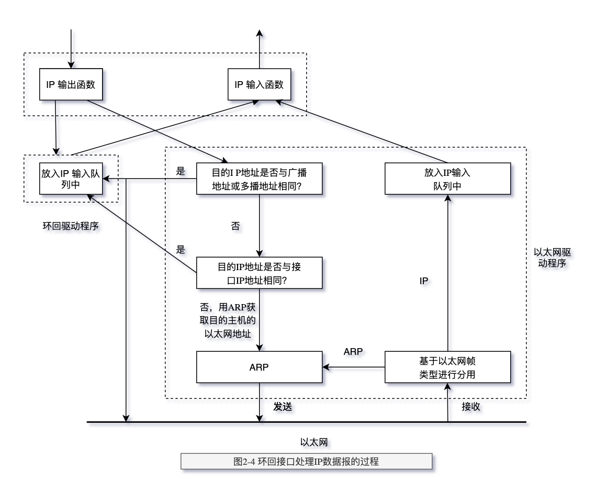

# 链路层

核心：理解`链路层`的封装。看懂图2-1即可(以太网和IEEE802封装)。了解`环回接口`的设计技巧

在TCP/IP协议族中，链路层主要有三个目的：

1. 为IP模块发送和接收IP数据报
2. 为ARP模块发送ARP请求和接收ARP应答
3. 为RARP发送RARP请求和接收RARP应答

TCP/IP支持多种不同的链路层协议，这取决于网络所使用的硬件，如`以太网`、令牌环网、FDDI（光纤分布式数据接口）及RS-232串行线路等。

> 了解的名词

- RFC 894
- 以太网和IEEE802封装
- SLIP封装
- CSLIP封装
- PPP协议
- 环回接口 Loopback Interface
- 最大传输单元MTU
- 路径MTU

## 硬件地址

两种帧格式都采用48bit（6字节）的目的地址和源地址（802.3允许使用16bit的地址，但一般是48bit地址）。
这就是我们在本书中所称的硬件地址。ARP和RARP协议对32bit的IP地址和48bit的硬件地址进行映射。

[ARP](./chp-04.md)和[RARP](./chp-05.md)是链路层的协议，`ARP` 通过IP找`硬件地址`，`RARP` 通过`硬件地址`找IP

## 以太网封装

> 图2-1 IEEE 802.2/802.3（RFC 1042）和以太网的封装格式（RFC 894）

> 从上面的图中可知，ARP和RARP协议都是被`包`在以太网协议中，没有IP层（网络层）的概念。这也是第[16章](chp-16.md)中的BOOTP解决的问题。

## MTU 最大传输单元

如果IP层有一个数据报要传，而且数据的长度比链路层的MTU还大，那么IP层就需要进行分片（fragmentation），
把数据报分成若干片，这样每一片都小于MTU。

## 路径MT

当在同一个网络上的两台主机互相进行通信时，该网络的MTU是非常重要的。但是如果
两台主机之间的通信要通过多个网络，那么每个网络的链路层就可能有不同的MTU。重要的
不是两台主机所在网络的MTU的值，重要的是两台通信主机路径中的最小MTU。它被称作路径MTU。
RFC 1191 描述了路径MTU的发现机制

路径MTU的不同导致，A->B,B->A走路的路也不同，也能导致两次报文从A->B的报文，先发的不一定先到B。

## 环回接口

理解`环回接口`的`设计技巧`

> 图2-4 环回接口处理IP数据报的过程

图中需要指出的关键点是：

1) 传给环回地址（一般是127.0.0.1）的任何数据均作为IP输入。
2) 传给广播地址或多播地址的数据报复制一份传给环回接口，然后送到以太网上。这是因为广播传送和多播传送的定义（第12章）包含主机本身。
3) 任何传给该主机IP地址的数据均送到环回接口。

看上去用传输层和IP层的方法来处理环回数据似乎效率不高，但它简化了设计，因为环回接口可以被看作是网络层下面的另一个链路层。
网络层把一份数据报传送给环回接口，就像传给其他链路层一样，只不过环回接口把它返回到IP的输入队列中。
