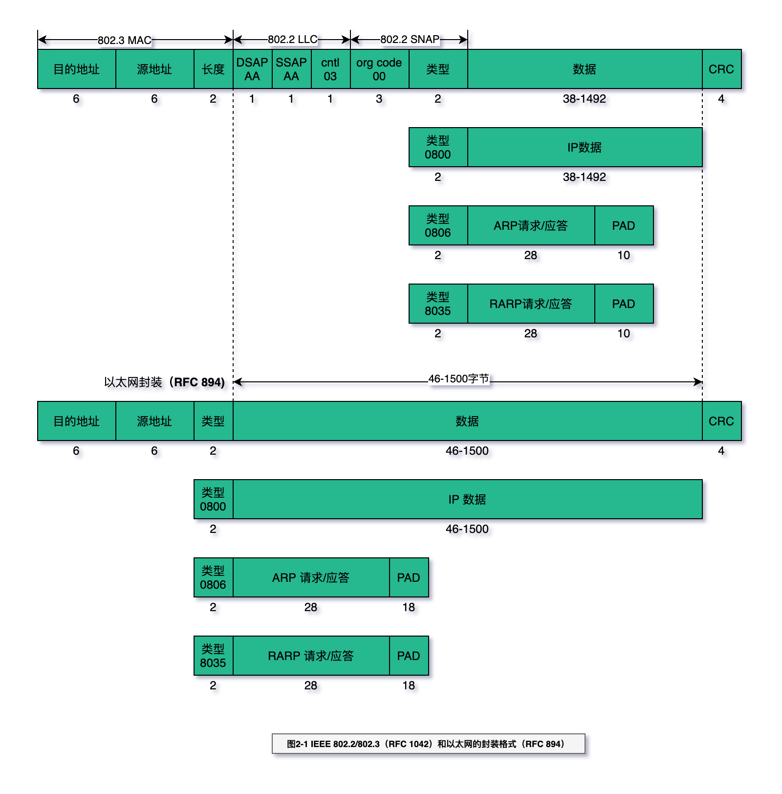

# 链路层

核心：理解链路层的封装。

在TCP/IP协议族中，链路层主要有三个目的：
-（1）为IP模块发送和接收IP数据报；
-（2）为ARP模块发送ARP请求和接收ARP应答；
-（3）为RARP发送RARP请求和接收RARP应答。

TCP/IP支持多种不同的链路层协议，这取决于网络所使用的硬件，如以
太网、令牌环网、FDDI（光纤分布式数据接口）及RS-232串行线路等。

- 以太网和IEEE802封装
- SLIP封装
- CSLIP封装
- PPP协议
- 环回接口
- 最大MTU
- 路径MTU

## MTU

路径MTU的不同导致，A->B,B->A走路的路也不同，也能导致两次报文从A->B的报文，先发的不一定先到B。

