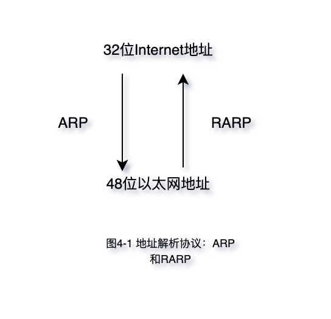
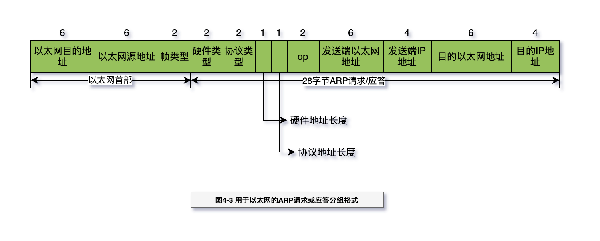

# ARP：地址解析协议

地址解析为这两种不同的地址形式提供映射：`32bit的IP地址`和数据`链路层`使用的任何类型的`地址`。
RFC826[Plummer 1982]是ARP规范描述文档。

ARP为IP地址到对应的硬件地址之间提供动态映射

当一台主机把以太网数据帧发送到位于同一局域网上的另一台主机时，是根据48 bit的以
太网地址来确定目的接口的。设备驱动程序从不检查IP数据报中的目的IP地址。

- A R P（地址解析协议）和R A R P（逆地址解析协议）

```log
[root@aliyun1 ~]# arp -a
? (10.0.9.2) at 02:42:0a:00:09:02 [ether] on docker0
? (10.0.15.0) at a6:d1:ea:4e:72:6f [ether] PERM on flannel.1
? (10.0.9.4) at 02:42:0a:00:09:04 [ether] on docker0
? (169.254.169.254) at <incomplete> on eth0
? (10.0.9.6) at 02:42:0a:00:09:06 [ether] on docker0
? (10.0.10.0) at da:06:4e:48:0b:9b [ether] PERM on flannel.1
gateway (172.19.175.253) at ee:ff:ff:ff:ff:ff [ether] on eth0
? (10.0.9.3) at 02:42:0a:00:09:03 [ether] on docker0
? (10.0.9.5) at 02:42:0a:00:09:05 [ether] on docker0
```

> 32 IP地址与48位以太网地址的转化（通过 ARP 和 RARP ）



> ARP 协议格式


