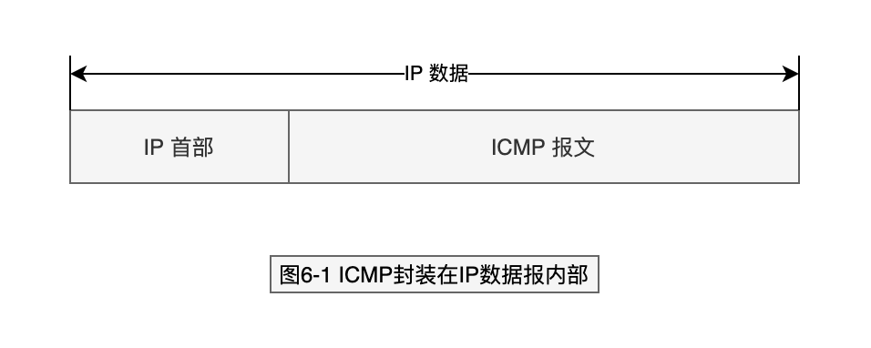
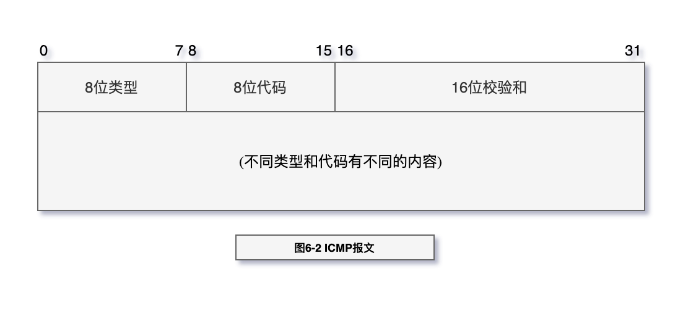
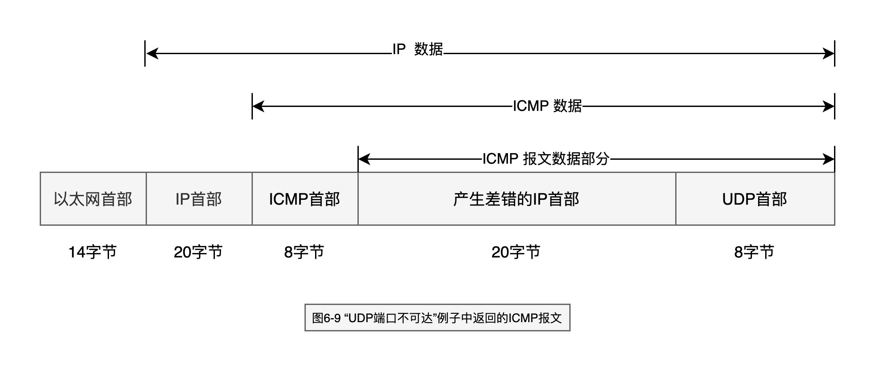
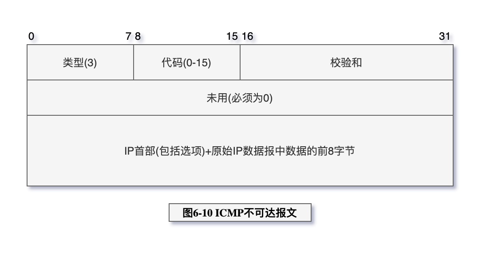

# ICMP：Internet控制报文协议

ICMP经常被认为是IP层的一个组成部分。它传递差错报文以及其他需要注意的信息。
ICMP报文通常被IP层或更高层协议（TCP或UDP）使用。一些ICMP报文把差错报文返回给用户进程。

一个重要的事实是包含在UDP首部中的内容是源端口号和目的端口号。就是由于目的端
口号（8888）才导致产生了ICMP端口不可达的差错报文。接收ICMP的系统可以根据源端口
号（2924）来把差错报文与某个特定的用户进程相关联（在本例中是TFTP客户程序）。
导致差错的数据报中的IP首部要被送回的原因是因为IP首部中包含了协议字段，使得
ICMP可以知道如何解释后面的8个字节（在本例中是UDP首部）。如果我们来查看TCP首部
（图17-2）,可以发现源端口和目的端口被包含在TCP首部的前8个字节中。

> 6-1

> 6-2

检验和字段覆盖整个ICMP报

> 6-9

> 6-10

## Links

- [https://www.rfc-editor.org/rfc/rfc792.txt](https://www.rfc-editor.org/rfc/rfc792.txt)
