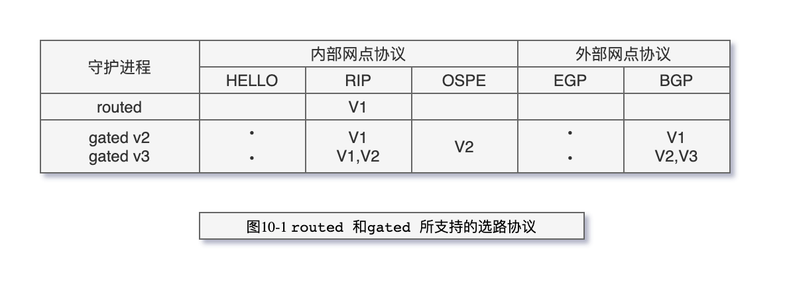
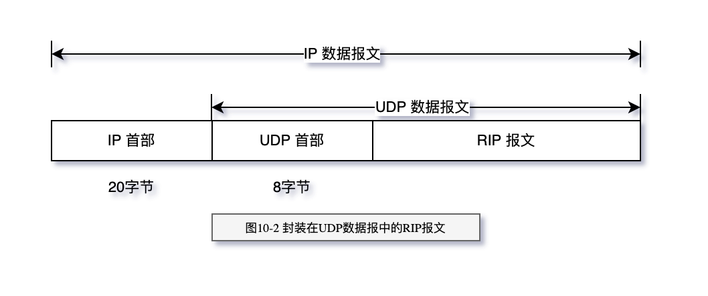

# 动态选路协议

动态选路协议，它用于路由器间的通信。我们主要讨论RIP，即选路信息协议
(Routing Infromation Protocol)，大多数TCP/IP实现都提供这个应用广泛的协议。然后讨论两
种新的选路协议，OSPF和BGP。本章的最后研究一种名叫无分类域间选路的新的选路技术，
现在Internet上正在开始采用该协议以保持B类网络的数量。

> 动态选路(概念)

当相邻路由器之间进行通信，以告知对方每个路由器当前所连接的网络，这时就出现了
动态选路。路由器之间必须采用选路协议进行通信，这样的选路协议有很多种。路由器上有
一个进程称为路由守护程序（routing daemon），它运行选路协议，并与其相邻的一些路由器
进行通信。路由守护程序根据它从相邻路由器接收到的信息，更新内核中的路由表。

动态选路并不改变内核在IP层的选路方式。这种选路方式称为选路机制（routing mechanism）。
内核搜索路由表，查找主机路由、网络路由以及默认路由的方式并没有改变。
仅仅是放置到路由表中的信息改变了—当路由随时间变化时，路由是由路
由守护程序动态地增加或删除，而不是来自于自引导程序文件中的route命令。

正如前面所描述的那样，路由守护程序将选路策略（ routing policy）加入到系统中，选
择路由并加入到内核的路由表中。如果守护程序发现前往同一信宿存在多条路由，那么它
（以某种方法）将选择最佳路由并加入内核路由表中。如果路由守护程序发现一条链路已经断
开（可能是路由器崩溃或电话线路不好），它可以删除受影响的路由或增加另一条路由以绕过
该问题。

> 名词

- RIP 选路信息协议 (Routing Infromation Protocol)
- CIDR 无类型域间选路
- 内部网关协议IGP（Interior Gateway Protocol）
- 域内选路协议（intradomain routing protocol）

> 选路协议

> RIP 报文格式

