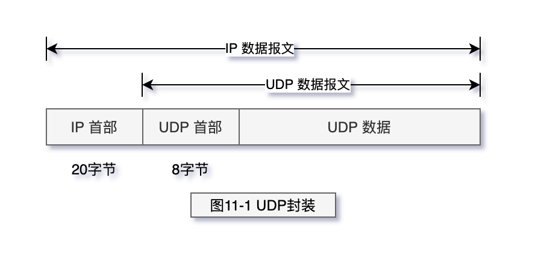
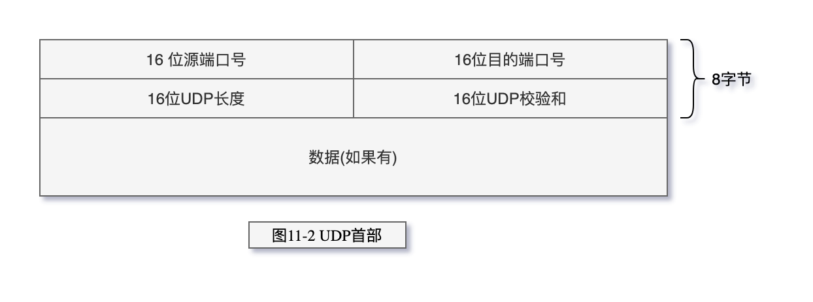

# UDP：用户数据报协议

- UDP长度字段指的是UDP首部和UDP数据的字节长度
- UDP检验和覆盖UDP首部和UDP数
- IP首部的检验和，它只覆盖IP的首部
- IP分片
- todo

> IP分片

物理网络层一般要限制每次发送数据帧的最大长度。任何
时候IP层接收到一份要发送的IP数据报时，它要判断向本地哪个接口发送数据（选路），并查
询该接口获得其MTU。IP把MTU与数据报长度进行比较，如果需要则进行分片。分片可以发
生在原始发送端主机上，也可以发生在中间路由器上。
把一份IP数据报分片以后，只有到达目的地才进行重新组装（这里的重新组装与其他网
络协议不同，它们要求在下一站就进行进行重新组装，而不是在最终的目的地）。重新组装由
目的端的IP层来完成，其目的是使分片和重新组装过程对运输层（TCP和UDP）是透明的，
除了某些可能的越级操作外。已经分片过的数据报有可能会再次进行分片（可能不止一次）。
IP首部中包含的数据为分片和重新组装提供了足够的信息。

当IP数据报被分片后，每一片都成为一个分组，具有自己的IP首部，并在选择路由时与
其他分组独立。这样，当数据报的这些片到达目的端时有可能会失序，但是在IP首部中有足
够的信息让接收端能正确组装这些数据报片。

另外需要解释几个术语：IP数据报是指IP层端到端的传输单元（在分片之前和重新组装
之后），分组是指在IP层和链路层之间传送的数据单元。一个分组可以是一个完整的IP数据报，
也可以是IP数据报的一个分片。

> UDP 封装

> UDP 首部

