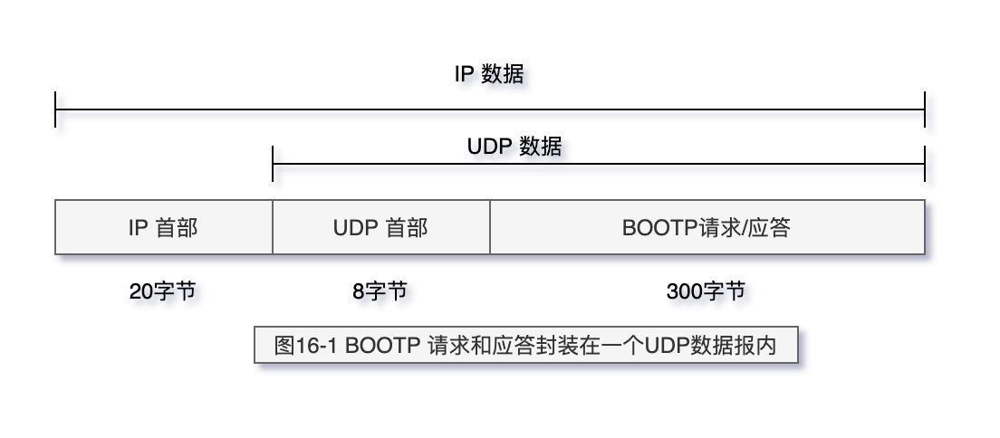

# BOOTP： 引导程序协议

在第5章我们介绍了一个无盘系统，它在不知道自身IP地址的情况下，在进行系统引导时
能够通过RARP来获取它的IP地址。然而使用RARP有两个问题：（1）IP地址是返回的唯一结
果；（2）既然RARP使用链路层广播，RARP请求就不会被路由器转发（迫使每个实际网络
设置一个RARP服务器）。本章将介绍一种用于无盘系统进行系统引导的替代方法，又称为引
导程序协议，或BOOTP。

- RFC 951
- RFC 1542

> 图16-1 BOOTP 请求和应答封装在一个UDP数据报内

