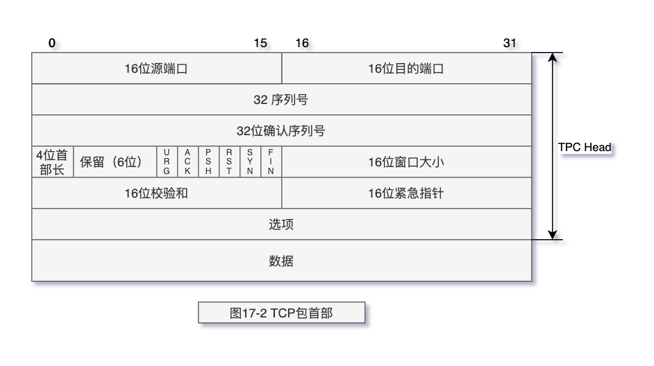

# TCP/IP 详解 卷 1

《TCP/IP 详解 卷 1》 读书笔记（方便回忆核心内容）

建议阅读的章节 1，2，3，4 ，11，12，14，17，18，19，20，21，22，23

## 建议

强烈建议阅读的书籍，此书是针对计算机网络中所有使用的`网络协议`说明(简介+设计)的入门书籍，绝对的经典。
这些协议对我们日常开发虽然无感知，但是确实是`基础设施`不可缺少。

但是本书涉及很多网络协议，第一次阅读会感觉`吃力`(至少对我来说是的 🐶)，建议多读几遍。如果有网络开发经验，阅读此书会很流畅。

如果没有网络开发经验，推荐可以去阅读一些`中间件`中的对网络的处理，如 Dubbo,RockeMQ 中对网络部分编码，解码的处理。如果读懂了，再来读本书，会容易很多。

本书中的配图很多，大部门都是关于`网络协议设计`的图。如果真正的理解了网络中的`编码`，`解码`操作。
那么对下面的图一定是能看懂的(或者说如果你读懂了书中的大部门内容，那么理解下图，不成问题)。

如果你理解了上图，并且只想关注 TCP 的设计，那么直接阅读本书的**17-24 章节**即可

## 目录

- [第 1 章 概述](chapter-01.md)
- [第 2 章 链路层](chapter-02.md)
- [第 3 章 IP：网际协议](chapter-03.md)
- [第 4 章 ARP：地址解析协议](chapter-04.md)
- [第 5 章 RARP：逆地址解析协议](chapter-05.md)
- [第 6 章 ICMP：Internet 控制报文协议](chapter-06.md)
- [第 7 章 Ping 程序](chapter-07.md)
- [第 8 章 Traceroute 程序](chapter-08.md)
- [第 9 章 IP 选路](chapter-08.md)
- [第 10 章 动态选路协议](chapter-10.md)
- [第 11 章 UDP：用户数据报协议](chapter-11.md)
- [第 12 章 广播和多播](chapter-12.md)
- [第 13 章 IGMP：Internet 组管理协议](chapter-13.md)
- [第 14 章 DNS：域名系统](chapter-14.md)
- [第 15 章 TFTP：简单文件传送协议](chapter-15.md)
- [第 16 章 BOOTP： 引导程序协议](chapter-16.md)
- [第 17 章 TCP：传输控制协议](chapter-17.md)
- [第 18 章 TCP 连接的建立与终止](chapter-18.md)
- [第 19 章 TCP 的交互数据流](chapter-19.md)
- [第 20 章 TCP 的成块数据流](chapter-20.md)
- [第 21 章 TCP 的超时与重传](chapter-21.md)
- [第 22 章 TCP 的坚持定时器](chapter-22.md)
- [第 23 章 TCP 的保活定时器](chapter-23.md)
- [第 24 章 TCP 的未来和性能](chapter-24.md)
- 第 25 章 SNMP：简单网络管理协议
- 第 26 章 Telnet 和 Rlogin：远程登录
- 第 27 章 FTP：文件传送协议
- 第 28 章 SMTP：简单邮件传送协议
- 第 29 章 网络文件系统
- 第 30 章 其他的 TCP/IP 应用程序
