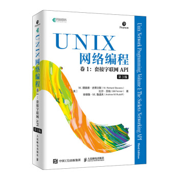

# Uninx 网络编程卷 1 （套接字联网 API）

目录：

- 第一章 [简介](chapter-01.md)
- 第二章 [传输层:TCP、UDP 和 SCTP](chapter-02.md)
- 第三章 [套接字编程简介](chapter-03.md)
- 第四章 [基本 TCP 套接字编程](chapter-04.md)
- 第五章 [TCP 客户/服务器程序示例](chapter-05.md)
- 🔥第六章 [I/O 复用 select 和 poll 函数](chapter-06.md)
- 第七章 [套接字选项](chapter-07.md)
- 第十四章 [高级 I/O 函数](chapter-14.md)
- 第十五章 [Unix 域协议](chapter-15.md)
- 第十六章 [非阻塞式 I/O](chapter-16.md)
- 第二十五章 [信号驱动式 I/O](chapter-25.md)

## 建议

此书是关于 Uninx 操作系统中，对 TCP 网络 API 的介绍，看此书需要一点 C 语言基础。

- 关键字：
  - I/O 模型，概念
  - 操作系统 API（系统函数模型）

此书中提供了很多概念，如：如同步 I/O,异步 I/O。

还介绍了 5 中 I/O 模型。

- 阻塞式 I/O;
- 非阻塞式 I/O;
- I/O 复用(selec 和 poll)
- 信号驱动式 I/O( SIGIO);
- 异步 I/O(POSX 的 aio\_系列函数)。

正如书名的描述, 此书更多的关注 `套接字联网API`。

看完此书，可以很容易理解 JAVA 中对 一些网络 API 的包装（native 交互）。
