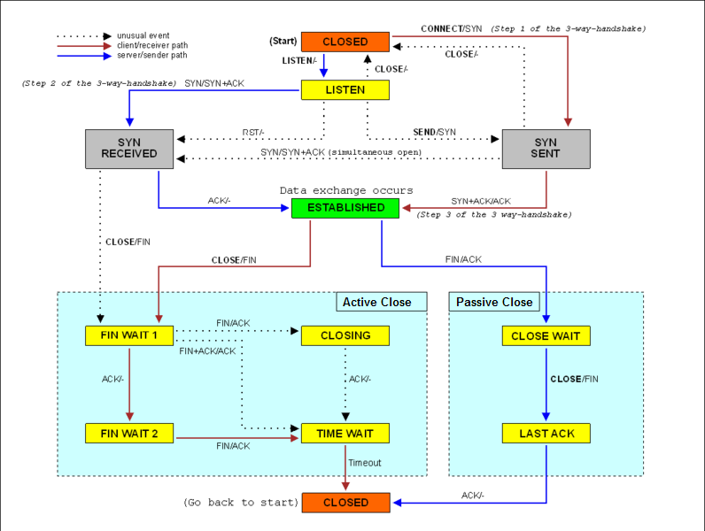

# TCP IP

《TCP/IP 详解 卷 1》和 《Unix 网络编程 卷 1》的阅读笔记。

- [TCP-IP-详解-卷 1](./TCP-IP-详解-卷1/readme.md)
- [Unix 网络编程-卷 1](./Unix网络编程-卷1/readme.md)

## Links

- [高效的网络IO模型](https://mp.weixin.qq.com/s/naGheZq_z5d8pyB_i9hY7g)
- TCP为什么需要三次握手 https://www.pixelstech.net/article/1727412048-Why-TCP-needs-3-handshakes

## TCP链接创建的图

> 注意图中的2个角色，客户端-服务端
> 
> 客户端的流程是红色的线，服务端的流程是蓝色的线

